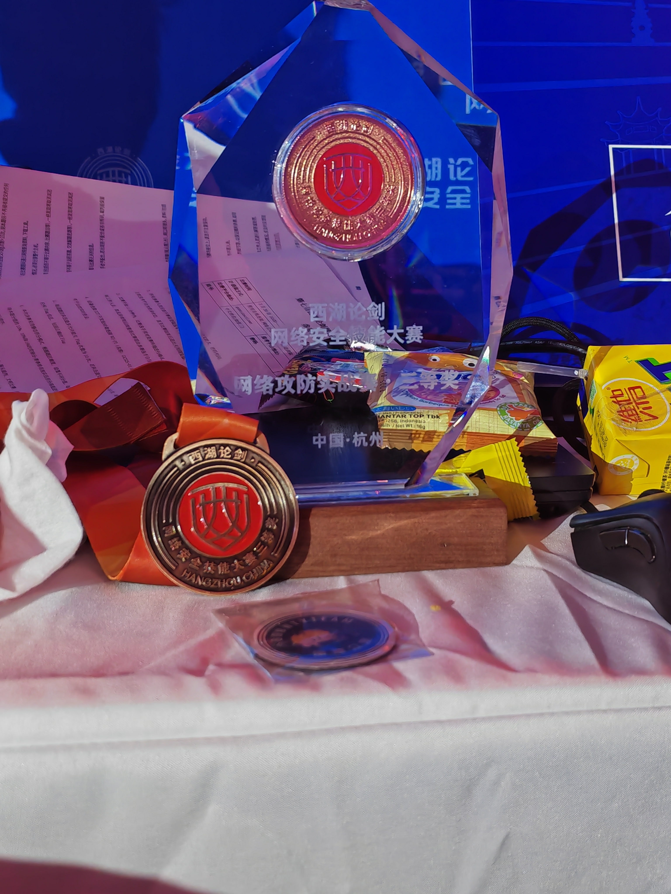
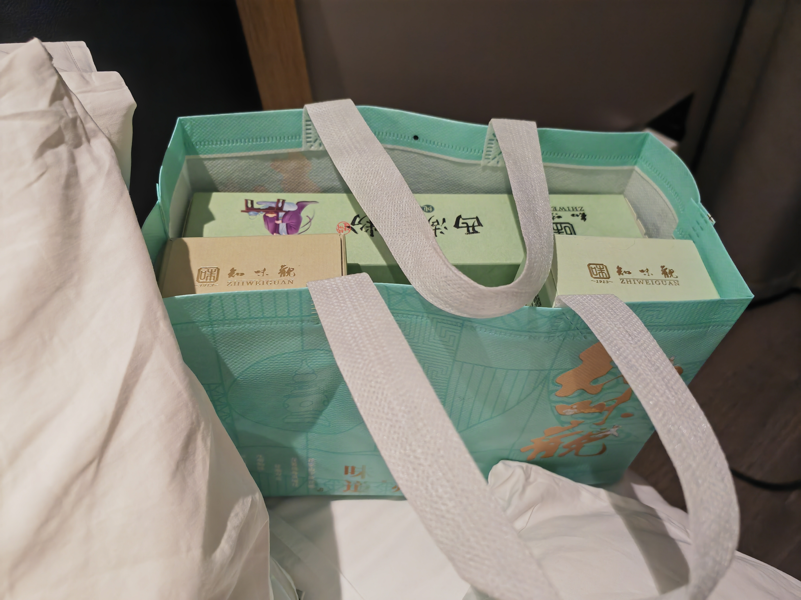
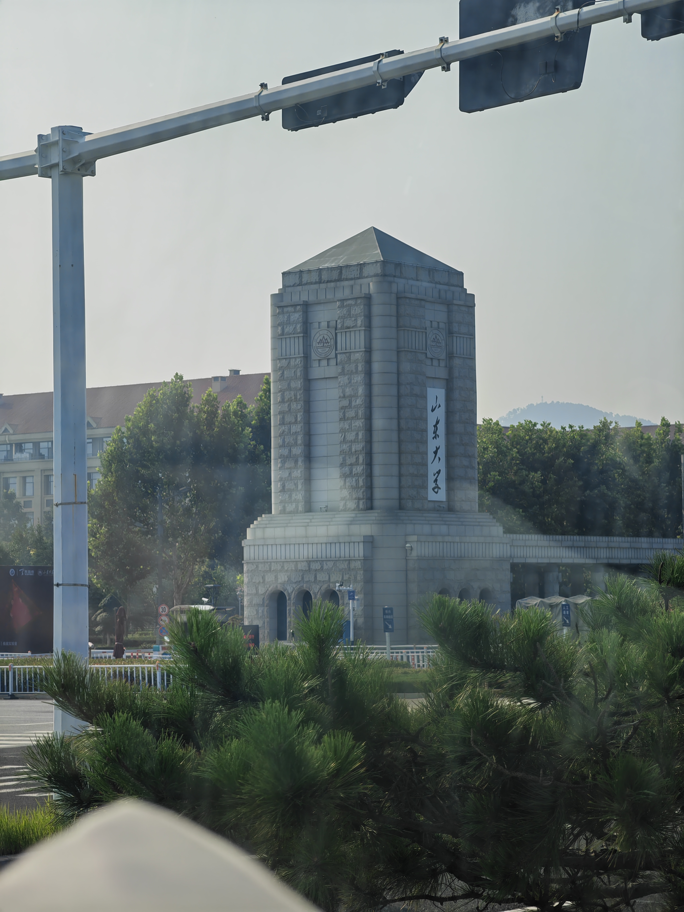
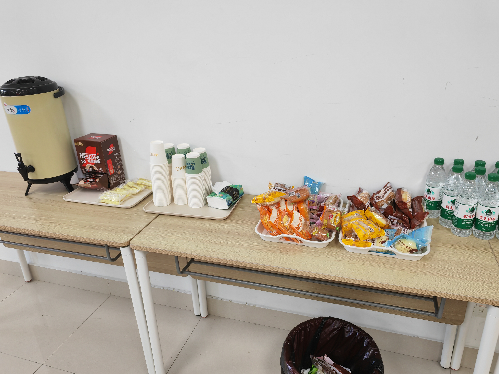
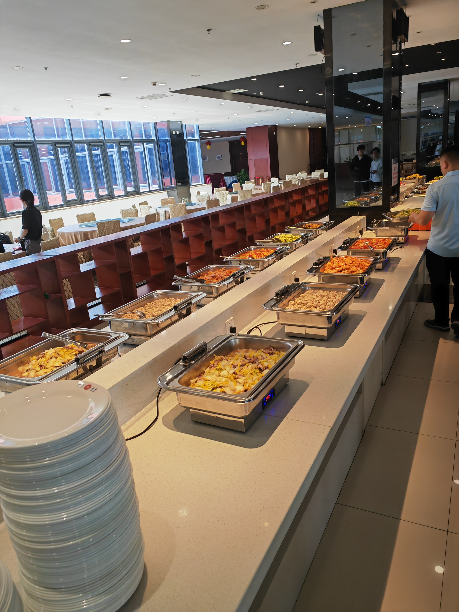
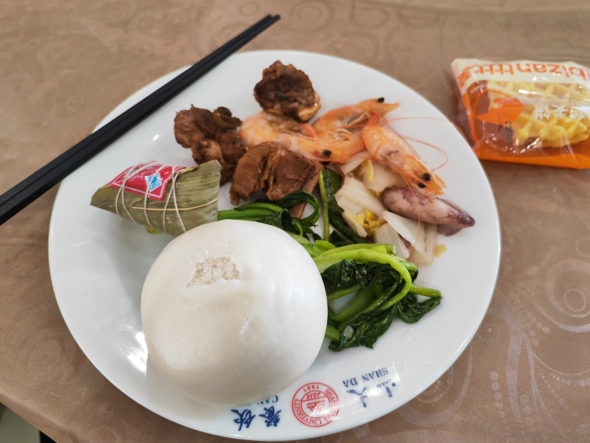
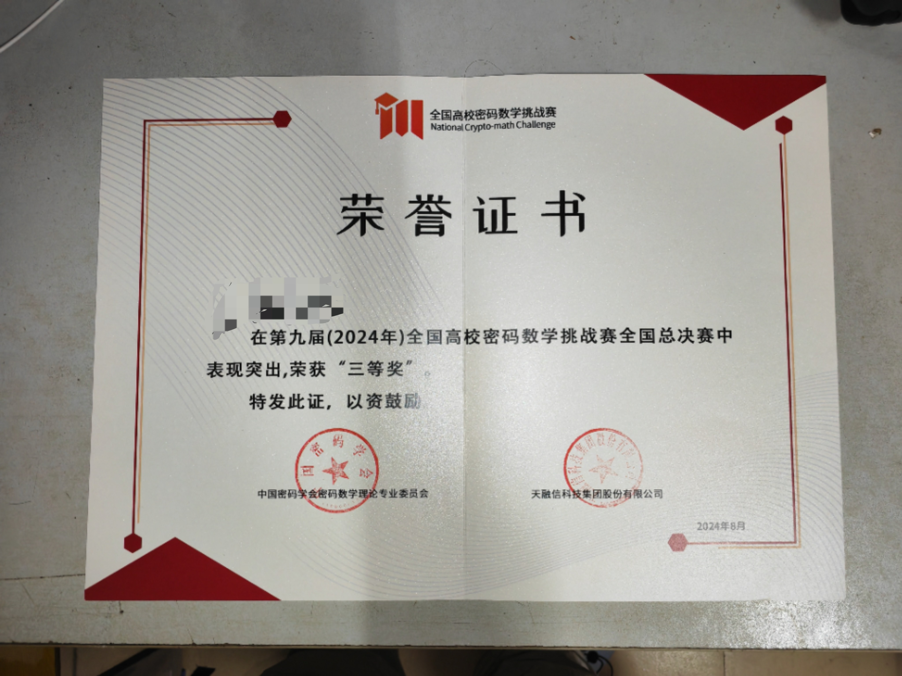
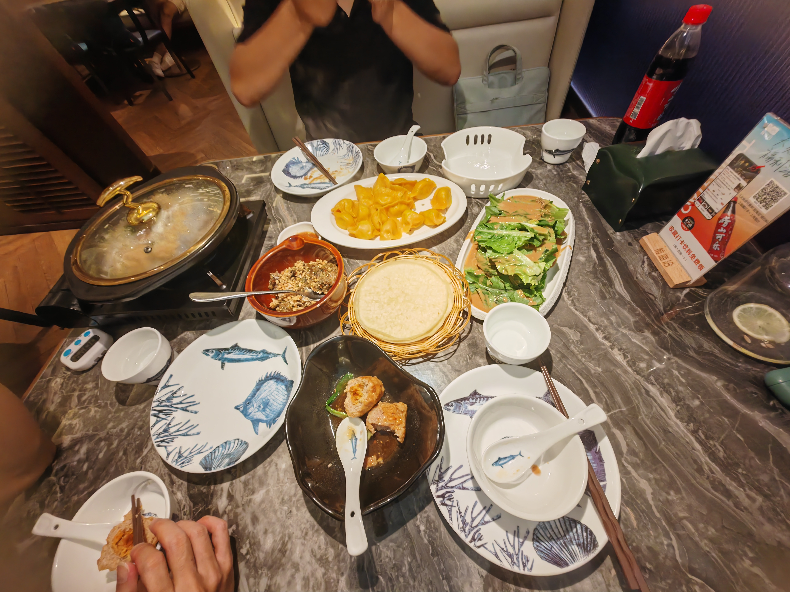
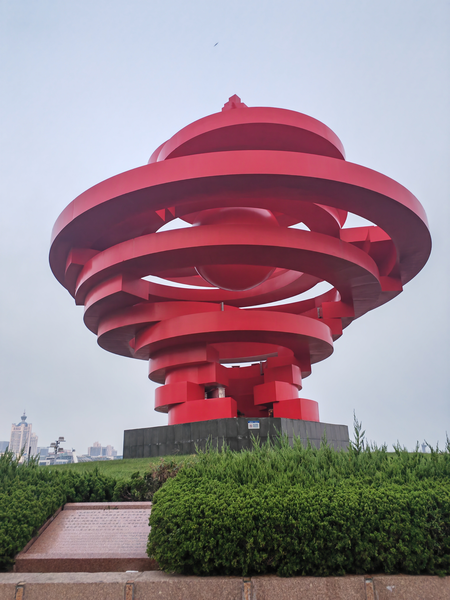
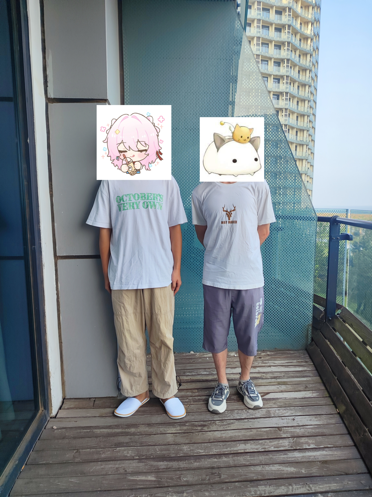

一时兴起写的，再加上也大学毕业了，确实该写一个回忆性质的东西了；所以就写了（主要还是以“随便”为主）

# 大三前

为啥不分年份去写呢？因为感觉大三之前确实写不了很多东西。

总结一下就两个字：**迷茫**：

> **1、**大一的时候进了网安协会的策划部（时代的眼泪，因为现在基本没影子了hhhh，都是实验室一块管了），之后就进了HnuSec的Crypto方向研究Crypto（但之后到大三这段时间，感觉自己在Crypto上的学习之路走得有点迷茫；而且因为Crypto方向也没啥人打，所以我是自我摸索但也没找到什么学习的感觉）
>
> **2、**到了大二，虽然也有说帮忙去打比赛，但感觉 “力不从心”，总是做不出题，感觉 “时间换不来结果”；于是当时的我也就变得有点迷茫（甚至有“转方向”或“放弃”之类的想法）

# 大三

到了大三，总结一下就是：**苦但快乐**。

因为这时候，HnuSec的实验室也搬到学院楼的一个大的地方，位置很多；所以当时的我就经常去实验室里呆着（可能是想给自己点压力吧）

然后就经常跟着HnuSec打比赛（虽然当时其实有 “想进联队” 这个想法，但自己不太敢去哈哈哈，之后才知道有些联队其实挺友好的，比如现在m1n9呆的NepNep、我现在呆的SU以及NK、XM等）；而且这一年，因为当了方向组长，所以也是亲自带了三个当时新进的密码手入门学Crypto（最后我毕业前的话，一个被我劝去科研了（因为人绩点摆在那，而且他其实也是有点想搞科研的），一个去了NepNep并当现役的Crypto方向组长（历史重演吗hhh）；还有一个是全栈哥，他是啥都看了点，主要是看的web，所以我跟他聊的相对前两位不是很多哈哈哈）

不过刚好因为NSS工坊出现了密码工坊，也让我认识了[DexterJie](https://dexterjie.github.io/)、[鸡块](https://tangcuxiaojikuai.xyz/)等密码师傅（甚至当时工坊群里都是聊密码的hhhhh）

这段时间里，也是很凑巧，去了两次线下决赛，一次是西湖论剑，另一次是密挑。

## 西湖论剑

这个确实是一次 “凑巧” 的经历。

因为当时虽然初赛打了第二名，但因为当时报名那一队里就四个人（主要是队里忘了可以报8个为一队，然后再精挑细选出其中4个去线下），于是就变成“**2web带着1crypto和1misc**”的队伍，去了西湖的线下——杭州打决赛。

（这里假装有很多拍的图片，因为有点懒得放哈哈哈）

虽然很遗憾的是：决赛我跟misc手打iot确实没打出来很多分，大部分的分数都是靠着Boogipop和另一个web✌打的，所以最后是拿了个三等奖（web组还是太强了）

不过在线下，也去面基了下upswing师傅，认识了中山大学的LilRan师傅。

至于之后的话，就是跑去西湖附近逛了一下，买了点吃的回宿舍吃

## 密挑

这个的话，算是个意外？

刚好那年的密挑有个 “RSA部分密钥泄露攻击” 的比赛赛题，然后那段时间也算是打CTF的RSA题有点多；于是就跟校里的两个密码手一块去打了初赛，最后是进了决赛，去了山东大学青岛校区。

最后也是依然三等奖收尾（毕竟确实是没搞清楚比赛的定位，以为跟CTF一样），当然也感谢river✌和mmy✌带我拿奖！

（不过也面基了几个密码✌——[鸡块](https://tangcuxiaojikuai.xyz/)、[dbt](https://d33b4t0.com/)和cot（cot的blog我一直不知道是啥，所以就没整超链接了hhh），一句话概括：一看就知道很有数学天分）

这里就随便放些图片：

不过当时最高兴的，还是跟鸡块师傅合了个影hhh：

# 大四

大四这年嘛。。。只能说遗憾吧，基本上这年干啥都不是很顺（无论是考研失利，还是说由此对未来的恐惧）；最后甚至是以一种冷淡的心情离开的学校的，只能说：唉~时间过得真快。（虽然这部分我也想写很多，但是。。确实都是遗憾，唉~）

# 至今（2025年度总结）

至于这块嘛。。。就是真的今年的总结了hhh

> **1、**因为emo，所以就去冷静了半个月（应该是）；然后也顺便跟LOV3他们组的正规子群去打了CryptoCTF2025和其他比赛（然后也因为当时Tr1ode的联队广告，加上之前bao的邀请，所以我就加入了SU（此处假装有个广告））
>
> **2、**目前的话，算是自己冷静了下来，因此就是 “找工作ing中”（**万事皆有可能**）；当然，有时候周末也会看看Crypto解解压（算是我自己压抑emo情绪的方法了只能说）

总的来说，我自己觉得算是一个比较平淡的一年吧，希望2026年，我自己能顺顺利利、心想事成吧~~~

