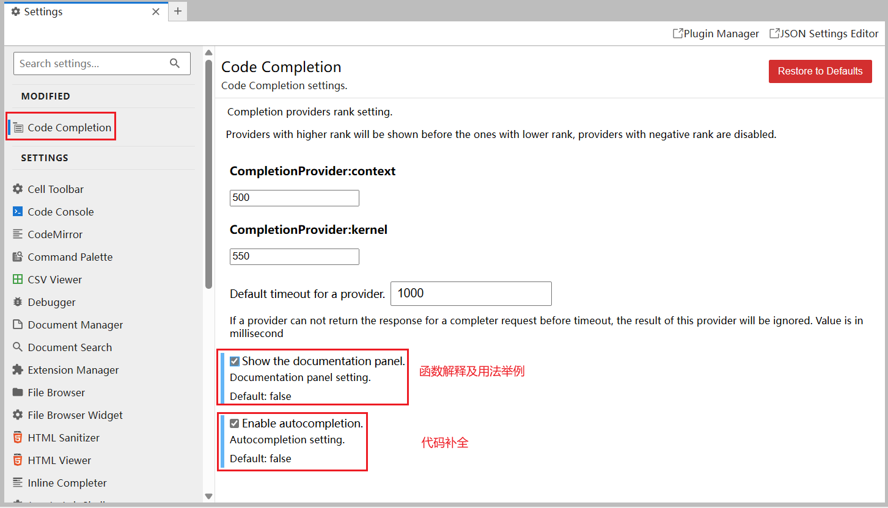

字面意思，因为懒得开VM了，一时兴起就整了下arch的sage，感觉用起来方便，故推荐！

（虽然说是教程，但实际是一个 “摸索出” 的过程记录）

配置：WSL2+Arch+SageMath10.4

## 1，安装Arch+Sage

这个有教程：[Windows 安装 SageMath 最新版 (WSL2)](https://zhuanlan.zhihu.com/p/633782050)

> 可能遇到的报错及解决办法：
>
> 1，0x80370102报错：[WSL2安装Linux子系统报0x80370102解决方法](https://zhuanlan.zhihu.com/p/391422861)
>
> 2，pacman -Sy archlinuxcn-keyring报错：
>
> [archlinuxcn-keyring 无法安装 / archlinuxcn-keyring can't be installed](https://github.com/archlinuxcn/repo/issues/3557)

安装完sage后，就是安装一些我自己觉得必要的库了：

```bash
# sudo pacman -S python-<package_name> [python-<package_name>]
sudo pacman -S python-gmpy2 python-pycryptodome python-pwntools python-tqdm
```

## 2，安装flatter（可以加速格基规约）

按顺序输入以下指令即可：

```bash
sudo pacman -S gmp mpfr eigen base-devel gcc git cmake
git clone https://github.com/keeganryan/flatter.git
cd flatter
mkdir build && cd ./build
cmake -DCMAKE_INSTALL_PREFIX=/usr ..
make
sudo make install
sudo ldconfig #这个可以不输入
```

只要最后输入`flatter -h`是正常的话，就说明安装成功了

## 代码补全（可选）

路径：Setting->Setting Editer->Code Completion


