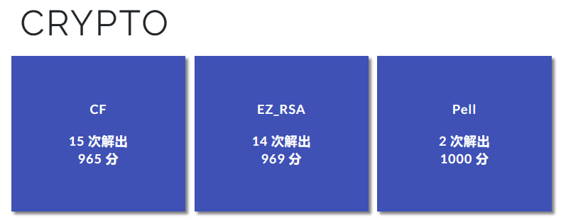

果然。。。都有解了呀（）

还得是Nowayback和HashTeam（



<hr style="border: 0.5px solid black;"/>

# EZ_RSA

题目需要我们算 $p1 + p2 + q1 + q2$ 的和的md5值，所以我们需要算出这四个素数才行。

于是这里分成两部分去计算：

## gen1

在加密代码里，出题人直接把这函数写成一行，这人真的坏（）

所以我们需要把这个gen1转成正常的加密代码才好做题：

```python
rand = lambda n: bytes(random.getrandbits(1) for _ in range(n))

def gen1(bits):
    p = getPrime(bits // 2, randfunc=rand)
    q = getPrime(bits // 2, randfunc=rand)
    return p, q
```

因为x使用的是 **getrandbits(1)**；因此，x里会有**b'\x00'** 和 **b'\x01'** 这两种可能的bytes的组合。

而且如果自己尝试用gen1生成素数会发现：**对应的bytes类型值里都是b"\x80"开头，且除去开头后的长度都是63。**

故我们可以通过剪枝的方法去爆破出$p_1$、$q_1$：

<details>
    <summary><b>点击展开代码</b></summary>


```python
from Crypto.Util.number import bytes_to_long


def findflag(p, q, n):
    if len(p) == 63:
        pp = bytes_to_long(b"\x80" + p)
        if n % pp == 0:
            print(pp)
    else:
        L = len(p)
        pp = bytes_to_long(p)
        qq = bytes_to_long(q)
        if pp * qq % (256**L) == n % (256**L):
            findflag(b"\x00" + p, b"\x01" + q, n)
            findflag(b"\x01" + p, b"\x01" + q, n)
            findflag(b"\x00" + p, b"\x00" + q, n)
            findflag(b"\x01" + p, b"\x00" + q, n)


n1 = 44945076854246685060397710825960160082061127479194994041436997195972585701097443198954359213635892234058786065342178389181538153413878118039445271277476379366294977408981257175008890470376094381644530106799352839565803317977637572325347776636285703517680754624094985374606187797141657688145287340444623176193
# 因为n1的最后一位是3，所以p和q的bytes里的最后一位都是b"\x01"
findflag(b"\x01", b"\x01", n1)
print("over")
# 6704108555018235126044943757232820606509394092422982568570889193755927961059256373509251540968761510597955349467469602569838971815245810437719445704016129
# 6704109351064115455893295955648034742490075153469647652626278891915863408109665863057399099944508436950445216168956861863970048266975514429634433698038017

```

</details>

## gen2

这个其实是RSA的一个后门：[A new idea for RSA backdoors (arxiv.org)](https://arxiv.org/pdf/2201.13153)，不过不看论文也能推出来的，算是比较巧妙吧（）

对应的解法如下：

### 获得所有可能的 (q2 mod T, p2 mod T)

还是一样，先将gen2转成正常的加密代码，这人真的坏（）：

```python
def gen2(alpha=512, K=500, T=getPrime(506)):
    while True:
        q = getPrime(alpha)
        r = getPrime(alpha)
        for k in range(2, K+1):
            p = r + (k * q - r) % T
            if isPrime(p):
                return p, q, T
```

现在我们便可以看出：
$$
p_2\equiv kq_2~mod~T
$$
于是代入到 $n_2$ 中便有：
$$
n_2\equiv kq_2^2~mod~T
$$
因为 $k\in[2,K]$ 且 $K$ 很小，那么我们可以遍历 $k$ 的值，

得到所有可能的 $(q_2~mod~T,~p_2~mod~T)$，然后通过下面的过程，我们来恢复 $p_2,~q_2$

### 恢复 p2, q2

通过gen2以及上述得到的式子，我们可以把 $n_2$ 写成：
$$
n_2=[\pi T+(p_2~mod~T)][vT+(q_2~mod~T)]~~~~~~\left(1\right)
$$
如果我们记：$\delta=[n_2-(p_2~mod~T)(q_2~mod~T)]/T$

那么我们展开便有：
$$
\delta=\pi vT+\pi(q~mod~T)+v(p~mod~T)
$$
然后我们记：$x=\pi,~C=\pi+v,~a=q~mod~T,~b=p~mod~T$，

那么我们可以得到：
$$
\delta=x(C-x)T+ax+b(C-x)
$$
我们计算一下 $C$ 的上界，会发现：我们是能穷举 $C$ 的

> **我们把$\left(1\right)$式张开得到**
> $$
> n_2=\pi vT^2+vT(p_2~mod~T)+\pi T(q_2~mod~T)+(p_2q_2~mod~T)
> $$
> **那么明显$~C=\pi+v\le\pi v\le n_2/T^2$**
>
> **通过计算（或者直接拿sage去算 $n_2/T^2$）可以知道：$n_2/T^2<2^{15}~(small~num)$，可以看出 $C$ 值确实很小**

于是我们就可以穷举 $C$ ，用下面这个方法来计算 $x$（即$\pi$），进而得到 $v$：


简单来说，就是两步：

> 1，遍历去找可能的C，使得$\Delta$这个判别式不小于0
>
> 2，然后尝试求我们这个二次方程的两个解：$D=(CT+a-b\pm\sqrt{\Delta})/2T$
>
> 3，然后判断$D$是否为整数；如果有一个解$D_i$成立，则$\pi=D_i,~v=C-\pi$

然后再通过下式便可算出 $p_2,~q_2$ ：

$$
p_2=\pi T+b
$$

$$
q_2=vT+a
$$

由于我们有了 $a=q_2~mod~T,~b=p_2~mod~T$ 的所有可能值，故我们可以通过遍历 $(a,~b)$ 进行上述操作，恢复出 $p_2,~q_2$

对应的exp:

<details>
    <summary><b>点击展开代码</b></summary>


```python
import gmpy2
from Crypto.Util.number import *

def Legendre(n, p):
    return pow(n, (p - 1) // 2, p)


def Tonelli_Shanks(n, p):
    assert Legendre(n, p) == 1
    if p % 4 == 3:
        return pow(n, (p + 1) // 4, p)
    q = p - 1
    s = 0
    while q % 2 == 0:
        q = q // 2
        s += 1
    for z in range(2, p):
        if Legendre(z, p) == p - 1:
            c = pow(z, q, p)
            break
    r = pow(n, (q + 1) // 2, p)
    t = pow(n, q, p)
    m = s
    if t % p == 1:
        return r
    else:
        i = 0
        while t % p != 1:
            temp = pow(t, 2 ** (i + 1), p)
            i += 1
            if temp % p == 1:
                b = pow(c, 2 ** (m - i - 1), p)
                r = r * b % p
                c = b * b % p
                t = t * c % p
                m = i
                i = 0
        return r

K=500
n = 57784854392324291351358704449756491526369373648574288191576366413179694041729248864428194536249209588548791706980878177790271653262097539281383559433402738548851606776347237650302071287124974607439996041713554182180186588308614458904981542909792071322939678815174962366963098166320441995961513884899917498099
T = 150514823288951667574011681197229106951781617714873679347685702558528178681176081082658953342482323349796111911103531429615442550000291753989779754337491

nt = n % T
gammas = []
for k in range(2, K + 1):
    k_ = inverse(k, T)
    if Legendre(nt * k_, T) == 1:
        gammas.append(nt * k_ % T)
pqs = []
for gamma in gammas:
    qt1 = Tonelli_Shanks(gamma, T)
    assert qt1**2 % T == gamma and qt1 < T
    qt2 = T - qt1
    assert qt2**2 % T == gamma
    pt1 = nt * inverse(qt1, T) % T
    pt2 = nt * inverse(qt2, T) % T
    pqs.append((qt1, pt1))
    pqs.append((qt2, pt2))
for a, b in pqs:
    begin = gmpy2.iroot(2 * (n // T**2) - 1, 2)[0]
    end = n // (T**2)
    delta = (n - a * b) // T
    for C in range(begin, end + 1):
        Delta = (b - a - C * T) ** 2 - 4 * T * (delta - b * C)
        if Delta < 0:
            continue
        xx = gmpy2.iroot(Delta, 2)
        if xx[1]:
            x1 = C * T + a - b + xx[0]
            x2 = C * T + a - b - xx[0]
            for x in (x1, x2):
                if x % (2 * T) == 0:
                    x = x // (2 * T)
                    pi = x
                    v = C - x
                    p1 = pi * T + b
                    q1 = v * T + a
                    if p1 * q1 == n:
                        print(p1, q1)
                        exit(0)
# 8604143985568971357221106163518321547782942525630490158067993880524661927741225574307260111628133976467492901704516592869940382055272648214920231756723373 
# 6715932984064668444342570644774156271984002289395510283696469320418962556390690901906940107908954287013902962625382543926197508086756331581472941654687263        

```

</details>

## last

最后计算flag即可：

```python
import hashlib

p1 = 6704108555018235126044943757232820606509394092422982568570889193755927961059256373509251540968761510597955349467469602569838971815245810437719445704016129
q1 = 6704109351064115455893295955648034742490075153469647652626278891915863408109665863057399099944508436950445216168956861863970048266975514429634433698038017
p2 = 8604143985568971357221106163518321547782942525630490158067993880524661927741225574307260111628133976467492901704516592869940382055272648214920231756723373
q2 = 6715932984064668444342570644774156271984002289395510283696469320418962556390690901906940107908954287013902962625382543926197508086756331581472941654687263
flag = "DASCTF{" + hashlib.md5(str(p1 + p2 + q1 + q2).encode()).hexdigest() + "}"
print(flag)
# DASCTF{354ed97c5a3d9d16f49ad93fc30e1c6f}
```

<hr style="border: 0.5px solid black;"/>

# CF

## Boneh and Durfee

对于相对较大的$e$，并且$e<n^{0.292}$，我们可以利用Boneh and Durfee Attack来做

首先我们可以知道：$e\times d≡1~(mod~\phi(n))$

于是可以转化一下，得到$ e\times d  = 1 + k\times\phi(n)$

即$k\times\phi(n)+1≡0\mod e~——~(1)$

又因为$\phi(n)=(p-1)(q-1)(r-1)(s-1)=n-t+1$，其中$t$为一个包含$p,q,r,s$的多项式

故我们代入到式$(1)$中，得到$k(n-t+1)+1≡0\mod e$

然后我们记：$A=(n+1)$，则上式可以写成：
$$
f(x,y)=x(A-y)+1≡0\mod e
$$
假如我们可以解出这个方程的根，我们便可得到$\phi(n)$

## 多元n与phi分解因子

多元$n$、$\phi(n)$分解因子这一步，需要用到这篇论文：[On Some Attacks on Multi-prime RSA](https://link.springer.com/content/pdf/10.1007/3-540-36492-7_25.pdf)；具体位置在 “Equivalence of Factoring and Exposing the Private Key” 这节。

参考其中的方法，使用$n$和$\phi(n)$来分解出因子即可。

不过嘛。。。网上其实是有脚本的：[known_phi.py](https://github.com/jvdsn/crypto-attacks/blob/master/attacks/factorization/known_phi.py)，直接拿来用就行。

完整EXP：

<details>
    <summary><b>点击展开代码</b></summary>


```python
from Crypto.Util.number import *
from Crypto.Cipher import AES
import hashlib
from __future__ import print_function


############################################
# Config
##########################################

"""
Setting debug to true will display more informations
about the lattice, the bounds, the vectors...
"""
debug = True

"""
Setting strict to true will stop the algorithm (and
return (-1, -1)) if we don't have a correct
upperbound on the determinant. Note that this
doesn't necesseraly mean that no solutions
will be found since the theoretical upperbound is
usualy far away from actual results. That is why
you should probably use `strict = False`
"""
strict = False

"""
This is experimental, but has provided remarkable results
so far. It tries to reduce the lattice as much as it can
while keeping its efficiency. I see no reason not to use
this option, but if things don't work, you should try
disabling it
"""
helpful_only = True
dimension_min = 7 # stop removing if lattice reaches that dimension

############################################
# Functions
##########################################

# display stats on helpful vectors
def helpful_vectors(BB, modulus):
    nothelpful = 0
    for ii in range(BB.dimensions()[0]):
        if BB[ii,ii] >= modulus:
            nothelpful += 1

    print(nothelpful, "/", BB.dimensions()[0], " vectors are not helpful")

# display matrix picture with 0 and X
def matrix_overview(BB, bound):
    for ii in range(BB.dimensions()[0]):
        a = ('%02d ' % ii)
        for jj in range(BB.dimensions()[1]):
            a += '0' if BB[ii,jj] == 0 else 'X'
            if BB.dimensions()[0] < 60:
                a += ' '
        if BB[ii, ii] >= bound:
            a += '~'
        print(a)

# tries to remove unhelpful vectors
# we start at current = n-1 (last vector)
def remove_unhelpful(BB, monomials, bound, current):
    # end of our recursive function
    if current == -1 or BB.dimensions()[0] <= dimension_min:
        return BB

    # we start by checking from the end
    for ii in range(current, -1, -1):
        # if it is unhelpful:
        if BB[ii, ii] >= bound:
            affected_vectors = 0
            affected_vector_index = 0
            # let's check if it affects other vectors
            for jj in range(ii + 1, BB.dimensions()[0]):
                # if another vector is affected:
                # we increase the count
                if BB[jj, ii] != 0:
                    affected_vectors += 1
                    affected_vector_index = jj

            # level:0
            # if no other vectors end up affected
            # we remove it
            if affected_vectors == 0:
                print("* removing unhelpful vector", ii)
                BB = BB.delete_columns([ii])
                BB = BB.delete_rows([ii])
                monomials.pop(ii)
                BB = remove_unhelpful(BB, monomials, bound, ii-1)
                return BB

            # level:1
            # if just one was affected we check
            # if it is affecting someone else
            elif affected_vectors == 1:
                affected_deeper = True
                for kk in range(affected_vector_index + 1, BB.dimensions()[0]):
                    # if it is affecting even one vector
                    # we give up on this one
                    if BB[kk, affected_vector_index] != 0:
                        affected_deeper = False
                # remove both it if no other vector was affected and
                # this helpful vector is not helpful enough
                # compared to our unhelpful one
                if affected_deeper and abs(bound - BB[affected_vector_index, affected_vector_index]) < abs(bound - BB[ii, ii]):
                    print("* removing unhelpful vectors", ii, "and", affected_vector_index)
                    BB = BB.delete_columns([affected_vector_index, ii])
                    BB = BB.delete_rows([affected_vector_index, ii])
                    monomials.pop(affected_vector_index)
                    monomials.pop(ii)
                    BB = remove_unhelpful(BB, monomials, bound, ii-1)
                    return BB
    # nothing happened
    return BB

""" 
Returns:
* 0,0   if it fails
* -1,-1 if `strict=true`, and determinant doesn't bound
* x0,y0 the solutions of `pol`
"""
def boneh_durfee(pol, modulus, mm, tt, XX, YY):
    """
    Boneh and Durfee revisited by Herrmann and May
    
    finds a solution if:
    * d < N^delta
    * |x| < e^delta
    * |y| < e^0.5
    whenever delta < 1 - sqrt(2)/2 ~ 0.292
    """

    # substitution (Herrman and May)
    PR.<u, x, y> = PolynomialRing(ZZ)
    Q = PR.quotient(x*y + 1 - u) # u = xy + 1
    polZ = Q(pol).lift()

    UU = XX*YY + 1

    # x-shifts
    gg = []
    for kk in range(mm + 1):
        for ii in range(mm - kk + 1):
            xshift = x^ii * modulus^(mm - kk) * polZ(u, x, y)^kk
            gg.append(xshift)
    gg.sort()

    # x-shifts list of monomials
    monomials = []
    for polynomial in gg:
        for monomial in polynomial.monomials():
            if monomial not in monomials:
                monomials.append(monomial)
    monomials.sort()
    
    # y-shifts (selected by Herrman and May)
    for jj in range(1, tt + 1):
        for kk in range(floor(mm/tt) * jj, mm + 1):
            yshift = y^jj * polZ(u, x, y)^kk * modulus^(mm - kk)
            yshift = Q(yshift).lift()
            gg.append(yshift) # substitution
    
    # y-shifts list of monomials
    for jj in range(1, tt + 1):
        for kk in range(floor(mm/tt) * jj, mm + 1):
            monomials.append(u^kk * y^jj)

    # construct lattice B
    nn = len(monomials)
    BB = Matrix(ZZ, nn)
    for ii in range(nn):
        BB[ii, 0] = gg[ii](0, 0, 0)
        for jj in range(1, ii + 1):
            if monomials[jj] in gg[ii].monomials():
                BB[ii, jj] = gg[ii].monomial_coefficient(monomials[jj]) * monomials[jj](UU,XX,YY)

    # Prototype to reduce the lattice
    if helpful_only:
        # automatically remove
        BB = remove_unhelpful(BB, monomials, modulus^mm, nn-1)
        # reset dimension
        nn = BB.dimensions()[0]
        if nn == 0:
            print("failure")
            return 0,0

    # check if vectors are helpful
    if debug:
        helpful_vectors(BB, modulus^mm)
    
    # check if determinant is correctly bounded
    det = BB.det()
    bound = modulus^(mm*nn)
    if det >= bound:
        print("We do not have det < bound. Solutions might not be found.")
        print("Try with highers m and t.")
        if debug:
            diff = (log(det) - log(bound)) / log(2)
            print("size det(L) - size e^(m*n) = ", floor(diff))
        if strict:
            return -1, -1
    else:
        print("det(L) < e^(m*n) (good! If a solution exists < N^delta, it will be found)")

    # display the lattice basis
    if debug:
        matrix_overview(BB, modulus^mm)

    # LLL
    if debug:
        print("optimizing basis of the lattice via LLL, this can take a long time")

    BB = BB.LLL()

    if debug:
        print("LLL is done!")

    # transform vector i & j -> polynomials 1 & 2
    if debug:
        print("looking for independent vectors in the lattice")
    found_polynomials = False
    
    for pol1_idx in range(nn - 1):
        for pol2_idx in range(pol1_idx + 1, nn):
            # for i and j, create the two polynomials
            PR.<w,z> = PolynomialRing(ZZ)
            pol1 = pol2 = 0
            for jj in range(nn):
                pol1 += monomials[jj](w*z+1,w,z) * BB[pol1_idx, jj] / monomials[jj](UU,XX,YY)
                pol2 += monomials[jj](w*z+1,w,z) * BB[pol2_idx, jj] / monomials[jj](UU,XX,YY)

            # resultant
            PR.<q> = PolynomialRing(ZZ)
            rr = pol1.resultant(pol2)

            # are these good polynomials?
            if rr.is_zero() or rr.monomials() == [1]:
                continue
            else:
                print("found them, using vectors", pol1_idx, "and", pol2_idx)
                found_polynomials = True
                break
        if found_polynomials:
            break

    if not found_polynomials:
        print("no independant vectors could be found. This should very rarely happen...")
        return 0, 0
    
    rr = rr(q, q)

    # solutions
    soly = rr.roots()

    if len(soly) == 0:
        print("Your prediction (delta) is too small")
        return 0, 0

    soly = soly[0][0]
    ss = pol1(q, soly)
    solx = ss.roots()[0][0]

    #
    return solx, soly

def factorize_multi_prime(N, phi):
    prime_factors = set()
    factors = [N]
    while len(factors) > 0:
        # Element to factorize.
        N = factors[0]

        w = randrange(2, N - 1)
        i = 1
        while phi % (2**i) == 0:
            sqrt_1 = pow(w, phi // (2**i), N)
            if sqrt_1 > 1 and sqrt_1 != N - 1:
                # We can remove the element to factorize now, because we have a factorization.
                factors = factors[1:]

                p = gcd(N, sqrt_1 + 1)
                q = N // p

                if is_prime(p):
                    prime_factors.add(p)
                elif p > 1:
                    factors.append(p)

                if is_prime(q):
                    prime_factors.add(q)
                elif q > 1:
                    factors.append(q)

                # Continue in the outer loop
                break

            i += 1

    return list(prime_factors)


def attack(N, e, factor_bit_length, factors, delta=0.25, m=1):
    x, y = ZZ["x", "y"].gens()
    A = N + 1
    f = x * (A + y) + 1
    X = int(RR(e) ** delta)
    Y = int(2 ** ((factors - 1) * factor_bit_length + 1))
    t = int((1 - 2 * delta) * m)
    x0, y0 = boneh_durfee(f, e, m, t, X, Y)
    z = int(f(x0, y0))
    if z % e == 0:
        phi = N +int(y0) + 1
        factors = factorize_multi_prime(N, phi)
        if factors:
            return factors

    return None


n = 12778528771742949806245151753869219326103790041631995252034948773711783128776305944498756929732298934720477166855071150429382343090525399073032692529779161146622028051975895639274962265063528372582516292055195313063685656963925420986244801150981084581230336100629998038062420895185391922920881754851005297105551156140379014123294775868179867798105218243424339964238809811837555910593108364135245826360599234594626605066012137694272914693621191616641820375665250179042481908961611154276842449520816511946371478115661488114557201063593848680402471689545509362224765613961509436533468849519328376263878041094637028661183
e = 4446726708272678112679273197419446608921686581114971359716086776036464363243920846432708647591026040092182012898303795518854800856792372040517828716881858432476850992893751986128026419654358442725548028288396111453301336112088168230318117251893266136328216825852616643551255183048159254152784384133765153361821713529774101097531224729203104181285902533238977664673240372553695106609481661124179618839909468411817548602076934523684639875632950838463168454592213740967654900802801128243623511466324869786575827161573559009469945330622017702786149269513046331878690768979142927851424854919322854779975658914469657308779
c = b'_\xf7\x16\x00S\x11\xd5\xec\x94+>\x98\x91\x8b\xaeC\xadV3\xf8\x07a\x95\xf6rr\x86\xd4\x1e\x1b\xe7\xf4H\xa0\xd9\x9b\xb5\x05.u\x08\x80\x04\x8d\xee\xec\x98\xf5'
p, q, r, s = attack(n, e, 512, 4, 0.127, 10)
key = hashlib.md5(str(p + q + r + s).encode()).digest()
aes = AES.new(key, mode=AES.MODE_ECB)
print(aes.encrypt(c))
# DASCTF{d4d0b2c4-b41d-4ce1-871a-b08325900b30}
```

</details>

<hr style="border: 0.5px solid black;"/>

# Pell

题目给了我们模数N、椭圆曲线点Q和密文C，我们先看加密函数：

```python
def encrypt(M, N, e):
    xm, ym = M
    M = (xm, ym, 0)
    a = (1 - xm**3) * inverse(ym**3, N) % N
    curve = Pell_Curve(int(a), N)
    if curve.is_on_curve(M):
        return curve.mul(M, e)
    return None
```

这里是实现了一个Cubic Pell Curve的加密，这一步的解法后边会提及；但在这之前，我们需分解一下N（为后面的解法做准备）。

## 分解N

通过ECLCG生成了两个质数作为加密系统的私钥

可以发现ECLCG的生成方式为
$$
Q_n=Q_0+nP
$$
于是我们可以得到对应的两个素数的形式：
$$
p=(Q_0)_x+(n*P)_x
$$

$$
q=(Q_0)_x+[(n_1+1)*n*P]_x
$$

且曲线为$y^2=x^3$，是一个奇异曲线；因此该曲线的dlp计算，我们可以转化成数域上的简单运算 **（以下的加法，均为椭圆曲线上的加法）**

> 根据参数方程，我们可以设$X_1=(t^2,t^3),X_i=((at)^2,(at)^3)$
>
> 那么$X_{i+1}=X_i+X_1$
>
> 通过一系列运算化简（当然，上面那步也可以直接用sage去算），可以得到
> $$
> X_{i+1}=((\frac{a}{a+1}t)^2,(\frac{a}{a+1}t)^3)
> $$
> 利用此关系可以简单证明（证明一个数列$a_{i+1}=a_i/(a_i+1), a_1=1$的性质）一下，便可得到下面这个式子
> $$
> X_n=(n^{-2}t^2,n^{-3}t^3)
> $$
> 也即：$nX_1=(n^{-2}t^2,n^{-3}t^3)~~~~~~~~~~~~~\left(2\right)$

对于我们这个随机数发生器，我们构造大量的测试数据可以发现两个质数之间差的n很小，一般不会超过1000；而我们可以由前面的p、q的素数形式知道：$q=p+(n_1*P)_x$，且点$Q_0$已知。

（这里为了方便，我们记：参数方程下的$Q_0=(t^2,~t^3)$）

于是我们可以设$nP=(x^2,~x^3)$，然后结合ECLCG的加法，我们就可以得到素数p和q的对应方程

（其中，下式中的$x_1=(1+n_1)^{-1}x$，这个可以根据$\left(2\right)$式和前面的式子推导而得）：
$$
p\equiv[(t^3-x^3)^2(t^2-x^2)^{-2}-x^2-t^2]~mod~N
$$

$$
q\equiv[(t^3-x_1^3)^2(t^2-x_1^2)^{-2}-x_1^2-t^2]~mod~N
$$

然后我们再将上式代入$N$，便能得到一个方程（因为发现太长了，就不列出来了，这里可以参考后面的代码）；然后就会发现：只有一个未知数x，因此我们在爆破$n_1+1$的同时解方程，便可分解出$p、q$

<details>
    <summary><b>点击展开代码</b></summary>


```python
# recover p, q：
import tqdm
import gmpy2
from Crypto.Util.number import *

n = 142509889408494696639682201799643202268988370577642546783876593347546850250051841172274152716714403313311584670791108601588046986700175746446804470329761265314268119548997548026516318449862727871202339967955587242463610862701184493904376304507029176806166448249192854001854607465457042204258734279909961546441004233711967226919624405968584449147177981949821415107225952390645278348482729250785152039807053641247569456385545220501027102363800108028762768824577077321340577271010321469215228402821463907345773901277193445125640936231772522681574300491883451795804527966948605710874090658775247402867915876744113646170885038891240778364069379164812880482584571673151293322613478565661348746336931021896668941228934951050789999827329748371987279847108342825214485163497943
N = 9909641861967580472493256614158113105414778684219844785944662774988084232380069009372420371597872375863508561123648164278317871844235719752735021659264009
Q =  (5725664012637594848838084306454804843458550077896287815106012266176452953193402684379119042639063659980463425502946083139850146060755640351348257807890845,7995259612407104192119579242200802136801092493271952329412936709212369500868134058817979488983954214781719018555338511778896087250394604977285067013758829)

R.<x> = Zmod(N)[]
f1 = x ^ 2 - Q[0]
f2 = x ^ 3 - Q[1]
for i in f1.roots():
    for j in f2.roots():
        if i[0] == j[0]:
            t = i[0]

R.<x> = Zmod(N)[]
for i in tqdm.tqdm(range(1, 1000)):
    xi = x * inverse(i, N)
    pp = ((t ^ 3 - x ^ 3) ^ 2 - (t ^ 2 + x ^ 2) * (t ^ 2 - x ^ 2) ^ 2)^3
    qq = ((t ^ 3 - xi ^ 3) ^ 2 - (t ^ 2 + xi ^ 2) * (t ^ 2 - xi ^ 2) ^ 2)^2
    f = n * (t ^ 2 - x ^ 2) ^ 6 * (t ^ 2 - xi ^ 2) ^ 4 - pp * qq
    roots = f.roots()
    if roots:
        for xx in roots:
            x1 = xx[0]
            if t != x1:
                p1 = (t ^ 3 - x1 ^ 3) ^ 2 * inverse(int(t ^ 2 - x1 ^ 2), N) ^ 2 - t ^ 2 - x1 ^ 2
                if n % int(p1) == 0:
                    p = int(p1)
                    print(p)
                    break
        if n % int(p1) == 0:
            break


        
r = 3
s = 2
q = int(gmpy2.iroot(n//p^3,2)[0])
```

</details>

## Cubic Pell Curve解密+模下开根

然后就是需要找一个Cubic Pell Curve解密系统

思路出自这篇paper：

[A New Public Key Cryptosystem Based on the Cubic Pell Curve](https://eprint.iacr.org/2024/385.pdf)

以下是思路：


这里就用到了我们刚刚分解出的p和q；简单来说，这个解密就是以下几步：

> 1，计算出第一步和第二步中的、模$p^r$和$q^s$下的方程里的两组根：$(a_{p,1},a_{p,2})$和$(a_{q,1},a_{q,2})$（计算参考论文里的Corollary 3）。
>
> 2，然后结合CRT与第三步中所列出来的同余关系，计算出$a_1、a_2、a_3、a_4$。
>
> 3，计算$D=(d_1,d_2,d_3,d_4)$，当$a_i$符合某一个$d_i$的条件时，则后面进行椭圆曲线数乘的时候使用这个$d$，其中$R^3(p)$指：在$Z/pZ$下$p$的立方剩余空间（这里直接理解成立方剩余就行）。$(d_1,d_2,d_3,d_4)$的计算公式如下：
>
> 
>
> 4，遍历$D=(d_1,d_2,d_3,d_4)$，并根据第六步的$M_i=(x_i,y_i,z_i)=d_i⊙(x_C,y_C,z_C)$以及$a_i$所对应的Cubic Pell Curve，计算出对应的$M_i$；当我们算出$M=(x_i,y_i,0)$时，我们便恢复出明文$M$了。

该解密系统对应的代码：

<details>
    <summary><b>点击展开代码</b></summary>


```python
# https://eprint.iacr.org/2024/385.pdf

import gmpy2
from Crypto.Util.number import *
from sympy.ntheory.modular import crt


def Legendre(n, p):
    return pow(n, (p - 1) // 2, p)


def Tonelli_Shanks(n, p):
    assert Legendre(n, p) == 1
    if p % 4 == 3:
        return pow(n, (p + 1) // 4, p)
    q = p - 1
    s = 0
    while q % 2 == 0:
        q //= 2
        s += 1
    z = next(z for z in range(2, p) if Legendre(z, p) == p - 1)
    c = pow(z, q, p)
    r = pow(n, (q + 1) // 2, p)
    t = pow(n, q, p)
    m = s
    if t % p == 1:
        return r
    else:
        i = 0
        while t % p != 1:
            temp = pow(t, 2 ** (i + 1), p)
            i += 1
            if temp % p == 1:
                b = pow(c, 2 ** (m - i - 1), p)
                r = r * b % p
                c = b * b % p
                t = t * c % p
                m = i
                i = 0
        return r


class Pell_Curve:
    def __init__(self, a, N):
        self.a = a
        self.N = N

    def is_on_curve(self, point):
        if point is None:
            return True
        x, y, z = point
        return (
            x**3 + self.a * y**3 + self.a**2 * z**3 - 3 * self.a * x * y * z
        ) % self.N == 1

    def add(self, P, Q):
        x1, y1, z1 = P
        x2, y2, z2 = Q
        x3 = (x1 * x2 + self.a * (y2 * z1 + y1 * z2)) % self.N
        y3 = (x2 * y1 + x1 * y2 + self.a * z1 * z2) % self.N
        z3 = (y1 * y2 + x2 * z1 + x1 * z2) % self.N
        return (x3, y3, z3)

    def mul(self, P, x):
        Q = (1, 0, 0)
        while x > 0:
            if x & 1:
                Q = self.add(Q, P)
            P = self.add(P, P)
            x >>= 1
        return Q


def psi(p, q, r, s):
    psi1 = p ** (2 * (r - 1)) * q ** (2 * (s - 1)) * (p**2 + p + 1) * (q**2 + q + 1)
    psi2 = p ** (2 * (r - 1)) * q ** (2 * (s - 1)) * (p - 1) ** 2 * (q - 1) ** 2
    psi3 = p ** (2 * (r - 1)) * q ** (2 * (s - 1)) * (p**2 + p + 1) * (q - 1) ** 2
    psi4 = p ** (2 * (r - 1)) * q ** (2 * (s - 1)) * (p - 1) ** 2 * (q**2 + q + 1)
    return (psi1, psi2, psi3, psi4)


def gen(E, Q, r, s):
    lcg = LCG(E, Q)
    while 1:
        p = lcg.get_prime()
        q = lcg.get_prime()
        if p % 3 == 1 and q % 3 == 1:
            N = p**r * q**s
            e = 0x20002
            return (N, e)


def cubic_residue(a, p):
    return pow(a, (p - 1) // gmpy2.gcd(3, p - 1), p) == 1


def judge_d(a, p, q, d):
    cr_p = cubic_residue(a, p)
    cr_q = cubic_residue(a, q)
    if cr_p and cr_q:
        return d[1]
    elif not cr_p and not cr_q:
        return d[0]
    elif not cr_p and cr_q:
        return d[2]
    else:  # cr_p and not cr_q
        return d[3]

# Corollary 3
def roots(C, p, n):
    xc, yc, zc = C
    a = zc**3
    b = yc**3 - 3 * xc * yc * zc
    c = xc**3 - 1
    delta = (b**2 - 4 * a * c) % p
    _delta = Tonelli_Shanks(delta, p)
    y = (-b + _delta) * gmpy2.invert(2 * a, p) % p
    z = (-b - _delta) * gmpy2.invert(2 * a, p) % p
    for i in range(1, n):
        y = y - (a * y**2 + b * y + c) * gmpy2.invert(
            int(2 * a * y + b), p ** (i + 1)
        ) % p ** (i + 1)
        z = z - (a * z**2 + b * z + c) * gmpy2.invert(
            int(2 * a * z + b), p ** (i + 1)
        ) % p ** (i + 1)
    return (y, z)

def decrypt(C, p, q, d, r, s):
    aps = roots(C, p, r)
    aqs = roots(C, q, s)
    N = p**r * q**s
    A = []
    for i in aps:
        for j in aqs:
            a = crt([p**r, q**s], [int(i), int(j)])[0]
            A.append(a)
    for i in range(len(A)):
        curve = Pell_Curve(A[i], N)
        M = curve.mul(C, judge_d(A[i], p, q, d))
        if M[2] == 0:
            return (int(M[0]), int(M[1]))
    return None


ps = psi(p, q, r, s)
d = []
for i in ps:
    d.append(inverse(e, i))
print(long_to_bytes(decrypt(C, p, q, d, r, s)[0]))
```

</details>

但代入计算会发现：计算不出来$d$

回去看加密代码会发现：$e=0x20002$，这样的话会有：
$$
\gcd(e,pq(p^2 + p + 1)(q^2 + q + 1)(p - 1)(q - 1))=2
$$
于是我们需要换个方法去转化一下。

这里记$C$为密文，$M$为原文，$0x10001$为$l$，那么
$$
C=2lM
$$
虽然我们无法直接计算出$M$，但是我们可以知道：
$$
\gcd(e/2,pq(p^2 + p + 1)(q^2 + q + 1)(p - 1)(q - 1))=1
$$
所以我们可以先通过解密系统计算出$2M$，然后再恢复$M$

而我们去推一下$2M$，可以发现：
$$
2M=(x^2,2xy,y^2)
$$
那么只要对解密完得到的$M_x$开二次方根即可 (我这里用了论文里的Corollary 3)

完整exp:

<details>
    <summary><b>点击展开代码</b></summary>


```python
import tqdm
import gmpy2
from Crypto.Util.number import *
from sympy.ntheory.modular import crt

n = 142509889408494696639682201799643202268988370577642546783876593347546850250051841172274152716714403313311584670791108601588046986700175746446804470329761265314268119548997548026516318449862727871202339967955587242463610862701184493904376304507029176806166448249192854001854607465457042204258734279909961546441004233711967226919624405968584449147177981949821415107225952390645278348482729250785152039807053641247569456385545220501027102363800108028762768824577077321340577271010321469215228402821463907345773901277193445125640936231772522681574300491883451795804527966948605710874090658775247402867915876744113646170885038891240778364069379164812880482584571673151293322613478565661348746336931021896668941228934951050789999827329748371987279847108342825214485163497943
N = 9909641861967580472493256614158113105414778684219844785944662774988084232380069009372420371597872375863508561123648164278317871844235719752735021659264009
Q =  (5725664012637594848838084306454804843458550077896287815106012266176452953193402684379119042639063659980463425502946083139850146060755640351348257807890845,7995259612407104192119579242200802136801092493271952329412936709212369500868134058817979488983954214781719018555338511778896087250394604977285067013758829)

R.<x> = Zmod(N)[]
f1 = x ^ 2 - Q[0]
f2 = x ^ 3 - Q[1]
for i in f1.roots():
    for j in f2.roots():
        if i[0] == j[0]:
            t = i[0]

R.<x> = Zmod(N)[]
for i in tqdm.tqdm(range(1, 1000)):
    xi = x * inverse(i, N)
    pp = ((t ^ 3 - x ^ 3) ^ 2 - (t ^ 2 + x ^ 2) * (t ^ 2 - x ^ 2) ^ 2)^3
    qq = ((t ^ 3 - xi ^ 3) ^ 2 - (t ^ 2 + xi ^ 2) * (t ^ 2 - xi ^ 2) ^ 2)^2
    f = n * (t ^ 2 - x ^ 2) ^ 6 * (t ^ 2 - xi ^ 2) ^ 4 - pp * qq
    roots = f.roots()
    if roots:
        for xx in roots:
            x1 = xx[0]
            if t != x1:
                p1 = (t ^ 3 - x1 ^ 3) ^ 2 * inverse(int(t ^ 2 - x1 ^ 2), N) ^ 2 - t ^ 2 - x1 ^ 2
                if n % int(p1) == 0:
                    p = int(p1)
                    print(p)
                    break
        if n % int(p1) == 0:
            break


        
r = 3
s = 2
q = int(gmpy2.iroot(n//p^3,2)[0])

def Legendre(n, p):
    return pow(n, (p - 1) // 2, p)


def Tonelli_Shanks(n, p):
    assert Legendre(n, p) == 1
    if p % 4 == 3:
        return pow(n, (p + 1) // 4, p)
    q = p - 1
    s = 0
    while q % 2 == 0:
        q //= 2
        s += 1
    z = next(z for z in range(2, p) if Legendre(z, p) == p - 1)
    c = pow(z, q, p)
    r = pow(n, (q + 1) // 2, p)
    t = pow(n, q, p)
    m = s
    if t % p == 1:
        return r
    else:
        i = 0
        while t % p != 1:
            temp = pow(t, 2 ** (i + 1), p)
            i += 1
            if temp % p == 1:
                b = pow(c, 2 ** (m - i - 1), p)
                r = r * b % p
                c = b * b % p
                t = t * c % p
                m = i
                i = 0
        return r


class Pell_Curve:
    def __init__(self, a, N):
        self.a = a
        self.N = N

    def is_on_curve(self, point):
        if point is None:
            return True
        x, y, z = point
        return (
            x**3 + self.a * y**3 + self.a**2 * z**3 - 3 * self.a * x * y * z
        ) % self.N == 1

    def add(self, P, Q):
        x1, y1, z1 = P
        x2, y2, z2 = Q
        x3 = (x1 * x2 + self.a * (y2 * z1 + y1 * z2)) % self.N
        y3 = (x2 * y1 + x1 * y2 + self.a * z1 * z2) % self.N
        z3 = (y1 * y2 + x2 * z1 + x1 * z2) % self.N
        return (x3, y3, z3)

    def mul(self, P, x):
        Q = (1, 0, 0)
        while x > 0:
            if x & 1:
                Q = self.add(Q, P)
            P = self.add(P, P)
            x >>= 1
        return Q


def psi(p, q, r, s):
    psi1 = p ** (2 * (r - 1)) * q ** (2 * (s - 1)) * (p**2 + p + 1) * (q**2 + q + 1)
    psi2 = p ** (2 * (r - 1)) * q ** (2 * (s - 1)) * (p - 1) ** 2 * (q - 1) ** 2
    psi3 = p ** (2 * (r - 1)) * q ** (2 * (s - 1)) * (p**2 + p + 1) * (q - 1) ** 2
    psi4 = p ** (2 * (r - 1)) * q ** (2 * (s - 1)) * (p - 1) ** 2 * (q**2 + q + 1)
    return (psi1, psi2, psi3, psi4)

def cubic_residue(a, p):
    return pow(a, (p - 1) // gmpy2.gcd(3, p - 1), p) == 1


def judge_d(a, p, q, d):
    cr_p = cubic_residue(a, p)
    cr_q = cubic_residue(a, q)
    if cr_p and cr_q:
        return d[1]
    elif not cr_p and not cr_q:
        return d[0]
    elif not cr_p and cr_q:
        return d[2]
    else:  # cr_p and not cr_q
        return d[3]

# Corollary 3
def roots(C, p, n):
    xc, yc, zc = C
    a = zc**3
    b = yc**3 - 3 * xc * yc * zc
    c = xc**3 - 1
    delta = (b**2 - 4 * a * c) % p
    _delta = Tonelli_Shanks(delta, p)
    y = (-b + _delta) * inverse(2 * a, p) % p
    z = (-b - _delta) * inverse(2 * a, p) % p
    for i in range(1, n):
        y = y - (a * y**2 + b * y + c) * inverse(
            int(2 * a * y + b), p ** (i + 1)
        ) % p ** (i + 1)
        z = z - (a * z**2 + b * z + c) * inverse(
            int(2 * a * z + b), p ** (i + 1)
        ) % p ** (i + 1)
    return (y, z)

C = (81768339111299816705544898152771220210336305743364535623542396932097508874478708007356482559951843443716017684599109593939309497876283954739065532068358640123897297735011312421303760220341679952682608376253590454613919282861879034834442483766217227383792409215337347571227544874051744198403805434968528386779039795337990338248171933970791615195263892724675263032559658819135855374073644306381889879990890042223246077362618291952646985683966244920555989982399613765530011499719074486903003792714562373937144871278164758310693947837335237349195046040995477558132367388842506474592468217861986173383953237474756202802360230890862369060851962186244111055545256271117424905591906972255761770741149563674457745615873496579818814035900990579591845004609499494547080458704584, 84621087300399647293777247835306246465300232341486881635357679809773437325943820311329988605594440622251629971586435278844599108015288735134349648420317858374374591896130432582322507215780484530408523427525797210077752785624079848616300884164345285833494971279538396297733797260240933961493604434803064166573528094704954546014575856837921125063112845773099272164228859908533081610458091806418565502108153124283531626701488036466436102247845200341492584130445948027051529476352653110990934770121255651400555911301783360692285788890607740888376040139286200434818197323063848144168033132174931153362170954175707409126745301216651916596489805505649061280397491087997636237767764403484186207472581036806824115157283392062188592165421921369151939109986184806890233258458794, 107470405748787057257826187107093535161311781207158281438762592876162686482566135109505652982571025667746244660986635749326688338471024529029121466041296205925603803529179856346298760611767192411134153152234712303426575150170977692186997733960581208607060982624871524319162170866870037830416559938924612968969966225954744925337757413696488884826990851697771972617146921133799053964257776476473920346656878321177511107743545375181606366722878715116467369115483252574781605976088763248469134730611983687505906661228606502293949130180171550100994569942435781067167383369188511834406179774120708650048333802855942156250759495072298696263590518886055347952253836780124031369144821306654247715239306949355039924862372681097653701186683219165141054051943634109692683916632353)
e = 0x20002

ps = psi(p, q, r, s)
d = []
for i in ps:
    d.append(inverse(e // 2, i))
aps = roots(C, p, r)
aqs = roots(C, q, s)
A = []
for i in aps:
    for j in aqs:
        a = crt([p**r, q**s], [int(i), int(j)])[0]
        A.append(a)

# 根据Corollary 3改改就能算平方根
def roots2(M1, p, n):
	a = 1
	b = 0
	c = -M1
	delta = (b**2 - 4 * a * c) % p
	_delta = Tonelli_Shanks(delta, p)
	y = (-b + _delta) * inverse(2 * a, p) % p
	z = (-b - _delta) * inverse(2 * a, p) % p
	for i in range(1, n):
		y = y - (a * y**2 + b * y + c) * inverse(int(2 * a * y + b), p ** (i + 1)) % p ** (i + 1)
		z = z - (a * z**2 + b * z + c) * inverse(int(2 * a * z + b), p ** (i + 1)) % p ** (i + 1)
	return (y, z)

for a in A:
    curve = Pell_Curve(a, n)
    M1 = curve.mul(C, judge_d(a, p, q, d))
    x, y, z = M1
    x1 = roots2(x, p, r)
    x2 = roots2(x, q, s)
    for i in x1:
        for j in x2:
            m=long_to_bytes(crt([p**r, q**s], [int(i), int(j)])[0])
            if m.startswith(b'DASCTF'):
                print(m)
                exit(0)
# DASCTF{3dc7844aafe4e0628ba29ef09501089dd4a2adeec924b916be275cfc3953d681}______This_is_pad:adwd3i2j0fj20ef2j0fj20efj9h2j0fj20efj9h2j0fj2asdaedfqe0efj9h2j0fj20efj9qfqdqwdh2j0fj2qfefwfewfqwedfqwdqwdqw0efj9h2j0fj20efj9h2j0fj20efjwfewfwefwefwe9hj9huiehv89h92j0fj20efj9h8hwd893y198e32
```

</details>
