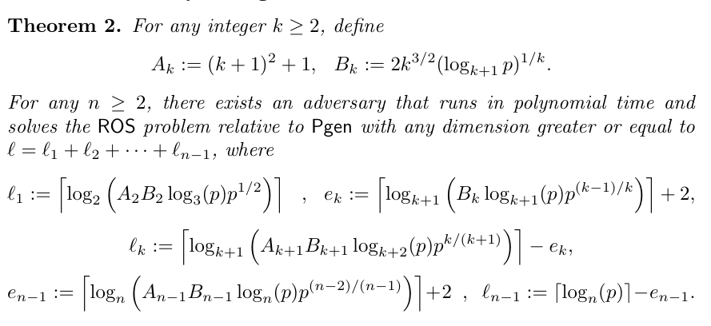

这次做出了前两道，后两道主要是复现一位✌的wp（*表示赛中未出的题）

# sign (in) the ca7s

## 题目

因为两道题的本质都是一样的，所以我就融合成一道题一块来讲了。


<details>
    <summary><b>点击展开代码</b></summary>


```python
from Crypto.Util.number import bytes_to_long
from hashlib import md5
import os
FLAG1 = os.environ.get("FLAG", "flag{**redacted**}")
FLAG2 = os.environ.get("FLAG", "flag{**redacted1**}")

E = EllipticCurve(GF(0x1337_ca7_eae368ff5d702e6067aaaa77ca_ca7_1337), [0, 3])
G, n = E(1, 2), E.order()

def sign(priv, ctx, msg):
    k = bytes_to_long(ctx + md5(str(priv).encode() + msg).digest())
    z = bytes_to_long(md5(ctx + msg).digest())
    r = int((k * G).x()) % n
    s = (pow(k, -1, n) * (z + r * priv)) % n
    return r, s

def verify(pub, ctx, msg, sig):
    z = bytes_to_long(md5(ctx + msg).digest())
    r, s = sig
    if 0 < r < n and 0 < s < n:
        return r == int((pow(s, -1, n) * (z * G + r * pub)).x()) % n

def chall(level, flag):
    priv = randint(1, n - 1)
    pub = priv * G
    msg = os.urandom(64)
    

    print(f"=== level {level} ===")
    for _ in range(catalan_number(level)):
        ctx = bytes.fromhex(input('context: '))
        r, s = sign(priv, ctx, msg)
        assert verify(pub, ctx, msg, (r, s))
        if level <= 1: print('message:', msg.hex())
        if level <= 2: print('sign:', r)
        if level <= 3: print('ature:', s)
    
    r, s = map(int, input('signature: ').split())
    assert verify(pub, b'n1junior_2025', f'cat /flag{level}'.encode(), (r, s))
    print(f'flag{level}:', flag)

if __name__ == "__main__":
    chall(0, "💧")
    chall(1, "🐱")
    chall(2, FLAG1)
    chall(3, FLAG2)
```


</details>


## 解题分析

### 一，MD5碰撞

这里主要还是先讲这道题的主要考点——**MD5哈希碰撞**。

对于这道题而言，也就是：**存在任意$n$个不同的$ctx_i$，使得对应的哈希值是相同的**；这里需要使用的工具是一个能实现“MD5碰撞”的工具（比如fastcoll）；想了解具体原理的话，可以参考[Fast Collision Attack on MD5](https://marc-stevens.nl/research/hashclash/fastcoll.pdf)，我这里就直接说具体的做法（或者说——**怎么通过fastcoll来生成多个符合条件的$ctx_i$**）。

我是直接在win上用的fastcoll.exe，因此运行一次，最多只能生成两个符合条件的ctx。

比如说，我这里以 **”test“** 为前缀（放在test.txt里了），运行一次可以得到这样的两个ctx：

<details>
    <summary><b>点击展开代码</b></summary>


```python
# .\fastcoll.exe -p test.txt -o md5_msg1.txt md5_msg2.txt
ctx1 = b"test\x00\x00\x00\x00\x00\x00\x00\x00\x00\x00\x00\x00\x00\x00\x00\x00\x00\x00\x00\x00\x00\x00\x00\x00\x00\x00\x00\x00\x00\x00\x00\x00\x00\x00\x00\x00\x00\x00\x00\x00\x00\x00\x00\x00\x00\x00\x00\x00\x00\x00\x00\x00\x00\x00\x00\x00\x00\x00\x00\x00)\xc0{xA\x00\x9f\xaaX\xa7\xee2\x0b\xfb\xad\x12\x9c\xb4%\xd5dVG\xa91bCQM\x90\xa6\x08\x98+\xa9\xc4^'\x1c,\x87ju\x9a\xf3\x8d+WSv\x97?\xdd-\\\xd3\x04\xbd\x1e\x80Y\xb2\x08\xe9\xeb/\xb160\xadE\x03\x7f'\xf1\xec\x01\x06\x08\x08\x9e\xff\x83\x0b%\x06.#\xc9\x1a\xf6\xbb\xecF\xfeg\xd0[\x9eX\x04\x8f\xe4Az\x1fMO\xe20\xd5&GF\x96<\xee/\xcdfVb\x0e$\xba8\x9cg"
ctx2 = b"test\x00\x00\x00\x00\x00\x00\x00\x00\x00\x00\x00\x00\x00\x00\x00\x00\x00\x00\x00\x00\x00\x00\x00\x00\x00\x00\x00\x00\x00\x00\x00\x00\x00\x00\x00\x00\x00\x00\x00\x00\x00\x00\x00\x00\x00\x00\x00\x00\x00\x00\x00\x00\x00\x00\x00\x00\x00\x00\x00\x00)\xc0{xA\x00\x9f\xaaX\xa7\xee2\x0b\xfb\xad\x12\x9c\xb4%UdVG\xa91bCQM\x90\xa6\x08\x98+\xa9\xc4^'\x1c,\x87ju\x9a\xf3\r,WSv\x97?\xdd-\\\xd3\x04\xbd\x1e\x00Y\xb2\x08\xe9\xeb/\xb160\xadE\x03\x7f'\xf1\xec\x01\x06\x08\x08\x9e\xff\x83\x8b%\x06.#\xc9\x1a\xf6\xbb\xecF\xfeg\xd0[\x9eX\x04\x8f\xe4Az\x1fMO\xe2\xb0\xd4&GF\x96<\xee/\xcdfVb\x0e\xa4\xba8\x9cg"
```

</details>

我们去查看后缀（除去前缀外的部分）会发现——**长度一致但内容不同**；而且这两个ctx长度**都是64bytes的整数倍**（刚好是一个哈希分组块的长度）

```python
# len("test") = 4
print(len(ctx1[4:])==len(ctx2[4:]), ctx1[4:]==ctx2[4:])
# True False
```

而这就是我们通过fastcoll做这道题的一个关键点了。

假如我们此时以ctx1为我们的前缀，再次使用fastcoll去生成ctx3和ctx4，并检查此时的后缀（与ctx1相比多出的部分）会发现——仍然是**长度一致但内容不同**；而且这两个ctx长度**依然都是64bytes的整数倍**。

<details>
    <summary><b>点击展开代码</b></summary>


```python
# .\fastcoll.exe -p test.txt -o md5_msg1.txt md5_msg2.txt
ctx3 = b"test\x00\x00\x00\x00\x00\x00\x00\x00\x00\x00\x00\x00\x00\x00\x00\x00\x00\x00\x00\x00\x00\x00\x00\x00\x00\x00\x00\x00\x00\x00\x00\x00\x00\x00\x00\x00\x00\x00\x00\x00\x00\x00\x00\x00\x00\x00\x00\x00\x00\x00\x00\x00\x00\x00\x00\x00\x00\x00\x00\x00)\xc0{xA\x00\x9f\xaaX\xa7\xee2\x0b\xfb\xad\x12\x9c\xb4%\xd5dVG\xa91bCQM\x90\xa6\x08\x98+\xa9\xc4^'\x1c,\x87ju\x9a\xf3\x8d+WSv\x97?\xdd-\\\xd3\x04\xbd\x1e\x80Y\xb2\x08\xe9\xeb/\xb160\xadE\x03\x7f'\xf1\xec\x01\x06\x08\x08\x9e\xff\x83\x0b%\x06.#\xc9\x1a\xf6\xbb\xecF\xfeg\xd0[\x9eX\x04\x8f\xe4Az\x1fMO\xe20\xd5&GF\x96<\xee/\xcdfVb\x0e$\xba8\x9cg\xbe\x98\xa9\xfcW\x1c=\xb6\xbbE\xc0\xdf\xd5\xf7\x82\xea\xc85\xeb\x96\xdb\xc6\xaa\x9a!\xf69a\x15(\x1b'\xc6\xf9\xb5\xb8^\xcd?x\x8b\xe4O\x12\xee\x11!G\x8a\xcf*\xdc={\x0f;\xc9\xef\x9ba\xaf5\xd9B\xfa\xafx\xaf\xd4\x83\xc5\xb9\xc3\r\xbf\x03\xf7\xcfj8G\x11cWpY\x93(+\xb3\x10w\x06`\xa8\xc6\xcbKN\x14\xaf\xc7[^:\t\x0c\\\x8b_\x17\xe2\xa8\x81\x0c\xb3$\x86]IblU\xd4\x86\x04\x15\xcc"
ctx4 = b"test\x00\x00\x00\x00\x00\x00\x00\x00\x00\x00\x00\x00\x00\x00\x00\x00\x00\x00\x00\x00\x00\x00\x00\x00\x00\x00\x00\x00\x00\x00\x00\x00\x00\x00\x00\x00\x00\x00\x00\x00\x00\x00\x00\x00\x00\x00\x00\x00\x00\x00\x00\x00\x00\x00\x00\x00\x00\x00\x00\x00)\xc0{xA\x00\x9f\xaaX\xa7\xee2\x0b\xfb\xad\x12\x9c\xb4%\xd5dVG\xa91bCQM\x90\xa6\x08\x98+\xa9\xc4^'\x1c,\x87ju\x9a\xf3\x8d+WSv\x97?\xdd-\\\xd3\x04\xbd\x1e\x80Y\xb2\x08\xe9\xeb/\xb160\xadE\x03\x7f'\xf1\xec\x01\x06\x08\x08\x9e\xff\x83\x0b%\x06.#\xc9\x1a\xf6\xbb\xecF\xfeg\xd0[\x9eX\x04\x8f\xe4Az\x1fMO\xe20\xd5&GF\x96<\xee/\xcdfVb\x0e$\xba8\x9cg\xbe\x98\xa9\xfcW\x1c=\xb6\xbbE\xc0\xdf\xd5\xf7\x82\xea\xc85\xeb\x16\xdb\xc6\xaa\x9a!\xf69a\x15(\x1b'\xc6\xf9\xb5\xb8^\xcd?x\x8b\xe4O\x12\xee\x91!G\x8a\xcf*\xdc={\x0f;\xc9\xef\x9b\xe1\xaf5\xd9B\xfa\xafx\xaf\xd4\x83\xc5\xb9\xc3\r\xbf\x03\xf7\xcfj8G\x11c\xd7pY\x93(+\xb3\x10w\x06`\xa8\xc6\xcbKN\x14\xaf\xc7[^:\t\x0c\\\x8b\xdf\x16\xe2\xa8\x81\x0c\xb3$\x86]IblUT\x86\x04\x15\xcc"

print(len(t3[len(t1):])==len(t4[len(t1):]), t1[len(t1):]==t2[len(t1):])
# True True

# 这里假设以"test"为前缀来看
print(len(t3[4:])==len(t4[4:]), t1[4:]==t2[4:])
# True False
```

</details>

看到这的师傅，应该会有这么个猜想：因为此时是以ctx1为前缀生成的ctx3和ctx4，且ctx3和ctx4的后缀也跟前面ctx1和ctx2的后缀是同一规律；那**会不会ctx3和ctx4的后缀给ctx2也能生成同样的MD5值呢？**

答案是肯定的：

<details>
    <summary><b>点击展开代码</b></summary>


```python
from hashlib import md5
ctx1 = b"test\x00\x00\x00\x00\x00\x00\x00\x00\x00\x00\x00\x00\x00\x00\x00\x00\x00\x00\x00\x00\x00\x00\x00\x00\x00\x00\x00\x00\x00\x00\x00\x00\x00\x00\x00\x00\x00\x00\x00\x00\x00\x00\x00\x00\x00\x00\x00\x00\x00\x00\x00\x00\x00\x00\x00\x00\x00\x00\x00\x00)\xc0{xA\x00\x9f\xaaX\xa7\xee2\x0b\xfb\xad\x12\x9c\xb4%\xd5dVG\xa91bCQM\x90\xa6\x08\x98+\xa9\xc4^'\x1c,\x87ju\x9a\xf3\x8d+WSv\x97?\xdd-\\\xd3\x04\xbd\x1e\x80Y\xb2\x08\xe9\xeb/\xb160\xadE\x03\x7f'\xf1\xec\x01\x06\x08\x08\x9e\xff\x83\x0b%\x06.#\xc9\x1a\xf6\xbb\xecF\xfeg\xd0[\x9eX\x04\x8f\xe4Az\x1fMO\xe20\xd5&GF\x96<\xee/\xcdfVb\x0e$\xba8\x9cg"
ctx2 = b"test\x00\x00\x00\x00\x00\x00\x00\x00\x00\x00\x00\x00\x00\x00\x00\x00\x00\x00\x00\x00\x00\x00\x00\x00\x00\x00\x00\x00\x00\x00\x00\x00\x00\x00\x00\x00\x00\x00\x00\x00\x00\x00\x00\x00\x00\x00\x00\x00\x00\x00\x00\x00\x00\x00\x00\x00\x00\x00\x00\x00)\xc0{xA\x00\x9f\xaaX\xa7\xee2\x0b\xfb\xad\x12\x9c\xb4%UdVG\xa91bCQM\x90\xa6\x08\x98+\xa9\xc4^'\x1c,\x87ju\x9a\xf3\r,WSv\x97?\xdd-\\\xd3\x04\xbd\x1e\x00Y\xb2\x08\xe9\xeb/\xb160\xadE\x03\x7f'\xf1\xec\x01\x06\x08\x08\x9e\xff\x83\x8b%\x06.#\xc9\x1a\xf6\xbb\xecF\xfeg\xd0[\x9eX\x04\x8f\xe4Az\x1fMO\xe2\xb0\xd4&GF\x96<\xee/\xcdfVb\x0e\xa4\xba8\x9cg"
ctx3 = b"test\x00\x00\x00\x00\x00\x00\x00\x00\x00\x00\x00\x00\x00\x00\x00\x00\x00\x00\x00\x00\x00\x00\x00\x00\x00\x00\x00\x00\x00\x00\x00\x00\x00\x00\x00\x00\x00\x00\x00\x00\x00\x00\x00\x00\x00\x00\x00\x00\x00\x00\x00\x00\x00\x00\x00\x00\x00\x00\x00\x00)\xc0{xA\x00\x9f\xaaX\xa7\xee2\x0b\xfb\xad\x12\x9c\xb4%\xd5dVG\xa91bCQM\x90\xa6\x08\x98+\xa9\xc4^'\x1c,\x87ju\x9a\xf3\x8d+WSv\x97?\xdd-\\\xd3\x04\xbd\x1e\x80Y\xb2\x08\xe9\xeb/\xb160\xadE\x03\x7f'\xf1\xec\x01\x06\x08\x08\x9e\xff\x83\x0b%\x06.#\xc9\x1a\xf6\xbb\xecF\xfeg\xd0[\x9eX\x04\x8f\xe4Az\x1fMO\xe20\xd5&GF\x96<\xee/\xcdfVb\x0e$\xba8\x9cg\xbe\x98\xa9\xfcW\x1c=\xb6\xbbE\xc0\xdf\xd5\xf7\x82\xea\xc85\xeb\x96\xdb\xc6\xaa\x9a!\xf69a\x15(\x1b'\xc6\xf9\xb5\xb8^\xcd?x\x8b\xe4O\x12\xee\x11!G\x8a\xcf*\xdc={\x0f;\xc9\xef\x9ba\xaf5\xd9B\xfa\xafx\xaf\xd4\x83\xc5\xb9\xc3\r\xbf\x03\xf7\xcfj8G\x11cWpY\x93(+\xb3\x10w\x06`\xa8\xc6\xcbKN\x14\xaf\xc7[^:\t\x0c\\\x8b_\x17\xe2\xa8\x81\x0c\xb3$\x86]IblU\xd4\x86\x04\x15\xcc"
ctx4 = b"test\x00\x00\x00\x00\x00\x00\x00\x00\x00\x00\x00\x00\x00\x00\x00\x00\x00\x00\x00\x00\x00\x00\x00\x00\x00\x00\x00\x00\x00\x00\x00\x00\x00\x00\x00\x00\x00\x00\x00\x00\x00\x00\x00\x00\x00\x00\x00\x00\x00\x00\x00\x00\x00\x00\x00\x00\x00\x00\x00\x00)\xc0{xA\x00\x9f\xaaX\xa7\xee2\x0b\xfb\xad\x12\x9c\xb4%\xd5dVG\xa91bCQM\x90\xa6\x08\x98+\xa9\xc4^'\x1c,\x87ju\x9a\xf3\x8d+WSv\x97?\xdd-\\\xd3\x04\xbd\x1e\x80Y\xb2\x08\xe9\xeb/\xb160\xadE\x03\x7f'\xf1\xec\x01\x06\x08\x08\x9e\xff\x83\x0b%\x06.#\xc9\x1a\xf6\xbb\xecF\xfeg\xd0[\x9eX\x04\x8f\xe4Az\x1fMO\xe20\xd5&GF\x96<\xee/\xcdfVb\x0e$\xba8\x9cg\xbe\x98\xa9\xfcW\x1c=\xb6\xbbE\xc0\xdf\xd5\xf7\x82\xea\xc85\xeb\x16\xdb\xc6\xaa\x9a!\xf69a\x15(\x1b'\xc6\xf9\xb5\xb8^\xcd?x\x8b\xe4O\x12\xee\x91!G\x8a\xcf*\xdc={\x0f;\xc9\xef\x9b\xe1\xaf5\xd9B\xfa\xafx\xaf\xd4\x83\xc5\xb9\xc3\r\xbf\x03\xf7\xcfj8G\x11c\xd7pY\x93(+\xb3\x10w\x06`\xa8\xc6\xcbKN\x14\xaf\xc7[^:\t\x0c\\\x8b\xdf\x16\xe2\xa8\x81\x0c\xb3$\x86]IblUT\x86\x04\x15\xcc"

print(md5(ctx3).hexdigest())
print(md5(ctx2+ctx3[len(ctx2):]).hexdigest())
print(md5(ctx2+ctx4[len(ctx2):]).hexdigest())
"""
f5624faf5b3f1d67342a20d7bbeb0f81
f5624faf5b3f1d67342a20d7bbeb0f81
f5624faf5b3f1d67342a20d7bbeb0f81
"""
```

</details>

此时我们便获得了$2^2=4$个可能的$ctx_i$，那假如以ctx3为前缀继续呢？

那便如下图所示：


此时就有$2^3=8$个可能的$ctx_i$

组合方式为：
$$
ctx_i=M+(A_1/A_2)+(B_1/B_2)+(C_1/C_2)+(D_1/D_2)
$$
于是就说明：**每次生成的两个后缀和前一次的未用前缀拼起来，可以的得到此时的同一md5值的两个串**。

所以我们手动$n$次fastcoll，就可以组合出$2^n$个我们需要的$ctx_i$（当然，其实maple师傅之前有出过一道题，对应的[解题脚本](https://github.com/maple3142/My-CTF-Challenges/blob/master/ImaginaryCTF/Round%2055/MagicHash/solve.py)里就实现了这一功能）。

### 二，具体题目

题目中提供数据的部分是这里：

```python
# 这里依据当时做题的时候测出来的情况而写的
def catalan_number(L):
    if L in [0, 1]:
        return 1
    elif L == 2:
        return 2
    else:
        return 5

def sign(priv, ctx, msg):
    k = bytes_to_long(ctx + md5(str(priv).encode() + msg).digest())
    z = bytes_to_long(md5(ctx + msg).digest())
    r = int((k * G).x()) % n
    s = (pow(k, -1, n) * (z + r * priv)) % n
    return r, s

def verify(pub, ctx, msg, sig):
    z = bytes_to_long(md5(ctx + msg).digest())
    r, s = sig
    if 0 < r < n and 0 < s < n:
        return r == int((pow(s, -1, n) * (z * G + r * pub)).x()) % n

def chall(level, flag):
    priv = randint(1, n - 1)
    pub = priv * G
    msg = os.urandom(64)
    
    print(f"=== level {level} ===")
    for _ in range(catalan_number(level)):
        ctx = bytes.fromhex(input('context: '))
        r, s = sign(priv, ctx, msg)
        assert verify(pub, ctx, msg, (r, s))
        if level <= 1: print('message:', msg.hex())
        if level <= 2: print('sign:', r)
        if level <= 3: print('ature:', s)
    
    r, s = map(int, input('signature: ').split())
    assert verify(pub, b'n1junior_2025', f'cat /flag{level}'.encode(), (r, s))
    print(f'flag{level}:', flag)
```

这题的签名算法是**ECDSA**，题目是让我们根据一定的交互次数与交互后的数据来算出私钥**priv**，从而伪造签名通过verify的验证。

因此我就按给的level来逐一说明。

#### Level 0/1

此时题目只给了我们一次**输入ctx**的机会，并获得一组**msg、sign、ature**（后两个是**r和s**）。

而我们知道ECDSA的签名是这样的：
$$
H=md5(ctx + msg),\ k=ctx+md5(priv+msg)\ mod\ n\\
s=k^{-1}(H+r*d)\ mod\ n
$$
于是我们就可以得到：
$$
d=(s*k-H)*r^{-1}\ mod\ n
$$
不过这里会有个问题：因为`r = int((k * G).x()) % n`，假如使用`E.lift_x(r)`，我们只是得到一个坐标 $(x,\ y)$，但有可能我们需要的正确坐标是 $(x,\ -y)$。

好在这里条件充分，且有`k = bytes_to_long(ctx + md5(str(priv).encode() + msg).digest())`，所以我们可以验证这个式子是否成立来判断取 $(x,\ y)$还是 $(x,\ -y)$，最后就是去仿造r和s了。

```python
# sage 10.6

# =============Level 0=============
io.recvuntil(b"context: ")
io.sendline(b"")
msg = bytes.fromhex(io.recvline().split()[-1].decode())
r = eval(io.recvline().split()[-1].decode())
s = eval(io.recvline().split()[-1].decode())

# s = (pow(k, -1, n) * (z + r * priv)) % n
z = bytes_to_long(md5(msg).digest())
k1 = (E.lift_x(Integer(r))).log(G)
k2 = (-E.lift_x(Integer(r))).log(G)
priv = ((s*k1-z)*invert(r, n))%n
priv_i = ((s*k1-z)*invert(r, n))%n
if k1 != bytes_to_long(md5(str(priv).encode() + msg).digest()):
    priv = priv_i
r, s = Sign(priv, b'n1junior_2025', f'cat /flag{level}'.encode())
io.recvuntil(b"signature: ")
io.sendline(b" ".join([str(r).encode(), str(s).encode()]))
c1 = io.recvline().decode()
print(c1)
level += 1
# flag0: 💧

# =============Level 1=============
io.recvuntil(b"context: ")
io.sendline(b"")
msg = bytes.fromhex(io.recvline().split()[-1].decode())
r = eval(io.recvline().split()[-1].decode())
s = eval(io.recvline().split()[-1].decode())

# s = (pow(k, -1, n) * (z + r * priv)) % n
z = bytes_to_long(md5(msg).digest())
k1 = (E.lift_x(Integer(r))).log(G)
k2 = (-E.lift_x(Integer(r))).log(G)
priv = ((s*k1-z)*invert(r, n))%n
priv_i = ((s*k1-z)*invert(r, n))%n
if k1 != bytes_to_long(md5(str(priv).encode() + msg).digest()):
    priv = priv_i
r, s = Sign(priv, b'n1junior_2025', f'cat /flag{level}'.encode())
io.recvuntil(b"signature: ")
io.sendline(b" ".join([str(r).encode(), str(s).encode()]))
c1 = io.recvline().decode()
print(c1)
level += 1
# flag1: 🐱
```

#### Level 2

此时题目给了我们两次**输入ctx**的机会，并获得两组**sign、ature**（也就是**r和s**）。

而前面介绍MD5碰撞的时候有说到**可以利用n次fastcoll来构造$2^n$个我们需要的$ctx_i$**。

于是我们就可以构造出两个ctx，直接传到靶机上去获取数据（毕竟ctx**都是64bytes的整数倍**，所以不影响最后的哈希值的一致），从而就有下列推导：
$$
\begin{align*}
s_1*k_1&=(H+r_1*d)\ mod\ n\\
s_2*k_2&=(H+r_2*d)\ mod\ n\\
s_2*k_2-s_1*k_1&=[(r_2-r_1)*d]\ mod\ n\\
d&=(s_2*k_2-s_1*k_1)*(r_2-r_1)^{-1}\ mod\ n
\end{align*}
$$
这里同样会有坐标 $(x,\ y)$与坐标 $(x,\ -y)$的取舍。

不过，我们如果去写代码去测试正确的$k$与我们计算的$k$的区别，会发现这样一个结论：**$ctx_1*256^{16}\ mod\ n$与正确的$k$的绝对值一定是最小的！**

所以我们可以由此来判断取 $(x,\ y)$还是 $(x,\ -y)$，最后就是去仿造r和s了。

```python
# sage 10.6

# =============Level 2=============
t1 = 
t2 = 
tt1 = int(bytes_to_long(t1)*256**16%n)
tt2 = int(bytes_to_long(t2)*256**16%n)
io.recvuntil(b"context: ")
io.sendline(t1.hex().encode())
r1 = eval(io.recvline().split()[-1].decode())
s1 = eval(io.recvline().split()[-1].decode())

io.recvuntil(b"context: ")
io.sendline(t2.hex().encode())
r2 = eval(io.recvline().split()[-1].decode())
s2 = eval(io.recvline().split()[-1].decode())

# s = (pow(k, -1, n) * (z + r * priv)) % n
k1 = (E.lift_x(Integer(r1))).log(G)
k2 = (E.lift_x(Integer(r2))).log(G)
k11 = (-E.lift_x(Integer(r1))).log(G)
k22 = (-E.lift_x(Integer(r2))).log(G)
if abs(tt1-k1) > abs(tt1-k11):
    k1 = k11
if abs(tt2-k2) > abs(tt2-k22):
    k2 = k22
priv = ((s1*k1-s2*k2)*invert(r1-r2, n))%n
r, s = Sign(priv, b'n1junior_2025', f'cat /flag{level}'.encode())
io.recvuntil(b"signature: ")
io.sendline(b" ".join([str(r).encode(), str(s).encode()]))
c2 = io.recvline().decode()
print(c2)
level += 1
# flag2: flag{**redacted**}
```

#### Level 3

此时题目给了我们五次**输入ctx**的机会，并获得五个**ature**（即**s**）。

与Level2一样，构造五个$ctx$，直接传到靶机上去获取数据，来得到五个**ature**（即**s**）。

此时我们便有这五个式子（我假设叫**方程组1**）：
$$
\begin{align*}
s_1*k_1&=(H+r_1*d)\ mod\ n\\
s_2*k_2&=(H+r_2*d)\ mod\ n\\
s_3*k_3&=(H+r_3*d)\ mod\ n\\
s_4*k_4&=(H+r_4*d)\ mod\ n\\
s_5*k_5&=(H+r_5*d)\ mod\ n
\end{align*}
$$
此时，未知数的数量是大于方程数量的（**12>5**）。但是，我们别忘了这个：
$$
\begin{align*}
k_1&={ctx}_1*256^{16} + md5(priv+msg)\\
k_2&={ctx}_2*256^{16} + md5(priv+msg)\\
k_3&={ctx}_3*256^{16} + md5(priv+msg)\\
k_4&={ctx}_4*256^{16} + md5(priv+msg)\\
k_5&={ctx}_5*256^{16} + md5(priv+msg)
\end{align*}
$$
如果我们以$k_0$为我们的未知量，那么我们便有（我假设叫**方程组2**）：
$$
\begin{align*}
k_1&=k_0\\
k_2&=k_0+({ctx}_2-{ctx}_1)*256^{16}\\
k_3&=k_0+({ctx}_3-{ctx}_1)*256^{16}\\
k_4&=k_0+({ctx}_4-{ctx}_1)*256^{16}\\
k_5&=k_0+({ctx}_5-{ctx}_1)*256^{16}
\end{align*}
$$
此时未知数的数量就减少为8个，仍大于我们的方程数。

于是还需要结合这个：
$$
\begin{align*}
r_1&=(k_1G)_x\\
r_2&=(k_2G)_x\\
r_3&=(k_3G)_x\\
r_4&=(k_4G)_x\\
r_5&=(k_5G)_x
\end{align*}
$$
此时便有：
$$
\begin{align*}
r_1&=(k_0G)_x\\
r_2&=[k_0G+({ctx}_2-{ctx}_1)G]_x=[k_0G+A]_x\\
r_3&=[k_0G+({ctx}_3-{ctx}_1)G]_x=[k_0G+B]_x\\
r_4&=[k_0G+({ctx}_4-{ctx}_1)G]_x=[k_0G+C]_x\\
r_5&=[k_0G+({ctx}_5-{ctx}_1)G]_x=[k_0G+D]_x
\end{align*}
$$
此时的未知数数量就减少到3个，小于我们的方程数。

但是，这样实现起来，还需要自己实现一个椭圆运算（因为$k_0$可不是数值），显得过于复杂了，那有没有更简单的方法呢？有的，兄弟有的！

既然是椭圆运算了，那不妨设$x_0$和$y_0$使得：
$$
(k_0G)=(x_0,\ y_0)
$$
于是便有（我假设叫**方程组3**）：
$$
\begin{align*}
r_1&=x_0\\
r_2&=[(\frac{A_y-y_0}{A_x-x_0})^2-(x_0+A_x)]\ mod\ n\\
r_3&=[(\frac{B_y-y_0}{B_x-x_0})^2-(x_0+B_x)]\ mod\ n\\
r_4&=[(\frac{C_y-y_0}{C_x-x_0})^2-(x_0+C_x)]\ mod\ n\\
r_5&=[(\frac{D_y-y_0}{D_x-x_0})^2-(x_0+D_x)]\ mod\ n
\end{align*}
$$
结合**方程组1**、**方程组2**、**方程组3**，整理一下就有：
$$
\begin{align*}
f_1&=s_1*k_1-H-x_0*d\\
f_2&=s_2*k_2*(A_x-x_0)^2-H*(A_x-x_0)^2-[(A_y-y_0)^2-(x_0+A_x)*(A_x-x_0)^2]*d\\
f_3&=s_3*k_3*(B_x-x_0)^2-H*(B_x-x_0)^2-[(B_y-y_0)^2-(x_0+B_x)*(B_x-x_0)^2]*d\\
f_4&=s_4*k_4*(C_x-x_0)^2-H*(C_x-x_0)^2-[(C_y-y_0)^2-(x_0+C_x)*(C_x-x_0)^2]*d\\
f_5&=s_5*k_5*(D_x-x_0)^2-H*(D_x-x_0)^2-[(D_y-y_0)^2-(x_0+D_x)*(D_x-x_0)^2]*d
\end{align*}
$$
此时的未知数数量为5个，刚好就是我们的方程数。

然后我们再用下`groebner_basis`，计算出$d$然后去伪造r跟s就行了。

```python
# sage 10.6

# =============Level 3=============
tt = []
t_int = [bytes_to_long(i) for i in tt]
io.recvuntil(b"context: ")
sh = []
R = PolynomialRing(GF(n), "k0, z, x0, y0, d")
k0, z, x0, y0, d = R.gens()
io.sendline(tt[0].hex().encode())
sh.append(eval(io.recvline().split()[-1].decode()))
eqs = [y0**2-(x0**3+3), sh[0]*k0-(z+x0*d)]
for i in range(1, 5):
    io.recvuntil(b"context: ")
    ki = k0 + (t_int[i]-t_int[0])*(256**16)
    del_k = (t_int[i]-t_int[0])*(256**16)*G
    del_kx, del_ky = del_k.xy()
    sl = (del_ky-y0)/(del_kx-x0)
    xi = sl**2-x0-del_kx
    io.sendline(tt[i].hex().encode())
    sh.append(eval(io.recvline().split()[-1].decode()))
    eqs.append((sh[i]*ki-(z+xi*d)).numerator())
# print("over")
I = R.ideal(eqs)
priv = I.groebner_basis()[-1]
# print(priv)
priv = int(-priv.coefficients()[-1])
r, s = Sign(priv, b'n1junior_2025', f'cat /flag{level}'.encode())
io.recvuntil(b"signature: ")
io.sendline(b" ".join([str(r).encode(), str(s).encode()]))
c3 = io.recvline().decode()
print(c3)
# flag3: flag{**redacted1**}
```

## exp

<details>
    <summary><b>点击展开代码</b></summary>


```python
# sage10.6
from pwn import *
from sage.all import *
from gmpy2 import invert
from Crypto.Util.number import *
from hashlib import md5


def Sign(priv, ctx, msg):
    k = bytes_to_long(ctx + md5(str(priv).encode() + msg).digest())
    z = bytes_to_long(md5(ctx + msg).digest())
    r = int((k * G).x()) % n
    s = (pow(k, -1, n) * (z + r * priv)) % n
    return r, s


E = EllipticCurve(GF(0x1337_ca7_eae368ff5d702e6067aaaa77ca_ca7_1337), [0, 3])
G, n = E(1, 2), E.order()
# io = remote("60.205.163.215", int(27074))
io = process(['sage', 'test.sage'])
level = 0


# =============Level 0=============
io.recvuntil(b"context: ")
io.sendline(b"")
msg = bytes.fromhex(io.recvline().split()[-1].decode())
r = eval(io.recvline().split()[-1].decode())
s = eval(io.recvline().split()[-1].decode())

# s = (pow(k, -1, n) * (z + r * priv)) % n
z = bytes_to_long(md5(msg).digest())
k1 = (E.lift_x(Integer(r))).log(G)
k2 = (-E.lift_x(Integer(r))).log(G)
priv = ((s*k1-z)*invert(r, n))%n
priv_i = ((s*k1-z)*invert(r, n))%n
if k1 != bytes_to_long(md5(str(priv).encode() + msg).digest()):
    priv = priv_i
r, s = Sign(priv, b'n1junior_2025', f'cat /flag{level}'.encode())
io.recvuntil(b"signature: ")
io.sendline(b" ".join([str(r).encode(), str(s).encode()]))
c1 = io.recvline().decode()
print(c1)
level += 1


# =============Level 1=============
io.recvuntil(b"context: ")
io.sendline(b"")
msg = bytes.fromhex(io.recvline().split()[-1].decode())
r = eval(io.recvline().split()[-1].decode())
s = eval(io.recvline().split()[-1].decode())

# s = (pow(k, -1, n) * (z + r * priv)) % n
z = bytes_to_long(md5(msg).digest())
k1 = (E.lift_x(Integer(r))).log(G)
k2 = (-E.lift_x(Integer(r))).log(G)
priv = ((s*k1-z)*invert(r, n))%n
priv_i = ((s*k1-z)*invert(r, n))%n
if k1 != bytes_to_long(md5(str(priv).encode() + msg).digest()):
    priv = priv_i
r, s = Sign(priv, b'n1junior_2025', f'cat /flag{level}'.encode())
io.recvuntil(b"signature: ")
io.sendline(b" ".join([str(r).encode(), str(s).encode()]))
c1 = io.recvline().decode()
print(c1)
level += 1


# =============Level 2=============
t1 = 
t2 = 
tt1 = int(bytes_to_long(t1)*256**16%n)
tt2 = int(bytes_to_long(t2)*256**16%n)
io.recvuntil(b"context: ")
io.sendline(t1.hex().encode())
r1 = eval(io.recvline().split()[-1].decode())
s1 = eval(io.recvline().split()[-1].decode())

io.recvuntil(b"context: ")
io.sendline(t2.hex().encode())
r2 = eval(io.recvline().split()[-1].decode())
s2 = eval(io.recvline().split()[-1].decode())

# s = (pow(k, -1, n) * (z + r * priv)) % n
k1 = (E.lift_x(Integer(r1))).log(G)
k2 = (E.lift_x(Integer(r2))).log(G)
k11 = (-E.lift_x(Integer(r1))).log(G)
k22 = (-E.lift_x(Integer(r2))).log(G)
if abs(tt1-k1) > abs(tt1-k11):
    k1 = k11
if abs(tt2-k2) > abs(tt2-k22):
    k2 = k22
priv = ((s1*k1-s2*k2)*invert(r1-r2, n))%n
r, s = Sign(priv, b'n1junior_2025', f'cat /flag{level}'.encode())
io.recvuntil(b"signature: ")
io.sendline(b" ".join([str(r).encode(), str(s).encode()]))
c2 = io.recvline().decode()
print(c2)
level += 1


# =============Level 3=============
tt = []
t_int = [bytes_to_long(i) for i in tt]
io.recvuntil(b"context: ")
sh = []
R = PolynomialRing(GF(n), "k0, z, x0, y0, d")
k0, z, x0, y0, d = R.gens()
io.sendline(tt[0].hex().encode())
sh.append(eval(io.recvline().split()[-1].decode()))
eqs = [y0**2-(x0**3+3), sh[0]*k0-(z+x0*d)]
for i in range(1, 5):
    io.recvuntil(b"context: ")
    ki = k0 + (t_int[i]-t_int[0])*(256**16)
    del_k = (t_int[i]-t_int[0])*(256**16)*G
    del_kx, del_ky = del_k.xy()
    sl = (del_ky-y0)/(del_kx-x0)
    xi = sl**2-x0-del_kx
    io.sendline(tt[i].hex().encode())
    sh.append(eval(io.recvline().split()[-1].decode()))
    eqs.append((sh[i]*ki-(z+xi*d)).numerator())
# print("over")
I = R.ideal(eqs)
priv = I.groebner_basis()[-1]
# print(priv)
priv = int(-priv.coefficients()[-1])
r, s = Sign(priv, b'n1junior_2025', f'cat /flag{level}'.encode())
io.recvuntil(b"signature: ")
io.sendline(b" ".join([str(r).encode(), str(s).encode()]))
c3 = io.recvline().decode()
print(c3)

"""
flag0: 💧

flag1: 🐱

flag2: flag{**redacted**}

flag3: flag{**redacted1**}

"""
```

</details>

<hr style="border: 0.5px solid #36add4;"/>

# *sign one m0re

## 题目

```python
from fastecdsa.curve import secp256k1
from fastecdsa.point import Point
from secrets import randbelow
from hashlib import sha512
import signal
import os

FLAG = os.environ.get("FLAG", "flag{**redacted**}")

MAX_SESSIONS = 192

p, q, G = secp256k1.p, secp256k1.q, secp256k1.G
info = int.from_bytes(b"[N1CTF Junior 2025]", "big")
z = Point(info, pow(info ** 3 + 7, (p + 1) // 4, p), secp256k1)

class Signer:
    def __init__(self):
        self.x = randbelow(q)
        self.y = self.x * G
        self.sessions = {sid: (0, ) for sid in range(MAX_SESSIONS)}
    
    def get_public_key(self):
        return self.y
    
    def commit(self, sid):
        assert sid in range(MAX_SESSIONS), "Invalid session"
        assert self.sessions[sid][0] == 0, "Invalid state"
        u, s, d = [randbelow(q) for _ in range(3)]
        a, b = u * G, s * G + d * z
        self.sessions[sid] = (1, u, s, d)
        return a, b
    
    def sign(self, sid, e):
        assert sid in range(MAX_SESSIONS), "Invalid session"
        assert self.sessions[sid][0] == 1, "Invalid state"
        assert 1 < e < q, "Invalid query"
        _, u, s, d = self.sessions[sid]
        c = (e - d) % q
        r = (u - c * self.x) % q
        self.sessions[sid] = (2, )
        return r, c, s, d

class Verifier:
    def __init__(self):
        self.messages = set()
    
    def oracle(self, α, β, z, msg):
        to_hash = "||".join(map(str, [α.x, α.y, β.x, β.y, z.x, z.y, msg]))
        return int.from_bytes(sha512(to_hash.encode()).digest(), "big") % q
    
    def verify(self, pub, sig, msg):
        assert all(1 < x < q for x in sig), "Invalid signature"
        ρ, ω, σ, δ = sig
        if (ω + δ) % q == self.oracle(ρ * G + ω * pub, σ * G + δ * z, z, msg):
            self.messages.add(msg)
            if len(self.messages) == MAX_SESSIONS + 1:
                return FLAG
            return "Good signature"
        return "Bad signature"

signal.alarm(300)
signer = Signer()
verifier = Verifier()

while True:
    cmd, *args = input("> ").split()
    if cmd == "get_key":
        y = signer.get_public_key()
        print(f"y = ({y.x}, {y.y})")
    elif cmd == "commit":
        sid = int(args[0])
        a, b = signer.commit(sid)
        print(f"a = ({a.x}, {a.y})")
        print(f"b = ({b.x}, {b.y})")
    elif cmd == "sign":
        sid, e = int(args[0]), int(args[1])
        r, c, s, d = signer.sign(sid, e)
        print(f"{r = }")
        print(f"{c = }")
        print(f"{s = }")
        print(f"{d = }")
    elif cmd == "verify":
        sig, msg = tuple(map(int, args[:4])), args[4]
        print(verifier.verify(signer.get_public_key(), sig, msg))

```

## 解题分析

先分析一下题目：

> 题目允许我们输入三种指令并输出对应的结果：
>
> **1，输入 "get_key"，会返回签名密钥y。**
>
> **2，输入 "commit sid"（$sid\in Z_{192}$），会返回sid对应的承诺值 $(a,\ b)$，其中 $a=u*G$、$b=s*G+d*z$；可以发192次。**
>
> **3，输入 "sign sid e"，会用sid的session来签名e（其中$e=H(\alpha,\beta,z,\text{msg})$，$z$为椭圆secp256k1上横坐标为info的点），得到签名值 $(r,\ c,\ s,\ d)$，其中 $c=(e-d)\ mod\ q$、$r=(u-c*x)\ mod\ q$；可以发192次**
>
> **4，输入 "verify r c s d msg"，会验证 $(r,\ c,\ s,\ d)$是否是msg的签名值；如果是，则返回 "Good signature"并储存到集合messages里，否则为 "Bad signature"；倘若messages里有193个值，则返回flag。**

由此可见，我们的目标就是：**在能获取192个签名的情况下，伪造出message值不同的第193个签名**

而这道题当时有给了提示（不过我没来得及保存），最后是指向一篇叫做[Dimensional eROSion: Improving the ROS Attack
with Decomposition in Higher Bases](https://eprint.iacr.org/2025/306.pdf)的论文，相关攻击在5.2节（当然，论文里也有对应的攻击代码，但就是需要改改才能用）。

但在讲攻击方法之前，我们先回看一下刚刚分析的第三步与第四步，因为每次签名与验签都是围绕着这个：
$$
\begin{align*}
(c+d)\ mod\ n=e&=H(\alpha,\beta,z,\text{msg})\\
&=H(ρ*G+ω*pub,σ*G+δ*z,z,msg)\\
&=H(r*G+c*pub,s*G+d*z,z,msg)
\end{align*}
$$
而如果我们关注一下$H(r*G+c*pub,s*G+d*z,z,msg)$会发现：
$$
\begin{align*}
\alpha&=r*G+c*pub=(u-c*x)G+(c*x)g=u*G=a\\
\beta&=s*G+d*z=b
\end{align*}
$$
也就是说：$e=(c+d)\ mod\ n=H(a,b,z,msg)$。

### attacking m-BZ

（因为我自己目前也没完全看懂整篇论文，所以就稍微写了下攻击流程，有空就再写详细点）

流程如下：

> 已知：$z$
>
> 1. **收集 commit**  
>    对每个会话 $i=0\dots191$ 做commit，拿到 $(a_i,b_i)$。
>
> 2. **预计算挑战值**  
>
>    根据**Theorem 2**，计算$A=\{A_i|i\in[0,6]\}$和$B=\{B_i|i\in[0,6]\}$：
>
>    遍历集合$B$，每次遍历里：
>
>    ​		选 $B_i$ 条消息 $m_{i,b}$，计算 $$e_{i,b}=H(a_i,b_i,z,m_{i,b})\bmod n$$，然后以 $e_{i,0}$ 为基准，构造差值向量 $q_i=[e_{i,1}-e_{i,0},\ e_{i,2}-e_{i,0},\ \dots]$
>
> 3. **Lattice + Babai**  
>    建矩阵 $M_i=\begin{bmatrix}q_i\\ nI\end{bmatrix}$，解“最近向量”（SVP）得 $\mu_i$，$\mu_i$ 满足 $$\mu_i\cdot q_i\approx[1,2,\dots]$$
>
> 4. **分解常数**  
>    目标：$\sum_{i=0}^{191} \text{pows}[i]\cdot\mu_i\cdot e_{i,\text{digits}[i]}\equiv 1\bmod n$  
>    用 `multibase(1,pows)` 逐位分解，输出 `digits[i]`——第 $i$ 维应选的挑战值索引。
>
> 5. **一次重放签名**  
>    按 `digits[i]` 重发挑战值 $e_{i,\text{digits}[i]}$，拿到 $(r_i,c_i,s_i,d_i)$ 后立即发送验证，累计 192 次。
>
> 6. **线性组合伪造**  
>    伪造以下参数：   
>    $$
>    \begin{aligned}
>    K_i&=\text{extra\_alpha}\cdot\text{pows}[i]\cdot\mu_i\bmod n\\
>    r_f&=\sum K_i r_i\bmod n\\[2pt]
>    c_f&=\sum K_i c_i\bmod n\\[2pt]
>    s_f&=\sum K_i s_i\bmod n\\[2pt]
>    d_f&=\sum K_i d_i\bmod n
>    \end{aligned}
>    $$
>    这些参数满足：
>    $$
>    c_f+d_f=\sum K_i e_{i,\text{digits}[i]}=H(r_f*G+c_f*pub,s_f*G+d_f*z,z,\text{msg}_{\text{forge}})
>    $$
>    也因此，我们便有了193个不同msg的签名。
>
> 7. **触发 flag**  
>    把 $(r_f,c_f,s_f,d_f,\text{msg}_{\text{forge}})$ 发给靶机进行 verify，verify通过时消息计数变为 193，于是直接返回了 flag。

## exp

这里贴一下某个✌的exp：

```python
#!/usr/bin/env python3
"""
One-shot ROS attack for 'sign one m0re' challenge
- Collect 192 commits (a_i, b_i)
- For each i, precompute multiple candidate e_{i,j} = H(a_i, b_i, z, m_{i,j}) by varying messages
- Build per-dimension lattices and solve via Babai to get mu_i
- Decompose target to choose j_i per dimension so that sum K_i * e_{i,j_i} == e_forge
- Query sign once per session with e_{i,j_i}, collect (r_i, c_i, s_i, d_i)
- Forge (rho, omega, sigma, delta) = sum K_i * (r_i, c_i, s_i, d_i)
- Verify forged signature on forged message to get flag

Notes:
- All modular arithmetic is done mod n (curve order)
- EC point ops use Sage on secp256k1 over GF(p)
- Requires running with `sage -python one_shot_ros.py`
"""

from pwn import *
import hashlib
import os
from sage.all import *
from sage.modules.free_module_integer import IntegerLattice

# secp256k1 params
FIELD_P = Integer(0xfffffffffffffffffffffffffffffffffffffffffffffffffffffffefffffc2f)  # field prime
ORDER_N = Integer(0xfffffffffffffffffffffffffffffffebaaedce6af48a03bbfd25e8cd0364141)  # group order
Fp = GF(FIELD_P)
Zn = GF(ORDER_N)
E = EllipticCurve(Fp, [0, 7])
G = E(Integer(0x79be667ef9dcbbac55a06295ce870b07029bfcdb2dce28d959f2815b16f81798),
      Integer(0x483ada7726a3c4655da4fbfc0e1108a8fd17b448a68554199c47d08ffb10d4b8))

MAX_SESSIONS = 192

# Fixed z from challenge
INFO = int.from_bytes(b"[N1CTF Junior 2025]", "big")
z_point = E(Integer(INFO), Integer(pow(INFO ** 3 + 7, (FIELD_P + 1) // 4, FIELD_P)))

# Oracle identical to challenge (mod n)
def oracle(alpha_pt, beta_pt, z_pt, msg_str):
    to_hash = "||".join(map(str, [int(alpha_pt[0]), int(alpha_pt[1]), int(beta_pt[0]), int(beta_pt[1]), int(z_pt[0]), int(z_pt[1]), msg_str]))
    return Integer(int.from_bytes(hashlib.sha512(to_hash.encode()).digest(), "big")) % ORDER_N

# Utilities

def inner_product(coeffs, vals):
    return sum(c * v for c, v in zip(coeffs, vals))


def scale_to_Zn(vec):
    # Convert a vector of rationals in Zn to a single Zn element (first entry) after solving
    assert all(gcd(ORDER_N, el.denominator()) == 1 for el in vec)
    return vector(Zn, [Zn(el.numerator()) / Zn(el.denominator()) for el in vec])


def pows_gen(n=7, group_bit_len=256, extra_digits=0):
    # Same as provided Sage, but using ORDER_N
    max_number = Integer(2) ** group_bit_len
    assert n >= 2
    factored = []
    k = n - 1
    while k >= 1:
        B = QQ(1) / QQ(500)  # practical tweak
        max_k = ceil(log(max_number, k + 1))
        if k == 1:
            e_k = 0
        else:
            e_k = ceil(log(B * log(ORDER_N, k + 1) * ORDER_N ** ((k - 1) / k), k + 1)) + extra_digits
        factored = [(k + 1, i) for i in range(e_k, max_k)] + factored
        max_number = (k + 1) ** e_k
        k -= 1
    return factored  # list of (base, exponent)


def multibase(num_int, pows):
    # pows is list of integers (bases already exponentiated)
    temp = Integer(num_int)
    digits = []
    for base in pows[::-1]:
        digits = [temp // base] + digits
        temp = temp % base
    assert inner_product(digits, pows) == num_int
    return digits


def choose_pows_up_to(max_sessions=192, start_basis=7, max_basis_cap=12):
    # Try to get len(pows) as close to max_sessions without exceeding
    best = None
    for mb in range(start_basis, max_basis_cap + 1):
        factored = pows_gen(n=mb + 1, group_bit_len=ceil(log(ORDER_N, 2)), extra_digits=0)
        pows = [Integer(b) ** Integer(e) for (b, e) in factored]
        if best is None or (len(pows) <= max_sessions and len(pows) > len(best[0])):
            best = (pows, [b for (b, e) in factored])
        if len(pows) == max_sessions:
            break
    # If still shorter, pad with base=2 powers of 1 to reach max_sessions (benign extra dims)
    pows, bases = best
    if len(pows) < max_sessions:
        pad = [Integer(2)] * (max_sessions - len(pows))
        pows = pows + pad
        bases = bases + [2] * len(pad)
    if len(pows) > max_sessions:
        pows = pows[:max_sessions]
        bases = bases[:max_sessions]
    return pows, bases


def main():
    context = contextlib = None  # avoid lint
    print("[*] One-shot ROS attack starting...")

    # Connect to challenge
    io = process(['python3', 'sign one m0re.py'])

    # Get public key
    io.sendline(b"get_key")
    line = io.recvline().decode().strip()
    y_coords = line.split("y = (")[1].rstrip(")")
    yx, yy = map(int, y_coords.split(", "))
    Y = E(Integer(yx), Integer(yy))
    print(f"[*] Public key Y.x={yx}")

    # Choose bases and pows
    pows, pows_bases = choose_pows_up_to(MAX_SESSIONS, start_basis=7, max_basis_cap=12)
    ell = len(pows)
    assert ell == MAX_SESSIONS, f"ell={ell} != {MAX_SESSIONS}, adjust choose_pows_up_to"
    print(f"[*] ell = {ell} dimensions")

    # Collect commits (a_i, b_i)
    A_pts = []
    B_pts = []
    a_coords_list = []
    b_coords_list = []

    for sid in range(ell):
        io.sendline(f"commit {sid}".encode())
        la = io.recvline().decode().strip()
        lb = io.recvline().decode().strip()
        ax_s = la.split("a = (")[1].rstrip(")")
        bx_s = lb.split("b = (")[1].rstrip(")")
        ax, ay = map(int, ax_s.split(", "))
        bx, by = map(int, bx_s.split(", "))
        a_pt = E(Integer(ax), Integer(ay))
        b_pt = E(Integer(bx), Integer(by))
        A_pts.append(a_pt)
        B_pts.append(b_pt)
        a_coords_list.append((ax, ay))
        b_coords_list.append((bx, by))
        if sid % 32 == 0:
            print(f"[*] commit {sid}/{ell}")

    # Generate candidate messages and e-values per dimension
    # For each i: generate pows_bases[i] candidates indexed 0..B_i-1
    msgs = []
    e_values = []  # list of lists of integers mod n

    for i in range(ell):
        Bi = int(pows_bases[i])
        mi_list = []
        ei_list = []
        for b in range(Bi):
            m = f"m{i}_{b}_{os.urandom(8).hex()}"
            eib = oracle(A_pts[i], B_pts[i], z_point, m)
            mi_list.append(m)
            ei_list.append(int(eib))
        msgs.append(mi_list)
        e_values.append(ei_list)
        if i % 32 == 0:
            print(f"[*] candidates {i}/{ell}")

    # Build qi and lattices M_i
    qi = []  # differences list for each i: [e_i_b - e_i_0] for b>=1
    M = []

    for i in range(ell):
        base_e0 = Integer(e_values[i][0])
        diffs = [Integer((Integer(e_values[i][b]) - base_e0) % ORDER_N) for b in range(1, int(pows_bases[i]))]
        qi.append(diffs)
        if len(diffs) > 0:
            top = Matrix(ZZ, [diffs])  # 1 x (Bi-1)
            bottom = ORDER_N * matrix.identity(ZZ, len(diffs))  # (Bi-1) x (Bi-1)
            Mi = block_matrix([[top], [bottom]])
        else:
            Mi = matrix(ZZ, [[int(ORDER_N)]])
        M.append(Mi)

    # Solve CVP with Babai per dimension to obtain mu_i in Zn
    mu = []
    for i in range(ell):
        Bi = int(pows_bases[i])
        if Bi > 1:
            tgt = vector(ZZ, [int(j * Integer(pows[i])) for j in range(1, Bi)])
            lattice = IntegerLattice(M[i])
            closest = vector(ZZ, lattice.babai(tgt))
            sol = M[i].solve_left(closest)  # rational vector (length 1)
            mu_i = (Zn(1) / Zn(int(pows[i]))) * scale_to_Zn(sol)[0]
            mu.append(mu_i)
        else:
            mu.append(Zn.random_element())
    print("[*] mu computed")

    # Forge target alpha,beta points (base sums)
    # alpha_base = sum pows[i]*mu[i] * A_pts[i]
    # beta_base  = sum pows[i]*mu[i] * B_pts[i]
    alpha_base = None
    beta_base = None
    for i in range(ell):
        coeff = int((Zn(int(pows[i])) * mu[i]).lift())  # 0..n-1
        if coeff % int(ORDER_N) == 0:
            continue
        term_a = Integer(coeff) * A_pts[i]
        term_b = Integer(coeff) * B_pts[i]
        alpha_base = term_a if alpha_base is None else alpha_base + term_a
        beta_base = term_b if beta_base is None else beta_base + term_b
    if alpha_base is None:
        print("[!] alpha_base is None, abort")
        io.close(); return

    # Try decomposition attempts
    attempts = 0
    success = False

    while attempts < 80 and not success:
        attempts += 1
        extra_alpha = Zn.random_element()
        if int(extra_alpha) == 0:
            continue
        inv_extra = Zn(int(pow(int(extra_alpha), -1, int(ORDER_N))))

        alpha_forge = int(extra_alpha) * alpha_base
        beta_forge = int(extra_alpha) * beta_base
        msg_forge = f"forge_msg_{os.urandom(6).hex()}"
        c_forge = Integer(oracle(alpha_forge, beta_forge, z_point, msg_forge))  # in [0,n)

        # NUM = extra_alpha^{-1} * c_forge + sum pows*mu*(-e_i0) mod n
        NUM = (inv_extra * Zn(int(c_forge)))
        for i in range(ell):
            NUM += (Zn(0) - (Zn(int(pows[i])) * mu[i] * Zn(int(e_values[i][0]))))
        NUM_int = Integer(int(NUM.lift()))  # 0..n-1

        # greedy digit by digit
        digits = [0] * ell
        NUM_cur = NUM_int
        ok = True
        for i in range(ell - 1, -1, -1):
            try:
                cur_digits = multibase(NUM_cur, [Integer(x) for x in pows])
            except AssertionError:
                ok = False
                break
            new_digit = int(cur_digits[i])
            digits[i] = new_digit
            if new_digit >= int(pows_bases[i]):
                ok = False
                break
            if new_digit != 0:
                # NUM_cur -= pows[i] * mu[i] * qi[i][new_digit-1] (mod n) as integer representative
                delta = (Zn(int(pows[i])) * mu[i] * Zn(int(qi[i][new_digit - 1])))
                NUM_cur = Integer((NUM_cur - int(delta.lift())) % int(ORDER_N))
            if NUM_cur < 0:
                ok = False
                break
            if NUM_cur == 0:
                # can break early only if remaining higher digits are 0
                pass
        if ok and NUM_cur == 0:
            success = True
            print(f"[+] Decomposition success in {attempts} attempts")
            break
        if attempts % 10 == 0:
            print(f"[*] attempt {attempts} failed")

    if not success:
        print("[!] Decomposition failed. Consider rerunning.")
        io.close(); return

    # With digits selected, we now sign once per session using e_i = e_values[i][digits[i]]
    # and immediately verify to accumulate 192 messages in the verifier
    signed = []  # tuples (r,c,s,d,msg)
    for i in range(ell):
        e_sel = int(e_values[i][digits[i]])
        msg_i = msgs[i][digits[i]]
        io.sendline(f"sign {i} {e_sel}".encode())
        r_line = io.recvline().decode().strip(); r = int(r_line.split("r = ")[1])
        c_line = io.recvline().decode().strip(); c = int(c_line.split("c = ")[1])
        s_line = io.recvline().decode().strip(); s = int(s_line.split("s = ")[1])
        d_line = io.recvline().decode().strip(); d = int(d_line.split("d = ")[1])
        signed.append((r, c, s, d, msg_i))
        # verify this legit signature to populate set
        io.sendline(f"verify {r} {c} {s} {d} {msg_i}".encode())
        vr = io.recvline().decode().strip()
        if "Good signature" not in vr and "flag{" not in vr:
            print(f"[!] Legit signature verify failed for session {i}: {vr}")
            io.close(); return
        if i % 32 == 0:
            print(f"[*] verified legit {i}/{ell}")

    # Compute forged signature as linear combination with K_i = extra_alpha * pows[i] * mu[i]
    rho_f = 0; omega_f = 0; sigma_f = 0; delta_f = 0
    for i in range(ell):
        Ki = int((extra_alpha * Zn(int(pows[i])) * mu[i]).lift()) % int(ORDER_N)
        r, c, s, d, _ = signed[i]
        rho_f = (rho_f + Ki * r) % int(ORDER_N)
        omega_f = (omega_f + Ki * c) % int(ORDER_N)
        sigma_f = (sigma_f + Ki * s) % int(ORDER_N)
        delta_f = (delta_f + Ki * d) % int(ORDER_N)

    # Final verify forged signature to trigger the flag
    io.sendline(f"verify {rho_f} {omega_f} {sigma_f} {delta_f} {msg_forge}".encode())
    res = io.recvline().decode().strip()
    print(res)

    io.close()

if __name__ == "__main__":
    main()

```


# 后续

还差一题，这周就一定更新！（确信！）


