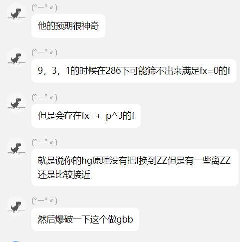
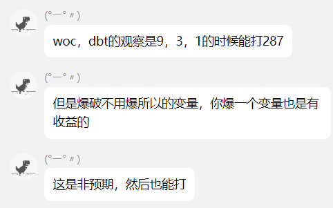

”*“ 表示未做出的题，“~” 表示赛后复现出的题，“!” 表示赛中做出的题

# 1，check-little (!)

## 题目

```python
from Crypto.Util.number import *
from Crypto.Util.Padding import pad
from Crypto.Cipher import AES
import os

flag, key = open('secret').read().split('\n')

e = 3

while 1:
    p = getPrime(1024)
    q = getPrime(1024)
    phi = (p - 1) * (q - 1)
    if phi % e != 0:
        break
N = p * q
c = pow(key, e, N)

iv = os.urandom(16)
ciphertext = AES.new(key = long_to_bytes(key)[:16], iv = iv, mode = AES.MODE_CBC).encrypt(pad(flag.encode(),16)).hex()

f = open('output.txt', 'w')
f.write(f'N = {N}\n')
f.write(f'c = {c}\n')
f.write(f'iv = {iv}\n')
f.write(f'ciphertext = {ciphertext}\n')

```

## 分析

（emmm，为啥会有人的key是p啊？？？？）

所以直接gcd(c, n)就有key了，然后AES解密即可

## EXP

```python
from Crypto.Util.number import *
from Crypto.Util.Padding import pad
from Crypto.Cipher import AES
from sage.all import *


n = 18795243691459931102679430418438577487182868999316355192329142792373332586982081116157618183340526639820832594356060100434223256500692328397325525717520080923556460823312550686675855168462443732972471029248411895298194999914208659844399140111591879226279321744653193556611846787451047972910648795242491084639500678558330667893360111323258122486680221135246164012614985963764584815966847653119900209852482555918436454431153882157632072409074334094233788430465032930223125694295658614266389920401471772802803071627375280742728932143483927710162457745102593163282789292008750587642545379046283071314559771249725541879213
c = 10533300439600777643268954021939765793377776034841545127500272060105769355397400380934565940944293911825384343828681859639313880125620499839918040578655561456321389174383085564588456624238888480505180939435564595727140532113029361282409382333574306251485795629774577583957179093609859781367901165327940565735323086825447814974110726030148323680609961403138324646232852291416574755593047121480956947869087939071823527722768175903469966103381291413103667682997447846635505884329254225027757330301667560501132286709888787328511645949099996122044170859558132933579900575094757359623257652088436229324185557055090878651740
iv = b'\x91\x16\x04\xb9\xf0RJ\xdd\xf7}\x8cW\xe7n\x81\x8d'
ciphertext = "bf87027bc63e69d3096365703a6d47b559e0364b1605092b6473ecde6babeff2"

key = gcd(c, n)
aes = AES.new(key = long_to_bytes(key)[:16], iv = iv, mode = AES.MODE_CBC)
aes.decrypt(bytes.fromhex(ciphertext))
```

---

# 2，ezran (!)

## 题目

```python
from Crypto.Util.number import *
from random import *

f = open('flag.txt', 'r')
flag = f.read().encode()

gift=b''
for i in range(3108):
    r1 = getrandbits(8)
    r2 = getrandbits(16)
    x=(pow(r1, 2*i, 257) & 0xff) ^ r2
    c=long_to_bytes(x, 2)
    gift+=c

m = list(flag)
for i in range(2025):
    shuffle(m)

c = "".join(list(map(chr,m)))

f = open('output.txt', 'w')
f.write(f"gift = {bytes_to_long(gift)}\n")
f.write(f"c = {c}\n")

```

## 分析

题目类似鸡块师傅的这题：[CatCTF2024-Random game](https://tangcuxiaojikuai.xyz/post/69eaef2e.html#Random-game-3-Solves-376-500-pts)

所以对于本题而言就是：

> 1，当$i$是64的倍数时，`(pow(r1, 2*i, 257) & 0xff) ^ r2`相当于`0/1 ^ r2`，因此这时候 $r_2$ 的前15bit是已知的；
>
> 2，当i是128的倍数时，`(pow(r1, 2*i, 257) & 0xff) ^ r2`相当于`1 ^ r2`，因此这时候 $r_2$ 是已知的；
>
> 3，其余情况下，因为`(pow(r1, 2*i, 257) & 0xff)`最大也只是一个8bit的数，所以`(pow(r1, 2*i, 257) & 0xff) ^ r2`相当于`0~255 ^ r2`，因此这时候 $r_2$ 的前8bit是能确定的。

因此我们可以根据这个造出对应的MT矩阵$L$，但是$L$并不是一个满秩矩阵（需要$rand(L)=19937$才行，但我们的是19932），因此——假如我们是直接解矩阵方程的话，还需要对求出的结果的右核空间进行爆破。

但我没用这个方法，我这里是使用了[gf2bv](https://github.com/maple3142/gf2bv)库来做这题；同样，因为前面的原因，我们这里就需要使用`solve_all()`函数来求解出所有可能解（假如结果唯一，可以用`solve_one()`）。

## EXP

```python
import random
from gf2bv import LinearSystem
from gf2bv.crypto.mt import MT19937
from tqdm import *
from pwn import *
from Crypto.Util.number import *


def mt19937(bs, out):
    lin = LinearSystem([32] * 624)
    mt = lin.gens()

    rng = MT19937(mt)
    zeros = []
    for o in range(len(out)):
        _ = rng.getrandbits(8)
        if o%128 == 0:
            zeros.append((rng.getrandbits(16)) ^ (out[o]^1))
        elif o%64 == 0:
            zeros.append((rng.getrandbits(16)>>1) ^ (out[o]>>1))
        else:
            zeros.append((rng.getrandbits(16)>>8) ^ (out[o]>>8))
    zeros += [mt[0] ^ (0x80000000)]
    # zeros += [mt[0] ^ (0x00000000)]
    sol = lin.solve_all(zeros)

    return sol

if(1):
    gift = ""
    sys.set_int_max_str_digits(14990)
    gift = long_to_bytes(int(gift))
    cs = [bytes_to_long(gift[i:i+2]) for i in range(0, len(gift), 2)]
    RNGs = mt19937(int(10), cs)    
    for RNG in tqdm(RNGs):
        flag = 1
        rng = MT19937(RNG).to_python_random()
        for i in range(3108):
            r1 = rng.getrandbits(8)
            r2 = rng.getrandbits(16)
            x = (pow(r1, 2*i, 257) & 0xff) ^ r2
            if x != cs[i]:
                flag = 0
                break
        if flag:
            c = ")9Lsu_4s_eb__otEli_nhe_tes5gii5sT@omamkn__ari{efm0__rmu_nt(0Eu3_En_og5rfoh}nkeoToy_bthguuEh7___u"
            x = [i for i in range(len(c))]
            for i in range(2025):
                rng.shuffle(x)
            flag = ""
            for i in range(len(c)):
                flag += c[x.index(i)]
            print(flag)
# flag{7hE_numbEr_0f_biT5_i5_Enou9h_@L5o_ThE_r4nk_must_3n0ugh}
```

---

# 3，sk (~)

## 题目

```python
from random import randint
from Crypto.Util.number import getPrime, inverse, long_to_bytes, bytes_to_long
from math import gcd
import signal
from secret import flag

def gen_coprime_num(pbits):
    lbits = 2 * pbits + 8
    lb = 2**lbits
    ub = 2**(lbits + 1)
    while True:
        r = randint(lb, ub)
        s = randint(lb, ub)
        if gcd(r, s) == 1:
            return r, s

def mult_mod(A, B, p):
    result = [0] * (len(A) + len(B) - 1)
    for i in range(len(A)):
        for j in range(len(B)):
            result[i + j] = (result[i + j] + A[i] * B[j]) % p
    
    return result

def gen_key(p):
    f = [randint(1, 2**128) for i in ":)"]
    h = [randint(1, 2**128) for i in ":("]
    
    R1, S1 = gen_coprime_num(p.bit_length())
    R2, S2 = gen_coprime_num(p.bit_length())

    B = [[randint(1, p - 1) for i in ":("] for j in ":)"]

    P = []
    for b in B:
        P.append(mult_mod(f, b, p))
    
    Q = []
    for b in B:
        Q.append(mult_mod(h, b, p))

    for i in range(len(P)):
        for j in range(len(P[i])):
            P[i][j] = P[i][j] * R1 % S1
            Q[i][j] = Q[i][j] * R2 % S2

    sk = [(R1, S1), (R2, S2), f, h, p]
    pk = [P, Q, p]

    return sk, pk

def encrypt(pk, pt):
    P, Q, p = pk
    pt = bytes_to_long(pt)

    PP = 0
    QQ = 0

    for i in range(len(P)):
        u = randint(1, p)
        for j in range(len(P[0])):
            PP = PP + P[i][j] * (u * pt**j % p)
            QQ = QQ + Q[i][j] * (u * pt**j % p)

    return PP, QQ

def decrypt(sk, ct):
    RS1, RS2, f, h, p = sk
    R1, S1 = RS1
    R2, S2 = RS2

    P, Q = ct
    invR1 = inverse(R1, S1)
    invR2 = inverse(R2, S2)
    P = (P * invR1 % S1) % p
    Q = (Q * invR2 % S2) % p

    f0q = f[0] * Q % p
    f1q = f[1] * Q % p
    h0p = h[0] * P % p
    h1p = h[1] * P % p

    a = f1q + p - h1p % p
    b = f0q + p - h0p % p

    pt = -b * inverse(a, p) % p
    pt = long_to_bytes(pt)

    return pt

signal.alarm(30)
p = getPrime(256)
sk, pk = gen_key(p)
ticket = long_to_bytes(randint(1, p))
enc_ticket = encrypt(pk, ticket)
print(pk)
print(enc_ticket)

for i in range(2):
    op = int(input("op>").strip())
    if op == 1:
        msg = input("pt:").strip().encode()
        ct = encrypt(pk, msg)
        print(f"ct: {ct}")
    elif op == 2:
        user_input = input("ct:").strip().split(" ")
        if len(user_input) == 2:
            ct = [int(user_input[0]), int(user_input[1])]
        else:
            print("invalid ct.")
            break
        
        user_input = input("your f:").strip().split(" ")
        if len(user_input) == 2:
            user_f = [int(user_input[0]), int(user_input[1])]
        else:
            print("invalid f.")
            break

        user_input = input("your h:").strip().split(" ")
        if len(user_input) == 2:
            user_h = [int(user_input[0]), int(user_input[1])]
        else:
            print("invalid h.")
            break

        user_input = input("your R1 S1:").strip().split(" ")
        if len(user_input) == 2:
            user_r1s1 = [int(user_input[0]), int(user_input[1])]
        else:
            print("invalid R1 S1.")
            break

        user_input = input("your R2 S2:").strip().split(" ")
        if len(user_input) == 2:
            user_r2s2 = [int(user_input[0]), int(user_input[1])]
        else:
            print("invalid R2 S2.")
            break

        pt = decrypt((user_r1s1, user_r2s2, user_f, user_h, p), ct)
        if pt == ticket:
            print(flag)
        else:
            print(pt.hex())
    else:
        print("invalid op.")
        break

print("bye!")

```

## 分析

当时赛中可能是看傻了。。。现在赛后跟别的师傅聊了后，复现出来了。

题目要求我们提交解密参数及密文，使得`decrypt(enc)=token`。

而题目的关键是加密函数：

```python
def encrypt(pk, pt):
    P, Q, p = pk
    pt = bytes_to_long(pt)

    PP = 0
    QQ = 0

    for i in range(len(P)):
        u = randint(1, p)
        for j in range(len(P[0])):
            PP = PP + P[i][j] * (u * pt**j % p)
            QQ = QQ + Q[i][j] * (u * pt**j % p)

    return PP, QQ
```

转换成式子如下：
$$
\begin{align*}
PP=\sum_{i,j=0}^{1,2}[P_{i,j}*(u_i*pt^{j}\ mod\ p)]\\

QQ=\sum_{i,j=0}^{1,2}[Q_{i,j}*(u_i*pt^{j}\ mod\ p)]
\end{align*}
$$
用 $upt_{i,j}=u_i*pt^{j}\ mod\ p$ 来替代的话，则为：
$$
\begin{align*}
PP=\sum_{i,j=0}^{1,2}P_{i,j}*upt_{i,j}\\
QQ=\sum_{i,j=0}^{1,2}Q_{i,j}*upt_{i,j}\\
\end{align*}
$$
因为我们知道 $P_{i,j}$、$Q_{i,j}$ 的值以及$PP$和$QQ$，而且$upt_{i,j}$的大小也不大，所以我们完全可以造格（类似背包格的造法）或者cuso来解出 $upt_{i,j}$ ，继而求出pt（也就是我们的token）。这里我采用的是cuso。

又因为我们的解密是需要我们输入解密参数的，所以我们可以自己生成一个公私钥对，将我们算出的token用我们的公钥加密，然后返回我们的新密文及对应的私钥即可。

## EXP

```python
from cuso import find_small_roots
from sage.all import *
from Crypto.Util.number import *
from math import gcd
from random import randint
from pwn import *


def gen_coprime_num(pbits):
    lbits = 2 * pbits + 8
    lb = 2**lbits
    ub = 2**(lbits + 1)
    while True:
        r = randint(lb, ub)
        s = randint(lb, ub)
        if gcd(r, s) == 1:
            return r, s

def mult_mod(A, B, p):
    result = [0] * (len(A) + len(B) - 1)
    for i in range(len(A)):
        for j in range(len(B)):
            result[i + j] = (result[i + j] + A[i] * B[j]) % p
    
    return result

def gen_key(p):
    f = [randint(1, 2**128) for i in ":)"]
    h = [randint(1, 2**128) for i in ":("]
    
    R1, S1 = gen_coprime_num(p.bit_length())
    R2, S2 = gen_coprime_num(p.bit_length())

    B = [[randint(1, p - 1) for i in ":("] for j in ":)"]

    P = []
    for b in B:
        P.append(mult_mod(f, b, p))
    
    Q = []
    for b in B:
        Q.append(mult_mod(h, b, p))

    for i in range(len(P)):
        for j in range(len(P[i])):
            P[i][j] = P[i][j] * R1 % S1
            Q[i][j] = Q[i][j] * R2 % S2

    sk = [(R1, S1), (R2, S2), f, h, p]
    pk = [P, Q, p]

    return sk, pk

def encrypt(pk, pt):
    P, Q, p = pk
    pt = bytes_to_long(pt)

    PP = 0
    QQ = 0

    for i in range(len(P)):
        u = randint(1, p)
        for j in range(len(P[0])):
            PP = PP + P[i][j] * (u * pt**j % p)
            QQ = QQ + Q[i][j] * (u * pt**j % p)

    return PP, QQ


sh = process(["python", "task.py"])
pk = eval(sh.recvline().strip().decode())
enc_ticket = eval(sh.recvline().strip().decode())
P,Q,p = pk
PP,QQ = enc_ticket

# cuso
upt0, upt1, upt2, upt3, upt4, upt5 = var('upt0, upt1, upt2, upt3, upt4, upt5')
f1 = P[0][0]*upt0 + P[0][1]*upt1 + P[0][2]*upt2 + P[1][0]*upt3 + P[1][1]*upt4 + P[1][2]*upt5 - PP
f2 = Q[0][0]*upt0 + Q[0][1]*upt1 + Q[0][2]*upt2 + Q[1][0]*upt3 + Q[1][1]*upt4 + Q[1][2]*upt5 - QQ

relations = [f1,f2]
bounds = {upt0:(0, 2**256), upt1:(0,p), upt2:(0,p), upt3:(0,2**256), upt4:(0,p), upt5:(0,p)}
roots = find_small_roots(
    relations,
    bounds,
)
    
for root in roots:
    u0 = root[upt0]
    u1 = root[upt3]
    m1 = root[upt1] * inverse(u0,p) % p
    m2 = root[upt4] * inverse(u1,p) % p
    if m1 == m2:
        sk1, pk1 = gen_key(p)
        RS1, RS2, f, h, pp = sk1
        R1,S1 = RS1
        R2,S2 = RS2
        ct1 = encrypt(pk1,long_to_bytes(m1))
        sh.sendlineafter(b"op>",b'2')
        sh.sendlineafter(b"ct:",f"{ct1[0]} {ct1[1]}".encode())
        sh.sendlineafter(b"your f:",f"{f[0]} {f[1]}".encode())
        sh.sendlineafter(b"your h:",f"{h[0]} {h[1]}".encode())
        sh.sendlineafter(b"your R1 S1:",f"{R1} {S1}".encode())
        sh.sendlineafter(b"your R2 S2:",f"{R2} {S2}".encode())
        print(sh.recvline().strip().decode())
```

---

# 4，Blurred (~)

## 题目

```python
from sage.all import *
from sage.misc import prandom
import random
from Crypto.Cipher import AES
from Crypto.Hash import SHA256
from Crypto.Util.Padding import pad

q = 1342261
n = 1031
PR = PolynomialRing(Zmod(q), "x")
x = PR.gens()[0]
Q = PR.quotient(x**n + 1)
flag = b"flag{*****************************}"

def sample(rand):
    return (rand.getrandbits(1) - rand.getrandbits(1)) * (rand.getrandbits(1) * rand.getrandbits(1))


def GenNTRU():
    f = [sample(prandom) for _ in range(n)]
    g1 = [sample(prandom)for _ in range(n)]
    g2 = [sample(prandom) for _ in range(n)]
    g1x = Q(g1)
    g2x = Q(g2)

    while True:
        fx = Q(f)
        try:
            h1 = g1x / fx
            h2 = g2x / fx
            return (h1.lift(), h2.lift(), fx)
        except:
            prandom.shuffle(f)
            continue

for _ in range(20259):
    c = int(input("c :"))
    if c == 1:
        coin = random.getrandbits(1)
        if coin == 0:
            pk1, pk2, fx = GenNTRU()
        else:
            pk1, pk2, fx = Q.random_element().lift(), Q.random_element().lift(), Q([sample(prandom) for _ in range(n)])

        print("Hints:", pk1.list(), pk2.list())
        
    elif c == 2:
        SHA = SHA256.new()
        SHA.update(str(random.getrandbits(256)).encode())
        KEY = SHA.digest()
        cipher = AES.new(KEY, AES.MODE_ECB)
        flag = pad(flag, AES.block_size)
        print("Flag:", cipher.encrypt(flag))
    else:
        break

```

## 分析

虽然一眼就能看出——需要我们收集足够的bit来打MT19937，但是赛中没想出如何区分NTRU，所以就没出。之后跟别的师傅聊了下，然后复现出来了。

区分的关键是那个环$R$：

> 因为$R$的不可约多项式是$x^{1031}+1$，里边有$x+1$这个因子，且$-1$是这个多项式的根，所以可以有这样一个映射，将环$R$映射到整数域$F_q$上：
> $$
> \phi: R\rightarrow F_q\\\phi[a(x)]=a(-1)\\
> \phi[h(x) \cdot f(x)] = \phi[g(x)] \implies h(-1) \cdot f(-1) \equiv g(-1)\pmod{q}
> $$

因此我们可以将 $h_1$ 和 $h_2$ 映射成 $H_1$ 和 $H_2$，造这样的格：
$$
\begin{pmatrix}
1&H_1&H_2\\
0&-p&0\\
0&0&-p
\end{pmatrix}
$$
然后LLL取第一行即可。

而经过测试会发现：如果是NTRU，LLL出来的结果会很小；因此取一个100的界限即可。

不过后面打MT19937的时候，使用gf2bv会存在 **`mt[0]`的高位取0与1的问题**，所以为稳妥起见，我两种都尝试了。

## EXP

```python
from sage.all import *
from pwn import * 
from tqdm import trange
from gf2bv import LinearSystem
from gf2bv.crypto.mt import MT19937
from Crypto.Util.number import *
from Crypto.Cipher import AES
from Crypto.Hash import SHA256


q = 1342261
n = 1031
PR = PolynomialRing(Zmod(q), "x")
x = PR.gens()[0]
Q = PR.quotient(x**n + 1)

sh = process(["python", "task.py"])

bits = []
for i in trange(19968):
    sh.sendlineafter(b"c :",b'1')
    res = sh.recvline().strip().decode().split(':')[-1]
    start1 = res.find('[')
    end1 = res.find(']')
    h1 = Q(eval(res[start1:end1+1]))
    start2 = res.find('[',end1)
    end2 = res.find(']',end1+1)
    h2 = Q(eval(res[start2:end2+1]))
    h1_value = h1.lift()(-1)
    h2_value = h2.lift()(-1)
    L = Matrix(ZZ,[
        [1,h1_value,h2_value],
        [0,-q,0],
        [0,0,-q]
    ])
    line = L.LLL()[0]
    if int(line.norm()) < 100:
        bits.append(0)
    else:
        bits.append(1)

sh.sendlineafter(b"c :",b'2')
sh.recvuntil(b"Flag: ")
enc_flag = eval(sh.recvline().strip())
print(f"enc_flag = {enc_flag}")
print(f"bits = {bits}")

def mt19937(out, ch):
    hig = [int(0x00000000), int(0x80000000)]
    lin = LinearSystem([32] * 624)
    mt = lin.gens()

    rng = MT19937(mt)
    zeros = []
    for o in out:
        zeros.append(rng.getrandbits(1) ^ int(o))
    zeros.append(mt[0] ^ hig[ch])

    for sol in lin.solve_all(zeros):
        rng = MT19937(sol)
        pyrand = rng.to_python_random()
        RNG = pyrand
        STATE = RNG.getstate()[1][:-1]
        STATE = STATE + (len(STATE),)
        RNG.setstate((3,STATE,None))
        
        for i in trange(19968):
            RNG.getrandbits(1)

        SHA = SHA256.new()
        SHA.update(str(RNG.getrandbits(256)).encode())
        KEY = SHA.digest()
        cipher = AES.new(KEY, AES.MODE_ECB)
        flag = cipher.decrypt(enc_flag)
        if b"flag" in flag:
            print(f"high = {ch}")
            print(f"{flag = }")

RNG = mt19937(bits, 0)
RNG = mt19937(bits, 1)
```

---

# 5，theorezhnp (*)

## 题目

```python
from Crypto.Cipher import AES
from ecdsa import NIST521p
from ecdsa.ecdsa import Public_key
from ecdsa.ellipticcurve import Point 
from random import randrange
from sys import stdin
from hashlib import *
from secret import seed_token, flag
import time, signal

signal.alarm(600)

def read(l):
    return stdin.read(l + 1).strip()

def pr(msg, key=None):
    if not key:
        print(msg)
    else:
        key = sha256(str(key).encode()).digest()
        print(AES.new(key, AES.MODE_ECB).encrypt(msg.encode()).hex())

def inp():
    try:
        return Point(E, int(read(131), 16), int(read(131), 16))
    except:
        pass
    return None

def DH(priv, pub):
    shared = priv * pub
    return shared.x()

token = input("Please input your team token: ")

if not token:
    exit()

def generate_token(seed, token):  
    return sha256((seed + '&' + sha1(token[::-1].encode()).hexdigest()[:10]).encode()).hexdigest()

to_encrypted_token = generate_token(seed_token, token)

E = NIST521p.curve
G = NIST521p.generator  
m = 235
n = G.order() 
Alice_sk = randrange(n)
Alice_pk = Public_key(G, Alice_sk * G).point
pr(f'Hi, Bob! Here is my public key: {Alice_pk.x() :x}')

Bob_sk = randrange(n)
Bob_pk = Public_key(G, Bob_sk * G).point
pr(f'Hi, Alice! Here is my public key: {Bob_pk.x() :x}')

shared_AB = DH(Alice_sk, Bob_pk)
shared_BA = DH(Bob_sk, Alice_pk)
assert shared_AB == shared_BA

pr('Now, it is your turn:')
for _ in range(19):
    Mallory_pk = inp()
    if not Mallory_pk:
        pr('Invalid pk!')
        exit()
    shared_AC = DH(Alice_sk, Mallory_pk)
    pr(f'Leak: {shared_AC >> m :x}')

pr(to_encrypted_token, shared_AB) 

pr("Give me your token:")
Guess_Token = input() 
if Guess_Token == to_encrypted_token:
    pr("Win for flag: " + flag)
else:
    pr("You Lose")
```

## 分析

题目有个描述，里边提到了babyDH2，根据那题可以找到这篇论文：[Fast Slicer for Batch-CVP: Making Lattice Hybrid Attacks Practical](https://eprint.iacr.org/2025/1910.pdf)。

然而，按论文里的说法，当我们$(n,d,t)=(9,3,1)$时，需要已知287bit才能打；但本题只提供了286bit，damn！！！

赛后的话，看别的师傅问了dbt，思路是这样的：


其中gbb是打$3^{10}$的groebner_basis

不过嘛。。。似乎有个非预期：


我只能说两个字：神奇！


不过最近也没空，有空再试试看吧。
