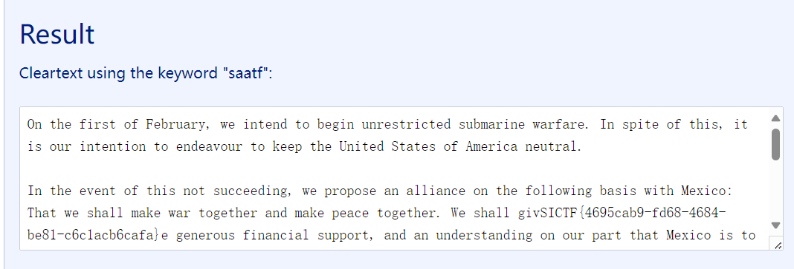
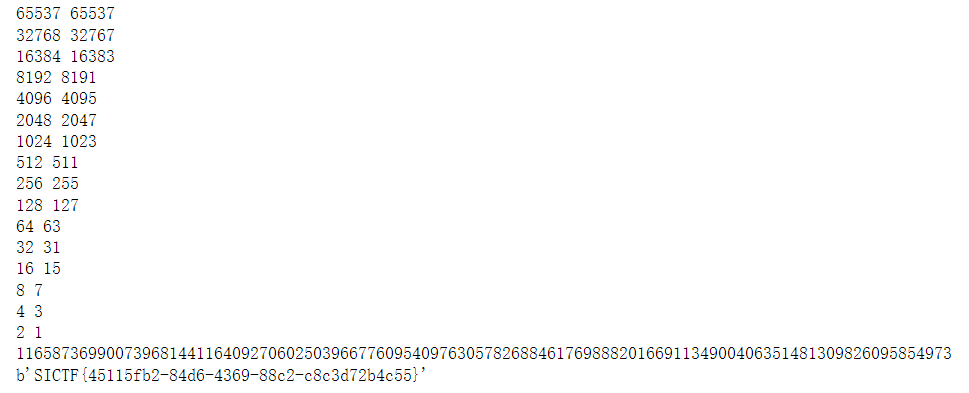
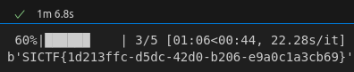
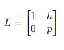
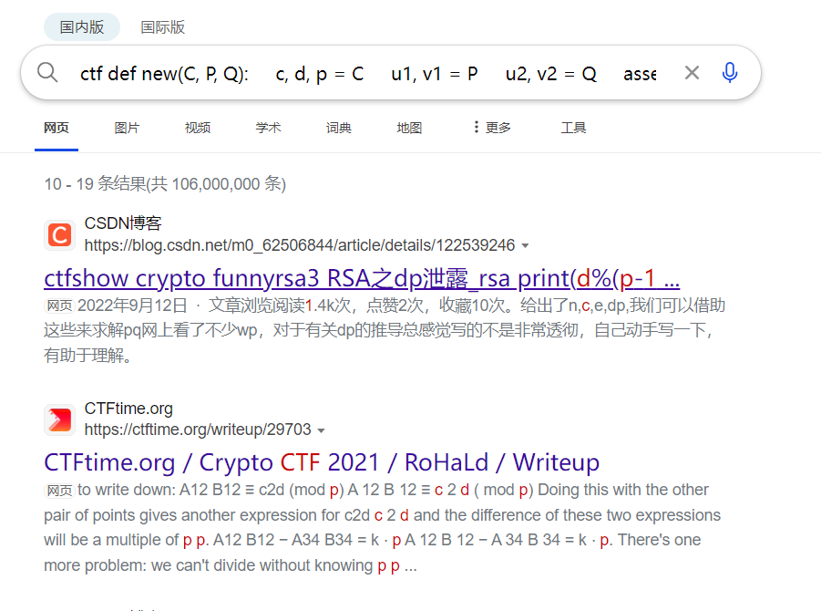
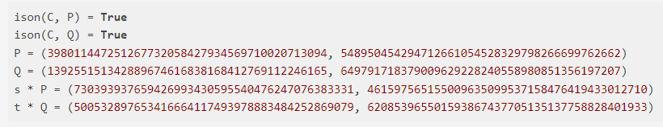
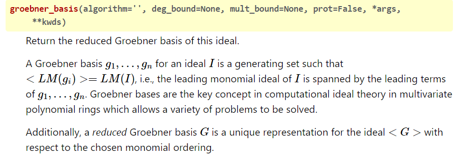

## [签到]Vigenere

直接用[网页](https://www.guballa.de/vigenere-solver)爆破就行：



<hr style="border: 0.5px solid black;"/>

## 签到，确信！

在[小鸡块博客](https://tangcuxiaojikuai.xyz/post/6144f326.html#more)里找到了解法。。。。

大概意思就是：通过商环和立方差公式可知——**$g^n$对应的多项式的其中一个项的系数与$n$的最大公因数就是$p$**

<details>
    <summary><b>exp（点击展开）</b></summary>


```python
from Crypto.Util.number import *

n = 8361361624563191168612863710516449028280757632934603412143152925186847721821552879338608951120157631182699762833743097837368740526055736516080136520584848113137087581886426335191207688807063024096128001406698217998816782335655663803544853496060418931569545571397849643826584234431049002394772877263603049736723071392989824939202362631409164434715938662038795641314189628730614978217987868150651491343161526447894569241770090377633602058561239329450046036247193745885174295365633411482121644408648089046016960479100220850953009927778950304754339013541019536413880264074456433907671670049288317945540495496615531150916647050158936010095037412334662561046016163777575736952349827380039938526168715655649566952708788485104126900723003264019513888897942175890007711026288941687256962012799264387545892832762304320287592575602683673845399984039272350929803217492617502601005613778976109701842829008365226259492848134417818535629827769342262020775115695472218876430557026471282526042545195944063078523279341459199475911203966762751381334277716236740637021416311325243028569997303341317394525345879188523948991698489667794912052436245063998637376874151553809424581376068719814532246179297851206862505952437301253313660876231136285877214949094995458997630235764635059528016149006613720287102941868517244509854875672887445099733909912598895743707420454623997740143407206090319567531144126090072331
e = 65537
c = 990174418341944658163682355081485155265287928299806085314916265580657672513493698560580484907432207730887132062242640756706695937403268682912083148568866147011247510439837340945334451110125182595397920602074775022416454918954623612449584637584716343806255917090525904201284852578834232447821716829253065610989317909188784426328951520866152936279891872183954439348449359491526360671152193735260099077198986264364568046834399064514350538329990985131052947670063605611113730246128926850242471820709957158609175376867993700411738314237400038584470826914946434498322430741797570259936266226325667814521838420733061335969071245580657187544161772619889518845348639672820212709030227999963744593715194928502606910452777687735614033404646237092067644786266390652682476817862879933305687452549301456541574678459748029511685529779653056108795644495442515066731075232130730326258404497646551885443146629498236191794065050199535063169471112533284663197357635908054343683637354352034115772227442563180462771041527246803861110504563589660801224223152060573760388045791699221007556911597792387829416892037414283131499832672222157450742460666013331962249415807439258417736128976044272555922344342725850924271905056434303543500959556998454661274520986141613977331669376614647269667276594163516040422089616099849315644424644920145900066426839607058422686565517159251903275091124418838917480242517812783383
k = 7
R = Zmod(n)["x"]
while True:
    Q = R.quo(R.random_element(k))
    pp = gcd(ZZ(list(Q.random_element() ^ n)[1]), n)
    if pp != 1:
        qq = sum([pp**i for i in range(k)])
        rr = n // (pp * qq)
        assert n == pp * qq * rr
        break
phi = (pp - 1) * (qq - 1) * (rr - 1)
d = pow(e, -1, phi)
m = pow(c, d, n)
print(long_to_bytes(int(m)))# SICTF{d9428fc7-fa3a-4096-8ec9-191c0a4562ff}
```

</details>

<hr style="border: 0.5px solid black;"/>

## gggcccddd

一开始看到的时候，想着这不是相关信息攻击吗？直接用**Franklin-Reiter相关消息攻击**就行。

但运行后加载了老半天。。。不太对（

但该说是机缘巧合吗。。。比赛群里当时有晒Kicky_Mu的博客，就随便去看看，在里边的文章里找到了[解法](https://www.cnblogs.com/mumuhhh/p/17789591.html)（


直接用该方法就行：

<details>
    <summary><b>exp（点击展开）</b></summary>

```python
from Crypto.Util.number import *
def HGCD(a, b):
    if 2 * b.degree() <= a.degree() or a.degree() == 1:
        return 1, 0, 0, 1
    m = a.degree() // 2
    a_top, a_bot = a.quo_rem(x^m)
    b_top, b_bot = b.quo_rem(x^m)
    R00, R01, R10, R11 = HGCD(a_top, b_top)
    c = R00 * a + R01 * b
    d = R10 * a + R11 * b
    q, e = c.quo_rem(d)
    d_top, d_bot = d.quo_rem(x^(m // 2))
    e_top, e_bot = e.quo_rem(x^(m // 2))
    S00, S01, S10, S11 = HGCD(d_top, e_top)
    RET00 = S01 * R00 + (S00 - q * S01) * R10
    RET01 = S01 * R01 + (S00 - q * S01) * R11
    RET10 = S11 * R00 + (S10 - q * S11) * R10
    RET11 = S11 * R01 + (S10 - q * S11) * R11
    return RET00, RET01, RET10, RET11
    
def GCD(a, b):
    print(a.degree(), b.degree())
    q, r = a.quo_rem(b)
    if r == 0:
        return b
    R00, R01, R10, R11 = HGCD(a, b)
    c = R00 * a + R01 * b
    d = R10 * a + R11 * b
    if d == 0:
        return c.monic()
    q, r = c.quo_rem(d)
    if r == 0:
        return d
    return GCD(d, r)


n = 71451784354488078832557440841067139887532820867160946146462765529262021756492415597759437645000198746438846066445835108438656317936511838198860210224738728502558420706947533544863428802654736970469313030584334133519644746498781461927762736769115933249195917207059297145965502955615599481575507738939188415191
c1 = 60237305053182363686066000860755970543119549460585763366760183023969060529797821398451174145816154329258405143693872729068255155086734217883658806494371105889752598709446068159151166250635558774937924668506271624373871952982906459509904548833567117402267826477728367928385137857800256270428537882088110496684
c2 = 20563562448902136824882636468952895180253983449339226954738399163341332272571882209784996486250189912121870946577915881638415484043534161071782387358993712918678787398065688999810734189213904693514519594955522460151769479515323049821940285408228055771349670919587560952548876796252634104926367078177733076253
e = 65537
a = 233
b = 9527
R.<x> = PolynomialRing(Zmod(n))
f = x^e - c1
g = (a*x+b)^e - c2

res = GCD(f,g)

m = -res.monic().coefficients()[0]
print(m)
flag = long_to_bytes(int(m))
print(flag)
```

</details>

然后一分钟内就出结果了



<hr style="border: 0.5px solid black;"/>

## 铜匠

这题的话，因为我之前有见过类似题目名字，所以一打开脚本就直接看一下能不能copper

已知信息是：题目中的p是一个512位的素数，leak是p的五进制的前112位

当时是想着二进制的copper，结果发现缺失的位数是253位来着，而$512*0.44=225.28$([公式来源](https://blog.csdn.net/qq_51999772/article/details/123620932))；可见——即便要加上爆破，但位数差的也太多了。。。所以就开始迟疑了一下。

但后来有个疑问：**题目干嘛会给的5进制？**

于是我就去随便生成512位的素数进行5进制转换，发现对应的长度基本都是**221**，而未知位数为**109**。

感觉未知位数比直接二进制的情况下要少，但又不太好确定能不能直接按109位去5进制copper，所以就去先试了试5进制下的低1位爆破+5进制copper，然后大概1分钟那样就出flag了（这里的确是做急了当时。。。算是猜的）

<details>
    <summary><b>exp（点击展开）</b></summary>
```python
# sage
from tqdm import *
from Crypto.Util.number import *
from gmpy2 import *
leak = "2011133132443111302000224204142244403203442000141102312242343143241244243020003333022112141220422134444214010012"
n = 85988668134257353631742597258304937106964673395852009846703777410474172989069717247424903079500594820235304351355706519069516847244761609583338251489134035212061654870087550317540291994559481862615812258493738064606592165529948648774081655902831715928483206013332330998262897765489820121129058926463847702821
e = 65537
c = 64708526479058278743788046708923650158905888858865427385501446781738669889375403360886995849554813207230509920789341593771929287415439407977283018525484281064769128358863513387658744063469874845446480637925790150835186431234289848506337341595817156444941964510251032210939739594241869190746437858135599624562
p0 = int(leak+"0"*109, 5)
p = 0
ff = 0
for i in trange(5):
        PR.<x> = PolynomialRing(Zmod(n))
        f = p0 + i + x*5
        f = f.monic()
        res = f.small_roots(X = 5**108,beta=0.49, epsilon = 0.01)
        if(res != []):
            p = int(p0 + i + int(res[0]) * 5)
            assert is_prime(p)
            ff = 1
            break
    if ff:
        break
if p:
    q = n // p
    phi = (p-1)*(q-1)
    d = invert(e, phi)
    m = pow(c, d, n)
    print(long_to_bytes(int(m)))
```

</details>



<hr style="border: 0.5px solid black;"/>

## easyLattice（二血）

没啥好说，就是一个简单的格：



但得对最后一列的数配平一下，我是都乘上了$2^{256}$：

<details>
    <summary><b>exp（点击展开）</b></summary>

```python
from Crypto.Util.number import *
h = 9848463356094730516607732957888686710609147955724620108704251779566910519170690198684628685762596232124613115691882688827918489297122319416081019121038443
p = 11403618200995593428747663693860532026261161211931726381922677499906885834766955987247477478421850280928508004160386000301268285541073474589048412962888947     
L = Matrix(ZZ, [[1, h*2**256],
                [0, p*2**256]])

m = abs(L.LLL()[0][0])

# print(m)

print(long_to_bytes(int(m)))

# SICTF{e3fea01c-18f3-4638-9544-9201393940a9}A\xf0\x89\x84
```

</details>

<hr style="border: 0.5px solid black;"/>

## [进阶]2024_New_Setback（复现）

**比赛时**

一开始解这题的时候，没一点思路，就不管了。。。

差不多要结束的时候，就想着说随便去网上搜搜看得了，没准碰到类似的题？

当时搜的内容是：**ctf def new(C, P, Q):     c, d, p = C     u1, v1 = P     u2, v2 = Q     assert happy(C, P) and happy(C, Q)     u3 = (u1 \* v2 + v1 \* u2) \* inverse(c \* (1 + d \* u1 \* u2 \* v1 \* v2), p) % p     v3 = (v1 \* v2 - u1 \* u2) \* inverse(c \* (1 - d \* u1 \* u2 \* v1 \* v2), p) % p     return (int(u3), int(v3))**

结果还真遇到了，而且是[原题-RoHaLd](https://ctftime.org/writeup/29703)。。。。



不仅题目代码一样，数据还一模一样。。。

所以，没啥好说，flag内容估计也一样。。。于是直接交了

等赛后再研究研究这个是咋解吧（

**赛后（主要是在复现别人的思路）**

先看看代码：

<details>
    <summary><b>task.py（点击展开）</b></summary>

```python
#user:mumu666
from Crypto.Util.number import *
from secret import flag, Curve

def happy(C, P):
    c, d, p = C
    u, v = P
    return (u**2 + v**2 - c**2 * (1 + d * u**2*v**2)) % p == 0

def new(C, P, Q):
    c, d, p = C
    u1, v1 = P
    u2, v2 = Q
    assert happy(C, P) and happy(C, Q)
    u3 = (u1 * v2 + v1 * u2) * inverse(c * (1 + d * u1 * u2 * v1 * v2), p) % p
    v3 = (v1 * v2 - u1 * u2) * inverse(c * (1 - d * u1 * u2 * v1 * v2), p) % p
    return (int(u3), int(v3))

def year(C, P, m):
    assert happy(C, P)
    c, d, p = C
    B = bin(m)[2:]
    l = len(B)
    u, v = P
    PP = (-u, v)
    O = new(C, P, PP)
    Q = O
    if m == 0:
        return O
    elif m == 1:
        return P
    else:
        for _ in range(l-1):
            P = new(C, P, P)
        m = m - 2**(l-1)
        Q, P = P, (u, v)
        return new(C, Q, year(C, P, m))

c, d, p = Curve

flag = flag.lstrip(b'SICTF{').rstrip(b'}')
l = len(flag)
l_flag, r_flag = flag[:l // 2], flag[l // 2:]

m1, m2 = bytes_to_long(l_flag), bytes_to_long(r_flag)
assert m1 < p and m2 < p

P = (398011447251267732058427934569710020713094, 548950454294712661054528329798266699762662)
Q = (139255151342889674616838168412769112246165, 649791718379009629228240558980851356197207)

print(f'happy(C, P) = {happy(Curve, P)}')
print(f'happy(C, Q) = {happy(Curve, Q)}')

print(f'P = {P}')
print(f'Q = {Q}')

print(f'm1 * P = {year(Curve, P, m1)}')
print(f'm2 * Q = {year(Curve, Q, m2)}')


"""
happy(C, P) = True
happy(C, Q) = True
P = (398011447251267732058427934569710020713094, 548950454294712661054528329798266699762662)
Q = (139255151342889674616838168412769112246165, 649791718379009629228240558980851356197207)
m1 * P = (730393937659426993430595540476247076383331, 461597565155009635099537158476419433012710)
m2 * Q = (500532897653416664117493978883484252869079, 620853965501593867437705135137758828401933) 
"""
```

</details>

题目给了我们两个点及对应的倍点：
$$
C_1=m_1P,\ C_2=m_2Q
$$
而我们已知椭圆曲线的方程为：$u^2+v^2=c^2(1 + du^2v^2)$。

这个看了鸡块师傅的博客了解到：这是**Twisted Edwards Curves**。然而我们并不知道这个曲线的具体参数，所以需要恢复参数。

鸡块师傅的想法是：

因为题目给了四个点，也就是说——我们知道了四个方程，所以可以用**groebner_basis**去求c、d和p（但是这里得到的那个p还不是我们要用的，所以需要稍微处理一下，这里我改了下鸡块师傅的代码）：

<details>
    <summary><b>get c2、d、p（点击展开）</b></summary>

```python
from Crypto.Util.number import *
#part1 get c2、d、p
P = (398011447251267732058427934569710020713094, 548950454294712661054528329798266699762662)
Q = (139255151342889674616838168412769112246165, 649791718379009629228240558980851356197207)
C1 = (730393937659426993430595540476247076383331, 461597565155009635099537158476419433012710)
C2 = (500532897653416664117493978883484252869079, 620853965501593867437705135137758828401933) 
PR.<c,d> = PolynomialRing(ZZ)
f1 = P[0]**2 + P[1]**2 - c**2 * (1 + d * P[0]**2*P[1]**2)
f2 = Q[0]**2 + Q[1]**2 - c**2 * (1 + d * Q[0]**2*Q[1]**2)
f3 = C1[0]**2 + C1[1]**2 - c**2 * (1 + d * C1[0]**2*C1[1]**2)
f4 = C2[0]**2 + C2[1]**2 - c**2 * (1 + d * C2[0]**2*C2[1]**2)
res = ideal([f1,f2,f3,f4]).groebner_basis()
p = res[2].coefficients()[-1]
for i in range(2, 1000):
    if p % i == 0:
        p //= i

# 因为上面求出的是ZZ域下的值，所以需要mod p才行

c2 = p-(res[0].coefficients()[-1])%p
d = p-(res[1].coefficients()[-1])%p
print(c2, d, p)
'''
c2 = 495368774702871559312404847312353912297284
d = 540431316779988345188678880301417602675534 
p = 903968861315877429495243431349919213155709
'''
```

</details>

然后，因为这里的曲线和我们常见的曲线不太一样，所以我们需要将这个曲线进行转化，以下转化过程来自鸡块师傅之前写过的[思路](https://tangcuxiaojikuai.xyz/post/187210a7.html)：

> **1，Twisted Edwards Curves => Montgomery Curves**
>
> 设如下参数：
> $$
> x'=\frac{1-x}{1-y},\ \ y'=\frac{1+x}{x(1-y)},\ \ A=\frac{2(a+d)}{a-d},\ \ B=\frac{4}{a-d}
> $$
> 然后代入到Twisted Edwards Curves方程里，便得到对应的Montgomery Curves方程：
> $$
> B(y')^2=(x')^3+A(x')^2+(x')\ mod\ p
> $$
> **2，Montgomery Curves => Weierstrass**
>
> 设如下参数：
> $$
> x''=\frac{3x'+A}{3B},\ \ y''=\frac{y'}{B},\ \ a=\frac{3-A^2}{3B^2},\ \ b=\frac{2A^3-9A}{27B^3}
> $$
> 然后代入到Montgomery Curves方程里，便得到了普通椭圆曲线方程：
> $$
> (y'')^2=(x'')^2+a(x'')+b\ mod\ p
> $$

最后我们求DLP即可

<details>
    <summary><b>exp（点击展开）</b></summary>

```python
from Crypto.Util.number import *
#part1 get c2、d、p
P = (398011447251267732058427934569710020713094, 548950454294712661054528329798266699762662)
Q = (139255151342889674616838168412769112246165, 649791718379009629228240558980851356197207)
C1 = (730393937659426993430595540476247076383331, 461597565155009635099537158476419433012710)
C2 = (500532897653416664117493978883484252869079, 620853965501593867437705135137758828401933)
PR.<c,d> = PolynomialRing(ZZ)
f1 = P[0]**2 + P[1]**2 - c**2 * (1 + d * P[0]**2*P[1]**2)
f2 = Q[0]**2 + Q[1]**2 - c**2 * (1 + d * Q[0]**2*Q[1]**2)
f3 = C1[0]**2 + C1[1]**2 - c**2 * (1 + d * C1[0]**2*C1[1]**2)
f4 = C2[0]**2 + C2[1]**2 - c**2 * (1 + d * C2[0]**2*C2[1]**2)
res = ideal([f1,f2,f3,f4]).groebner_basis()
p = res[2].coefficients()[-1]
for i in range(2, 1000):
    if p % i == 0:
        p //= i

# Since the above is the value in the ZZ field, we need to take the module p for (c^2, d)

c2 = p-(res[0].coefficients()[-1])%p
d = p-(res[1].coefficients()[-1])%p

# print(c2, d, p)

# get c

PR.<c> = PolynomialRing(Zmod(p))
f = c^2 - c2

# print(f.roots())

# get 2 possible values of c

c = 662698094423288904843781932253259903384619

# c = 241270766892588524651461499096659309771090


#part2 map to ECC
a = 1
F = GF(p)
dd = F(d*c^4)
A = F(2) * F(a+dd) / F(a-dd)
B = F(4) / F(a-dd)
a = F(3-A^2) / F(3*B^2)
b = F(2*A^3-9*A) / F(27*B^3)

def edwards_to_ECC(x,y):
    x1 = F(x) / F(c)
    y1 = F(y) / F(c)
    #now curve is a*x^2+y^2 = 1+dd*x^2*y^2

    x2 = F(1+y1) / F(1-y1)
    y2 = F(x2) / F(x1)
    #now curve is By^2 = x^3 + Ax^2 + x

    x3 = (F(3*x2) + F(A)) / F(3*B)
    y3 = F(y2) / F(B)
    #now curve is y^2 = x^3 + ax + b

    return (x3,y3)

def ECC_to_edwards(x,y):
    x2 = (F(x) * F(3*B) - F(A)) / F(3)
    y2 = F(y) * F(B)
    #now curve is By^2 = x^3 + Ax^2 + x

    x1 = F(x2) / F(y2)
    y1 = F(1) - (F(2) / F(x2+1))
    #now curve is a*x^2+y^2 = 1+dd*x^2*y^2

    x_ = F(x1) * F(c)
    y_ = F(y1) * F(c)
    #now curve is a*x^2+y^2 = c^2(1+d*x^2*y^2)
    
    return (x_,y_)

E = EllipticCurve(GF(p), [a, b])
P = E(edwards_to_ECC(P[0],P[1]))
Q = E(edwards_to_ECC(Q[0],Q[1]))
C1 = E(edwards_to_ECC(C1[0],C1[1]))
C2 = E(edwards_to_ECC(C2[0],C2[1]))


#part3 Dlog
m1 = int(P.discrete_log(C1))
m2 = int(Q.discrete_log(C2))

print(long_to_bytes(m1))
print(long_to_bytes(m2))

#SICTF{nOt_50_3a5Y_Edw4rDs_3LlipT!c_CURv3}
```

</details>

<hr style="border: 0.5px solid black;"/>

## SuperbRSA

没啥好说，就是个e1和e2不互素下的共模攻击：

<details>
    <summary><b>exp（点击展开）</b></summary>

```python
from libnum import *
from gmpy2 import *
n= 19006830358118902392432453595802675566730850352890246995920642811967821259388009049803513102750594524106471709641202019832682438027312468849299985832675191795417160553379580813410722359089872519372049229233732405993062464286888889084640878784209014165871696882564834896322508054231777967011195636564463806270998326936161449009988434249178477100127347406759932149010712091376183710135615375272671888541233275415737155953323133439644529709898791881795186775830217884663044495979067807418758455237701315019683802437323177125493076113419739827430282311018083976114158159925450746712064639569301925672742186294237113199023
c1= 276245243658976720066605903875366763552720328374098965164676247771817997950424168480909517684516498439306387133611184795758628248588201187138612090081389226321683486308199743311842513053259894661221013008371261704678716150646764446208833447643781574516045641493770778735363586857160147826684394417412837449465273160781074676966630398315417741542529612480836572205781076576325382832502694868883931680720558621770570349864399879523171995953720198118660355479626037129047327185224203109006251809257919143284157354935005710902589809259500117996982503679601132486140677013625335552533104471327456798955341220640782369529
c2= 11734019659226247713821792108026989060106712358397514827024912309860741729438494689480531875833287268454669859568719053896346471360750027952226633173559594064466850413737504267807599435679616522026241111887294138123201104718849744300769676961585732810579953221056338076885840743126397063074940281522137794340822594577352361616598702143477379145284687427705913831885493512616944504612474278405909277188118896882441812469679494459216431405139478548192152811441169176134750079073317011232934250365454908280676079801770043968006983848495835089055956722848080915898151352242215210071011331098761828031786300276771001839021
e1=55
e2=200

_, k1, k2 = gcdext(e1, e2)
g = gcd(e1, e2)
m = pow(pow(c1, k1, n)*pow(c2, k2, n),1,n)
print(long_to_bytes(iroot(Integer(m), 3)[0]))

# SICTF{S0_Great_RSA_Have_Y0u_Learned?}
```

</details>

<hr style="border: 0.5px solid black;"/>

## Baby_RSA (复现)

这题当时的确是忘记能**groebner_basis**了（（（

还是看了[出题人博客](https://www.cnblogs.com/mumuhhh/p/18019200)和[小鸡块博客](https://tangcuxiaojikuai.xyz/post/678d5ec.html#more)才发现能用（虽然之前BeginCTF那时候有用过，但忘了）

不过也是，虽然知道这个，但里边的原理都没怎么看过（（（

所以这里记一下groebner_basis的用法（来自[sagemath的参考文档](https://doc.sagemath.org/html/en/reference/polynomial_rings/sage/rings/polynomial/multi_polynomial_ideal.html#sage.rings.polynomial.multi_polynomial_ideal.MPolynomialIdeal.groebner_basis)）及对应的一种形式上的代码吧（以下都是自己的理解，不一定对，仅供参考）：



假如懒得看英文的话，~~可以自己直接机器翻译的~~，不过就是看的有点难受，所以我也翻一下（毕竟我看着都难受了，下面翻译中出现的**理想**一词，是一种数学概念）：

> 返回一个在**该理想**下的简化Groebner基。
>
> 一个在**理想**$I$下的Groebner基$g_1,...g_n$是一个使得$<LM(g_i)>=LM(I)$的生成基，也就是说，这个首项单项式的理想$I$由首项$g_1,...g_n$构成。Groebner基是多元多项式环上计算理想理论的核心概念，它可以解决许多问题。
>
> 此外，简化的Groebner基$G$是相对于所选的单项排序的理想$<G>$的唯一表示。

对于我们而言，我们其实用到的是最后一句话：**简化的Groebner基$G$是相对于所选的单项排序的理想$<G>$的唯一表示。**

也就是说，简化的Groebner基就是一个含有多个在所选的多元多项式环上的、形如$a+r1或b+r_2$的单项式的列表。

简单理解就是：**如果符合条件的话，我们所要计算的未知量的数值，都包含在这个简化的Groebner基里**。

因此，我们只要在算出简化Groebner基后，对这些式子取负号，并取最后一个数即可，这样方便点 (而且没必要，等会列出的代码里也有对比)。

> 关于 **”为什么取负号“** 这个问题，要是对域不太懂的话，也可以理解成是模运算（假如不知道模运算，可以自行百度），简单来说就是：
>
> **已知：$a,a_1\in[0, p)$，**
>
> **那么，假如是 $(a+a_1)\ mod\ p=0$，我们可以知道：只有 $a+a_1=p$才行，即：$a=p-a_1$；**
> **但如果是 $(a-a_1)\ mod\ p=0$，我们可以知道：只有 $a-a_1=0$才行，即：$a=a_1$**。

关于代码，分两种情况：

### **1，多项式**

首先是根据上面的“固有印象”，而得到的第一种方法——**通过多项式去算groebner_basis**：

<details>
    <summary><b>Polynomial（点击展开）</b></summary>

```python
# sage
"""
1，多项式
假如通过多项式去算的话，步骤如下：
a, 有一个内含你需要的多项式的列表
b, 转成这个环下的理想，
c, 最后用groebner_basis就行
（但就是这方法挺麻烦的）
"""

# 定义我们用到的域

PR.<a, b, x> = GF(p)[]

# 需要用到的多项式组

f1 = ...
f2 = ...
...
fn = ...
fs = [f1, ...， fn]

# 转成理想

G = ideal(fs)
"""
计算groebner_basis
"""
res = G.groebner_basis()

# 下面也可以写成：a = p-(res[0].coefficients()[-1])，但没必要

a = -res[0].coefficients()[-1]
b = -res[1].coefficients()[-1]
x = -res[2].coefficients()[-1]
```

</details>

### **2，矩阵**

还有一种是来自出题人——**通过矩阵去算groebner_basis**，本质其实也是多项式的做法，但好操作点：

<details>
    <summary><b>Matrix（点击展开）</b></summary>

```python
# sage
"""
2，矩阵（以本题为例）
方法其实就是：
a，把多个多项式化成一个矩阵
b, 转成这个环下的理想，
c, 最后计算groebner_basis（可以用前面那种，也可以使用variety()）
"""

# 定义我们用到的域

PR.<a, b, x> = GF(p)[]

# 范德蒙德行列式

M = Matrix.vandermonde([1, 2, 3, 4, 5, 6])[:]

# 这里其实和前面的多项式法类似，只是转成了矩阵而已

eqs = M * vector(v) - vector(vv)

# 转成理想

I = ideal(list(eqs))

# 计算groebner_basis：

"""
1，可以用前面多项式情况下的最后一步：
res = G.groebner_basis()
a = -res[0].coefficients()[-1]
b = -res[1].coefficients()[-1]
x = -res[2].coefficients()[-1]
"""

"""
2，也可以使用variety()
这个可以理解成与groebner_basis()的功能一致，但返回的是含有多个形如{x1:r1, x2:r2, ..., xn:rn}的字典的列表
"""

# 假如输出只有一组，就直接取0即可

sol = I.variety()[0]
a = sol['a']
b = sol['b']
x = sol['x']
```

</details>

### **3，解题代码**

题目给了我们素数**p**、1~4的**[(i, f(i))]**和**f(flag)**。

因为f()与h()有关，而且我们并不知道a、b、x的值，但是我们知道h()是mod p的，并且f()是一个多项式。

所以具体的思路就是：

> 1，通过groebner_basis计算出a、b、x的值
>
> 2，代入a、b、x的值，计算多项式下的开根，求出flag

关于具体的代码，多项式情况可以参考[小鸡块师傅](https://tangcuxiaojikuai.xyz/post/678d5ec.html#more)的，我这里引用下出题人的矩阵做法：

<details>
    <summary><b>exp（点击展开）</b></summary>

```python
# sage
# 来源：https://www.cnblogs.com/mumuhhh/p/18019200
from Crypto.Util.number import *
p = 8432316544210923620966806031040552674652729976238765323782536889706914762471638598119051165931563126522925761119650997703305509546949570434637437942542827
v_me_50 = [(1, 5237331460408741346823741966490617418367283531029963248255318507187035341590236835730694472064897540292182231844047116067936691956970631907605500080014355), (2, 5798977431976767515500795413771120575460553181185728489626756434911307088093739452469315524092208822863785429164219547384598943937099787390543171055679780), (3, 5030862375386942201139427367618716490378481408210696947331523552250206476805124204780313138835912303941204343248384742875319182761611109448446270069831113), (4, 4705360705603328842229554954026497175574981026785287316439514185860486128679614980330307863925942038530792583274904352630757089631411920876914529907563209)]
flag = 7251453750672416392395590357197330390627853878488142305852099080761477796591562813165554150640801022882531891827653530623183405183605476913024545431842867

shu = [i[1] for i in v_me_50]
PR.<a, b, x> = GF(p)[]
def h():
    global a, b, x
    x = a*x + b
    return x
mu = [h() for _ in range(6)]
x_list = [X**i for i in range(6)]

# 靠vandermonde算[1, 4]的0到5次方

M = Matrix.vandermonde([1, 2 ,3, 4, 5 ,6])[:-2]

# 这里其实和前面的多项式类似，只是转成了矩阵而已

eqs = M * vector(mu) - vector(shu)

# 转成理想

I = ideal(list(eqs))

# 确认是否为0维

assert I.dimension() == 0

# 计算groebner_basis：

"""
1，可以用前面多项式情况下的最后一步：
res = G.groebner_basis()
a = -res[0].coefficients()[-1]
b = -res[1].coefficients()[-1]
x = -res[2].coefficients()[-1]
"""

"""
2，也可以使用variety()
这个可以理解成与groebner_basis()的功能一致，但返回的是含有多个形如{x1:r1, x2:r2, ..., xn:rn}的字典的列表
官方定义：使用msolve计算零维理想的变化。
"""

# 结果只有一组，所以末尾直接取的0

sol = I.variety()[0]
a = sol["a"]
b = sol["b"]
x = sol["x"]
"""
print(a)
print(b)
print(x)
"""

# 计算多项式下的开根

PR.<X> = PolynomialRing(GF(p))
f = h() + h()*X + h()*X**2 + h()*X**3 + h()*X**4 + h()*X**5
print(long_to_bytes(int((f-flag).roots()[0][0])))
```

</details>

<hr style="border: 0.5px solid black;"/>

## [进阶]easy_or_baby_RSA?（复现）

这是一道论文题，因为与普通RSA不同：

> $n=p^5q^3$
>
> $d$ 是1380bit的素数

当时想进行copper的，但是不符合正常的copper条件。

不过比赛的最后，出题人给了对应的论文：

[Attack on the Multi-prime Power RSA](https://wwt.lanzout.com/i7lU01omy8uf)

然后仿照论文去实现就行（（（

（后面问鸡块师傅才知道这是别人写过的对应轮子：[solve.sage](https://github.com/zarismine/small-private-d-RSA/blob/main/solve.sage)，属实没料到）

<details>
    <summary><b>exp（点击展开）</b></summary>

```python
from Crypto.Util.number import *
import gmpy2
def small_roots(f, bound,r,s,N,m):
    '''
    small private d RSA with moduli N=p^r*q^s,that d < 1-(3*r+s)/(r+s)^2 - eps
    the eps is 
    ((15*s+1)*r^4-(2*s^2-10*s)*r^3-(s^3-6*s^2+8*s)*r^2+(2*s^3-12*s^2+6*s)*r+s^4-4*s^3+s^2)
    /(4*m*(r-s)*(r+s)^3) in theory,by this we can choose the proper m which is lower than theory.
    return : one factor of N.you can factor N by this
    for example:
    p,q : 256
    r,s : 5,3
    d : 1300,m = 9
    d : 1350,m = 14
    d : 1360,m = 20
    d : 1370,m = 30
    d > 1370,m = 40 # spend long time to do this(2800s)
    you can choose the larger m to approach the theory solution
    '''
    t1 = int((r*(r+s-2))/((r-1)*(r+s))*m)
    t2 = m
    bounds = [bound ,1]
    f = f.change_ring(ZZ)
    G = Sequence([], f.parent())
    x = f.variables()[0]
    for k in range(t2+1):
        for i in range(t2+1-k):
            d=max([0,ceil((r-1)*(t1-k)/r),ceil((s-1)*(t2-k)/s)])
            base=N ^ d * f ^ k * x ^ i
            G.append(base)
    B, monomials = G.coefficient_matrix()
    monomials = vector(monomials)
    factors = [monomial(*bounds) for monomial in monomials]
    for i, factor in enumerate(factors):
        B.rescale_col(i, factor)
    B = B.dense_matrix().LLL()

#     B = flatter(B)

    '''
    another question is can't use flatter because flatter not support 
    the matrix that its row far greater than its cols
    '''
    B = B.change_ring(QQ)
    for i, factor in enumerate(factors):
        B.rescale_col(i, 1 / factor)
    H = Sequence([], f.parent().change_ring(QQ))
    for h in filter(None, B * monomials):
        for i in h.coefficients():
            if gcd(i,N)!=1 and gcd(i,N)!=N:
                return gcd(h.coefficients()[0],N)
    return 0

c = 6027704939934795526809476320408984749353451163184148193613218899917989403800738729505135647560822568147775955030636790796412038749080589962404088890138
N = 2345049742327685796181532105032554795628696111708534285951012187089560814230641663133312117797131139088986342455315166062482479446527815702735474197358418746066993291802284464812612727625991647573889402281825863578807474887341632160586307943897790827019291411639756252138594856687013363652094621849674259604512491449809337670874218320926522274379234396955495643125680407916326561528774056618181536326260093822819468635513422755218190798616168156924793527386350080400722536575372660262573683231490166520738579903818495107264328324326819989553511070207494208500239603511665056894947107356065440333537271115434438827753
e = 1560967245790387854530279132085915310737094193704812456970549221459036227794862560384548159924112528879771688534015861357630951162558357151823378870345945435342412220708167081427844035498174919749839232806280901968067512188264340755833308035745702731211924571583963089915893479992177245815565483658484702813753029786985027579475059989141119719224961817402605977566829967197490932672021566512826377376988752959467389833419735737545201988916590880487156074463948048461415870071893002222885078350961871888123567241990517365430474025391208925638731208820904957752596249597885523540692851123131898267246576902438472358221
r,s= 5,3
edge = 1380

if(0):
    a= -int(inverse(e,N)) %N
    PR.<x,y> = PolynomialRing(Zmod(N))
    f=a-x
    m=40
    res=small_roots(f, 2^edge,r,s,N,m)
    print(res) #3880841886154333953773650424963616396441043690868788265611642694520916610789745536631157643368280831495777902173955747450998897753151868119085453880516169

q= 62296403476880862016690545256535671712771160075146460730605631039440772133987
print(isPrime(q))
p=int(gmpy2.iroot(N//q^3,5)[0])
assert N==p^5*q^3

p1 = gmpy2.next_prime(p)
q1 = gmpy2.next_prime(q)
d=inverse(65537,(p1-1)*(q1-1))
print(long_to_bytes(ZZ(pow(c,d,p1*q1))))


#SICTF{4d41abf4-c48a-4b82-aefe-0e05d59933a0}
```

</details>

<hr style="border: 0.5px solid black;"/>

## 结语

只能说，还是学得不够啊（（（
