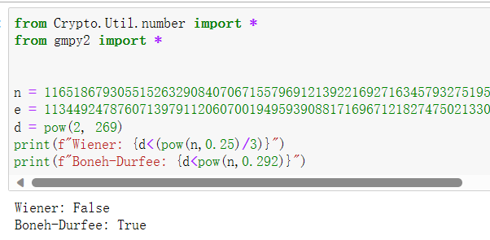
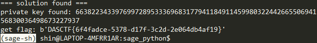

## so-large-e

 **题目：**

<details>
    <summary><b>点击展开代码</b></summary>


```python
from Crypto.Util.number import *
from Crypto.PublicKey import RSA
from flag import flag
import random

m = bytes_to_long(flag)

p = getPrime(512)
q = getPrime(512)
n = p*q
e = random.getrandbits(1024)
assert size(e)==1024
phi = (p-1)*(q-1)
assert GCD(e,phi)==1
d = inverse(e,phi)
assert size(d)==269

pub = (n, e)
PublicKey = RSA.construct(pub)
with open('pub.pem', 'wb') as f :
    f.write(PublicKey.exportKey())

c = pow(m,e,n)
print('c =',c)

print(long_to_bytes(pow(c,d,n)))


#c = 6838759631922176040297411386959306230064807618456930982742841698524622016849807235726065272136043603027166249075560058232683230155346614429566511309977857815138004298815137913729662337535371277019856193898546849896085411001528569293727010020290576888205244471943227253000727727343731590226737192613447347860

#pub文件里有n和e的值：
#n = 116518679305515263290840706715579691213922169271634579327519562902613543582623449606741546472920401997930041388553141909069487589461948798111698856100819163407893673249162209631978914843896272256274862501461321020961958367098759183487116417487922645782638510876609728886007680825340200888068103951956139343723
#e = 113449247876071397911206070019495939088171696712182747502133063172021565345788627261740950665891922659340020397229619329204520999096535909867327960323598168596664323692312516466648588320607291284630435682282630745947689431909998401389566081966753438869725583665294310689820290368901166811028660086977458571233
```

</details>

因为对比n和e的时候发现：这两数是几乎一样长的；所以可以猜测这两种攻击中的一种：**Wiener攻击** 或 **Boneh-Durfee攻击**

这两种攻击的区别在于：前者的条件是：**$d<\frac {1}{3}N^{\frac {1}{4}}$**,而后者的条件是：$d<N^{0.292}$。

假如说一开始不太懂区分，那就直接都试一下。这里因为题目有给出d的位数，所以我就通过计算去分析，看应该是哪种攻击，结果如下：



由此可知：这里应该选**Boneh-Durfee攻击**。

接着就是直接带进[脚本](https://github.com/mimoo/RSA-and-LLL-attacks/blob/master/boneh_durfee.sage)里去算就行，不过得调调参数才能运行（好像是 **delta>=0.23，m>=5**；这样的运行速度更快）。

代码如下：

<details>
    <summary><b>点击展开代码</b></summary>


```python
# sage
from __future__ import print_function
from Crypto.Util.number import *
import time

############################################
# Config
##########################################

"""
Setting debug to true will display more informations
about the lattice, the bounds, the vectors...
"""
debug = True

"""
Setting strict to true will stop the algorithm (and
return (-1, -1)) if we don't have a correct
upperbound on the determinant. Note that this
doesn't necesseraly mean that no solutions
will be found since the theoretical upperbound is
usualy far away from actual results. That is why
you should probably use `strict = False`
"""
strict = False

"""
This is experimental, but has provided remarkable results
so far. It tries to reduce the lattice as much as it can
while keeping its efficiency. I see no reason not to use
this option, but if things don't work, you should try
disabling it
"""
helpful_only = True
dimension_min = 7 # stop removing if lattice reaches that dimension

############################################
# Functions
##########################################

# display stats on helpful vectors
def helpful_vectors(BB, modulus):
    nothelpful = 0
    for ii in range(BB.dimensions()[0]):
        if BB[ii,ii] >= modulus:
            nothelpful += 1

    print(nothelpful, "/", BB.dimensions()[0], " vectors are not helpful")

# display matrix picture with 0 and X
def matrix_overview(BB, bound):
    for ii in range(BB.dimensions()[0]):
        a = ('%02d ' % ii)
        for jj in range(BB.dimensions()[1]):
            a += '0' if BB[ii,jj] == 0 else 'X'
            if BB.dimensions()[0] < 60:
                a += ' '
        if BB[ii, ii] >= bound:
            a += '~'
        print(a)

# tries to remove unhelpful vectors
# we start at current = n-1 (last vector)
def remove_unhelpful(BB, monomials, bound, current):
    # end of our recursive function
    if current == -1 or BB.dimensions()[0] <= dimension_min:
        return BB

    # we start by checking from the end
    for ii in range(current, -1, -1):
        # if it is unhelpful:
        if BB[ii, ii] >= bound:
            affected_vectors = 0
            affected_vector_index = 0
            # let's check if it affects other vectors
            for jj in range(ii + 1, BB.dimensions()[0]):
                # if another vector is affected:
                # we increase the count
                if BB[jj, ii] != 0:
                    affected_vectors += 1
                    affected_vector_index = jj

            # level:0
            # if no other vectors end up affected
            # we remove it
            if affected_vectors == 0:
                print("* removing unhelpful vector", ii)
                BB = BB.delete_columns([ii])
                BB = BB.delete_rows([ii])
                monomials.pop(ii)
                BB = remove_unhelpful(BB, monomials, bound, ii-1)
                return BB

            # level:1
            # if just one was affected we check
            # if it is affecting someone else
            elif affected_vectors == 1:
                affected_deeper = True
                for kk in range(affected_vector_index + 1, BB.dimensions()[0]):
                    # if it is affecting even one vector
                    # we give up on this one
                    if BB[kk, affected_vector_index] != 0:
                        affected_deeper = False
                # remove both it if no other vector was affected and
                # this helpful vector is not helpful enough
                # compared to our unhelpful one
                if affected_deeper and abs(bound - BB[affected_vector_index, affected_vector_index]) < abs(bound - BB[ii, ii]):
                    print("* removing unhelpful vectors", ii, "and", affected_vector_index)
                    BB = BB.delete_columns([affected_vector_index, ii])
                    BB = BB.delete_rows([affected_vector_index, ii])
                    monomials.pop(affected_vector_index)
                    monomials.pop(ii)
                    BB = remove_unhelpful(BB, monomials, bound, ii-1)
                    return BB
    # nothing happened
    return BB

""" 
Returns:
* 0,0   if it fails
* -1,-1 if `strict=true`, and determinant doesn't bound
* x0,y0 the solutions of `pol`
"""
def boneh_durfee(pol, modulus, mm, tt, XX, YY):
    """
    Boneh and Durfee revisited by Herrmann and May
    
    finds a solution if:
    * d < N^delta
    * |x| < e^delta
    * |y| < e^0.5
    whenever delta < 1 - sqrt(2)/2 ~ 0.292
    """

    # substitution (Herrman and May)
    PR.<u, x, y> = PolynomialRing(ZZ)
    Q = PR.quotient(x*y + 1 - u) # u = xy + 1
    polZ = Q(pol).lift()

    UU = XX*YY + 1

    # x-shifts
    gg = []
    for kk in range(mm + 1):
        for ii in range(mm - kk + 1):
            xshift = x^ii * modulus^(mm - kk) * polZ(u, x, y)^kk
            gg.append(xshift)
    gg.sort()

    # x-shifts list of monomials
    monomials = []
    for polynomial in gg:
        for monomial in polynomial.monomials():
            if monomial not in monomials:
                monomials.append(monomial)
    monomials.sort()
    
    # y-shifts (selected by Herrman and May)
    for jj in range(1, tt + 1):
        for kk in range(floor(mm/tt) * jj, mm + 1):
            yshift = y^jj * polZ(u, x, y)^kk * modulus^(mm - kk)
            yshift = Q(yshift).lift()
            gg.append(yshift) # substitution
    
    # y-shifts list of monomials
    for jj in range(1, tt + 1):
        for kk in range(floor(mm/tt) * jj, mm + 1):
            monomials.append(u^kk * y^jj)

    # construct lattice B
    nn = len(monomials)
    BB = Matrix(ZZ, nn)
    for ii in range(nn):
        BB[ii, 0] = gg[ii](0, 0, 0)
        for jj in range(1, ii + 1):
            if monomials[jj] in gg[ii].monomials():
                BB[ii, jj] = gg[ii].monomial_coefficient(monomials[jj]) * monomials[jj](UU,XX,YY)

    # Prototype to reduce the lattice
    if helpful_only:
        # automatically remove
        BB = remove_unhelpful(BB, monomials, modulus^mm, nn-1)
        # reset dimension
        nn = BB.dimensions()[0]
        if nn == 0:
            print("failure")
            return 0,0

    # check if vectors are helpful
    if debug:
        helpful_vectors(BB, modulus^mm)
    
    # check if determinant is correctly bounded
    det = BB.det()
    bound = modulus^(mm*nn)
    if det >= bound:
        print("We do not have det < bound. Solutions might not be found.")
        print("Try with highers m and t.")
        if debug:
            diff = (log(det) - log(bound)) / log(2)
            print("size det(L) - size e^(m*n) = ", floor(diff))
        if strict:
            return -1, -1
    else:
        print("det(L) < e^(m*n) (good! If a solution exists < N^delta, it will be found)")

    # display the lattice basis
    if debug:
        matrix_overview(BB, modulus^mm)

    # LLL
    if debug:
        print("optimizing basis of the lattice via LLL, this can take a long time")

    BB = BB.LLL()

    if debug:
        print("LLL is done!")

    # transform vector i & j -> polynomials 1 & 2
    if debug:
        print("looking for independent vectors in the lattice")
    found_polynomials = False
    
    for pol1_idx in range(nn - 1):
        for pol2_idx in range(pol1_idx + 1, nn):
            # for i and j, create the two polynomials
            PR.<w,z> = PolynomialRing(ZZ)
            pol1 = pol2 = 0
            for jj in range(nn):
                pol1 += monomials[jj](w*z+1,w,z) * BB[pol1_idx, jj] / monomials[jj](UU,XX,YY)
                pol2 += monomials[jj](w*z+1,w,z) * BB[pol2_idx, jj] / monomials[jj](UU,XX,YY)

            # resultant
            PR.<q> = PolynomialRing(ZZ)
            rr = pol1.resultant(pol2)

            # are these good polynomials?
            if rr.is_zero() or rr.monomials() == [1]:
                continue
            else:
                print("found them, using vectors", pol1_idx, "and", pol2_idx)
                found_polynomials = True
                break
        if found_polynomials:
            break

    if not found_polynomials:
        print("no independant vectors could be found. This should very rarely happen...")
        return 0, 0
    
    rr = rr(q, q)

    # solutions
    soly = rr.roots()

    if len(soly) == 0:
        print("Your prediction (delta) is too small")
        return 0, 0

    soly = soly[0][0]
    ss = pol1(q, soly)
    solx = ss.roots()[0][0]

    #
    return solx, soly

def Boneh_Durfee(N, e):
    ############################################
    # How To Use This Script
    ##########################################

    #
    # The problem to solve (edit the following values)
    #

    # the hypothesis on the private exponent (the theoretical maximum is 0.292)
    delta = 0.23 # this means that d < N^delta

    #
    # Lattice (tweak those values)
    #

    # you should tweak this (after a first run), (e.g. increment it until a solution is found)
    m = 5 # size of the lattice (bigger the better/slower)

    # you need to be a lattice master to tweak these
    t = int((1-2*delta) * m)  # optimization from Herrmann and May
    X = 2*floor(N^delta)  # this _might_ be too much
    Y = floor(N^(1/2))    # correct if p, q are ~ same size

    #
    # Don't touch anything below
    #

    # Problem put in equation
    P.<x,y> = PolynomialRing(ZZ)
    A = int((N+1)/2)
    pol = 1 + x * (A + y)

    #
    # Find the solutions!
    #

    # Checking bounds
    if debug:
        print("=== checking values ===")
        print("* delta:", delta)
        print("* delta < 0.292", delta < 0.292)
        print("* size of e:", int(log(e)/log(2)))
        print("* size of N:", int(log(N)/log(2)))
        print("* m:", m, ", t:", t)

    # boneh_durfee
    if debug:
        print("=== running algorithm ===")
        start_time = time.time()

    solx, soly = boneh_durfee(pol, e, m, t, X, Y)

    # found a solution?
    if solx > 0:
        print("=== solution found ===")
        if False:
            print("x:", solx)
            print("y:", soly)

        d = int(pol(solx, soly) / e)
        print("private key found:", d)
        return int(d)
    else:
        print("=== no solution was found ===")
        return 0

    if debug:
        print(("=== %s seconds ===" % (time.time() - start_time)))

if __name__ == "__main__":
    # cipher
    c = 6838759631922176040297411386959306230064807618456930982742841698524622016849807235726065272136043603027166249075560058232683230155346614429566511309977857815138004298815137913729662337535371277019856193898546849896085411001528569293727010020290576888205244471943227253000727727343731590226737192613447347860
    # the modulus
    N = 116518679305515263290840706715579691213922169271634579327519562902613543582623449606741546472920401997930041388553141909069487589461948798111698856100819163407893673249162209631978914843896272256274862501461321020961958367098759183487116417487922645782638510876609728886007680825340200888068103951956139343723
    # the public exponent
    e = 113449247876071397911206070019495939088171696712182747502133063172021565345788627261740950665891922659340020397229619329204520999096535909867327960323598168596664323692312516466648588320607291284630435682282630745947689431909998401389566081966753438869725583665294310689820290368901166811028660086977458571233
    d = Boneh_Durfee(N, e)
    if d != 0:
        print(f"get flag: {long_to_bytes(int(pow(c, d, N)))}")
```

</details>

结果如下：



于是就得到了flag：**DASCTF{6f4fadce-5378-d17f-3c2d-2e064db4af19}**

<hr style="border: 0.5px solid black;"/>

## matrixequation

**题目：**

<details>
    <summary><b>点击展开代码</b></summary>


```python
from sage.all import *
import string
from myflag import finalflag, flag

assert len(flag) == 24

alphabet = string.printable[:71]
p = len(alphabet)


def getKey():
    R = random_matrix(GF(p), 11, 11)
    while True:
        tmpMatrix = random_matrix(GF(p), 11, 11)
        if tmpMatrix.rank() == 11:
            _, leftmatrix, matrixU = tmpMatrix.LU()
            return R, leftmatrix, matrixU

A = matrix([[0 for i in range(11)] for i in range(11)])
for k in range(len(flag)):
	i, j = 5*k // 11, 5*k % 11
	A[i, j] = alphabet.index(flag[k])
from hashlib import md5
assert(finalflag == 'DASCTF{' + f'{md5(flag.encode()).hexdigest()}' + '}')
key = getKey()
R, leftmatrix, matrixU = key
tmpMatrix = leftmatrix * matrixU
X = A + R
Y = tmpMatrix * X
E = leftmatrix.inverse() * Y

f = open('output','w')
f.write(str(E)+'\n')
f.write(str(leftmatrix * matrixU * leftmatrix)+'\n')
f.write(str(f'{leftmatrix.inverse() * tmpMatrix**2 * leftmatrix}\n'))
f.write(str(f'{R.inverse() * tmpMatrix**8}\n'))
#因为矩阵太长了，所以我就不展示了，如果有需要的师傅可以qq联系我
```

</details>

这道题说到底，就是考了个**矩阵乘法**。

所以解题的关键就是看我们知道啥：

> 已知信息：$\\1,\ E=U*(A+R)\\ 2,\ E1=LUL\\3,\ E2=ULUL\\4,\ E3=(R^-1)*(LU)^8$

因此，我们有以下解题过程：

> 由$E2$和$E1$可以得到:$\ \ U=E2*({E1}^{-1})\\$由$U$、$E3$和$E2$可以得到:$\ \ R=(E3 * {(E1*U)}^{-4})^{-1}\\$ 由$E$和$U$可以得到: $\ \ AR=E*{U}^{-1}$  (即$A+R$) $\\$ 最后便可得到:$\ \ A=AR-R$

因为我们的flag是按一定的规则存入矩阵A中：

```python
for k in range(len(flag)):
	i, j = 5*k // 11, 5*k % 11
	A[i, j] = alphabet.index(flag[k])
```

所以我们就直接按这个顺序，输出矩阵A上对应位置的数字所对应的printable[:71]里的字符即可。

最后就是带上 **DASCTF{}**，再算个MD5值提交即可。

代码如下：

<details>
    <summary><b>点击展开代码</b></summary>


```python
from Crypto.Util.number import  long_to_bytes
from hashlib import md5 
import re
import string


alphabet = string.printable[:71]
p = Integer(len(alphabet))

with open("D:\\CTF\\ctf\\ctf_task\\chb\\matrixequation的附件\\tempdir\\CRYPTO附件\\matrixequation\\output", "r") as p:
     data = p.read().split("\n")[:-1]
# print(data)
data = [re.findall(r"\d+", d) for d in data]
data = [[Integer(di) for di in d] for d in data]
# print(data[:11])
E = matrix(GF(71), data[:11])
LUL = matrix(GF(71), data[11:22])
ULUL = matrix(GF(71), data[22:33])
R1LU8 = matrix(GF(71), data[33:])

U = LUL.solve_left(ULUL)
LU8=(LUL*U)**4
R = (LU8.solve_left(R1LU8)).inverse()
AR = U.solve_right(E)
A = AR - R
m = "".join([alphabet[A[5*k // 11, 5*k % 11]] for k in range(24)])
print(md5(m.encode()).hexdigest())
# 3529d01631d8436edca1c78ad82b6f26
```

</details>

<hr style="border: 0.5px solid black;"/>

还剩一道cuckoo，因为没咋见过，就没写出来（

