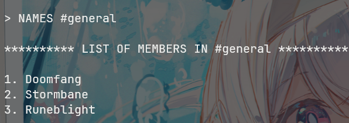
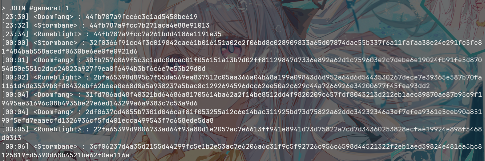

# Traces

## 题目与描述

> Long ago, a sacred message was sealed away, its meaning obscured by the overlapping echoes of its own magic. The careless work of an enchanter has left behind a flaw—a weakness hidden within repetition. With keen eyes and sharper wits, can you untangle the whispers of the past and restore the lost words?

<details>
    <summary><b>点击展开代码</b></summary>

```python
from db import *
from Crypto.Util import Counter
from Crypto.Cipher import AES
import os
from time import sleep
from datetime import datetime

def err(msg):
    print('\033[91m'+msg+'\033[0m')

def bold(msg):
    print('\033[1m'+msg+'\033[0m')

def ok(msg):
    print('\033[94m'+msg+'\033[0m')

def warn(msg):
    print('\033[93m'+msg+'\033[0m')

def menu():
    print()
    bold('*'*99)
    bold(f"*                                🏰 Welcome to EldoriaNet v0.1! 🏰                                *")
    bold(f"*            A mystical gateway built upon the foundations of the original IRC protocol 📜        *")
    bold(f"*          Every message is sealed with arcane wards and protected by powerful encryption 🔐      *")
    bold('*'*99)
    print()

class MiniIRCServer:
    def __init__(self, host, port):
        self.host = host
        self.port = port
        self.key = os.urandom(32)

    def display_help(self):
        print()
        print('AVAILABLE COMMANDS:\n')
        bold('- HELP')
        print('\tDisplay this help menu.')
        bold('- JOIN #<channel> <key>')
        print('\tConnect to channel #<channel> with the optional key <key>.')
        bold('- LIST')
        print('\tDisplay a list of all the channels in this server.')
        bold('- NAMES #<channel>')
        print('\tDisplay a list of all the members of the channel #<channel>.')
        bold('- QUIT')
        print('\tDisconnect from the current server.')

    def output_message(self, msg):
        enc_body = self.encrypt(msg.encode()).hex()
        print(enc_body, flush=True)
        sleep(0.001)

    def encrypt(self, msg):
        encrypted_message = AES.new(self.key, AES.MODE_CTR, counter=Counter.new(128)).encrypt(msg)
        return encrypted_message
    
    def decrypt(self, ct):
        return self.encrypt(ct)
    
    def list_channels(self):
        bold(f'\n{"*"*10} LIST OF AVAILABLE CHANNELS {"*"*10}\n')
        for i, channel in enumerate(CHANNELS.keys()):
            ok(f'{i+1}. #{channel}')
        bold('\n'+'*'*48)

    def list_channel_members(self, args):
        channel = args[1] if len(args) == 2 else None

        if channel not in CHANNEL_NAMES:
            err(f':{self.host} 403 guest {channel} :No such channel')
            return
        
        is_private = CHANNELS[channel[1:]]['requires_key']
        if is_private:
            err(f':{self.host} 401 guest {channel} :Unauthorized! This is a private channel.')
            return

        bold(f'\n{"*"*10} LIST OF MEMBERS IN {channel} {"*"*10}\n')
        members = CHANNEL_NAMES[channel]
        for i, nickname in enumerate(members):
            print(f'{i+1}. {nickname}')
        bold('\n'+'*'*48)

    def join_channel(self, args):
        channel = args[1] if len(args) > 1 else None
        
        if channel not in CHANNEL_NAMES:
            err(f':{self.host} 403 guest {channel} :No such channel')
            return

        key = args[2] if len(args) > 2 else None

        channel = channel[1:]
        requires_key = CHANNELS[channel]['requires_key']
        channel_key = CHANNELS[channel]['key']

        if (not key and requires_key) or (channel_key and key != channel_key):
            err(f':{self.host} 475 guest {channel} :Cannot join channel (+k) - bad key')
            return
        
        for message in MESSAGES[channel]:
            timestamp = message['timestamp']
            sender = message['sender']
            print(f'{timestamp} <{sender}> : ', end='')
            self.output_message(message['body'])
        
        while True:
            warn('You must set your channel nickname in your first message at any channel. Format: "!nick <nickname>"')
            inp = input('guest > ').split()
            if inp[0] == '!nick' and inp[1]:
                break

        channel_nickname = inp[1]
        while True:
            timestamp = datetime.now().strftime('%H:%M')
            msg = input(f'{timestamp} <{channel_nickname}> : ')
            if msg == '!leave':
                break

    def process_input(self, inp):
        args = inp.split()
        cmd = args[0].upper() if args else None

        if cmd == 'JOIN':
            self.join_channel(args)
        elif cmd == 'LIST':
            self.list_channels()
        elif cmd == 'NAMES':
            self.list_channel_members(args)
        elif cmd == 'HELP':
            self.display_help()
        elif cmd == 'QUIT':
            ok('[!] Thanks for using MiniIRC.')
            return True
        else:
            err('[-] Unknown command.')


server = MiniIRCServer('irc.hackthebox.eu', 31337)

exit_ = False
while not exit_:
    menu()
    inp = input('> ')
    exit_ = server.process_input(inp)
    if exit_:
        break

```

</details>

---

## 题目分析

其实也没啥好分析的（因为我是手动去解的，所以对这题没什么好感。。。）

这个主要是考的**CTR模式的参数复用问题**（算是直觉吧，毕竟这个问题理解起来确实挺easy的）：

> 因为我们知道：$C_{i}=E_{i}(Counter, key)\oplus M_{i}$，其中$E_{i}()$是加密函数。
>
> 假如key与Counter固定，那此时就变成了流密码了，即：$C_{i}=E_{i}(Counter, key)\oplus M_{i}=K_{i}\oplus M_{i}$

而题目代码里就表明key与Counter是固定的（key和Counter分别在 **\_\_init\_\_** 和 **encrypt** 两处有所涉及），所以我们直接想成流密码的加解密形式即可（原理其实是异或的性质了，这个我就不过多解释了）。

然后就说一下题目具体的形式了。

本题靶机能实现的功能其实就四种：

> - HELP 
>
>   —— 显示此帮助菜单。 
>
> - JOIN #\<channel\> \<key\>
>
>   —— 使用可选密钥 \<key\> 连接到频道 #\<channel\>。 
>
> - LIST
>
>   —— 显示此服务器中所有频道的列表。 
>
> - NAMES #\<channel\>
>
>   —— 显示频道 #\<channel\> 所有成员的列表。 
>
> - QUIT
>
>   —— 与当前服务器断开连接。 

所以我们先LIST一下看看：


会发现有两个channel，然后NAMES一下看看：




那很明显——flag肯定是在secret里的（不让看名字，肯定有什么见不得人的东西bushi）

然后就看一下题目中我们最需要关心的一个函数——join_channel()，因为这部分有用到CTR加密，也与上面两个频道有关：

```python
def join_channel(self, args):
    channel = args[1] if len(args) > 1 else None
    
    if channel not in CHANNEL_NAMES:
        err(f':{self.host} 403 guest {channel} :No such channel')
        return

    key = args[2] if len(args) > 2 else None

    channel = channel[1:]
    requires_key = CHANNELS[channel]['requires_key']
    channel_key = CHANNELS[channel]['key']

    if (not key and requires_key) or (channel_key and key != channel_key):
        err(f':{self.host} 475 guest {channel} :Cannot join channel (+k) - bad key')
        return
        
    for message in MESSAGES[channel]:
        timestamp = message['timestamp']
        sender = message['sender']
        print(f'{timestamp} <{sender}> : ', end='')
        self.output_message(message['body'])

    while True:
        warn('You must set your channel nickname in your first message at any channel. Format: "!nick <nickname>"')
        inp = input('guest > ').split()
        if inp[0] == '!nick' and inp[1]:
            break

    channel_nickname = inp[1]
    while True:
        timestamp = datetime.now().strftime('%H:%M')
        msg = input(f'{timestamp} <{channel_nickname}> : ')
        if msg == '!leave':
            break
```

其中有一个判断语句引起了我的注意：

```python
channel = channel[1:]
requires_key = CHANNELS[channel]['requires_key']
channel_key = CHANNELS[channel]['key']
if (not key and requires_key) or (channel_key and key != channel_key):
    err(f':{self.host} 475 guest {channel} :Cannot join channel (+k) - bad key')
    return
```

这里说明一件事：**general频道的key随便输，但secret频道的key是固定的**。

既然如此，我就有个大胆的想法：secret的key应该是在general里的。（毕竟刚刚都提到了CTR的问题）

所以我们先连接general看看，会发现命令行里出现了一个预设对话（但是加密了）：



然后发现前三句好像有一部分是相同的，最后三句也是（之后解的时候才发现其实是join_channel函数里的"**!nick** "(**k后面有一个空格**)和"**!leave**"）；前三句的其余部分又刚好跟说话的人的名字长度一一对应，所以就能得到一部分的K。

因为我当时并不知道有啥自动的解法，所以我就干脆直接纯手动——**根据已知部分去拼接猜测前或者后的单词**XD（只能说十分难绷），通过自己的英文水平+GPT来猜已知信息的前后字母所对应的单词（这个还是有个判断标准的：如果猜对的话，对话的其他部分肯定也解出来**可打印字符**）

然后就能在里边找到secret频道的key：**%mi2gvHHCV5f_kcb=Z4vULqoYJ&oR**

接着就还是同样的方法，去secret里边得到一个预设对话，最后就找到了flag：**HTB{Crib_Dragging_Exploitation_With_Key_Nonce_Reuse!}**

(前面能这样做是因为：从general那得到我手动得到的key后，我就重新试了一遍，发现secret频道的key是固定的，所以就发现flag是静态的了XD)

---

## EXP

我这里放一下分别放一下general和secret最后的记录：

<details>
    <summary><b>点击展开代码</b></summary>

```python
'''
6ded45c5f91e 5875f06d55a52e01
6ded45c5f91e 4f6ef0725ea621086c
6ded45c5f91e 4e6ff16551a8290161af
'''

bb = ["6ded45c5f91e5875f06d55a52e01",
      "6ded45c5f91e4f6ef0725ea621086c",
      "6ded45c5f91e4e6ff16551a8290161af",
      "1be60bd0f71e7b75eb2052e42e037efb0601de8a8c813698acbeb4ef0aafc8dda47bf9e6cdbb3559fd03fb8e77718e24bf34adc12677391bd81a9382b76655b83fa2", 
      "19ed48c3e04d6875f0641de408077afb0600cbd888c33b88bdf0e0e601f69acbaf79fbb58cfd5948e141e58e6e718c26f02ea8da68737109c5548095fe7f41be7ae063f636c581ad3f017c",
      "02ec5886eb5b6836bf6246b0602f2eb6520bc6cf8e883083bfbeb3e802ea9acda86be6e082f7594fe043e6cf7067c574d63df8c76e71285adf5f8d83bb3041bf76ac75e0628885a5211063cd84fb9c8c124433d4a0590ef49a0f9b56253256e808b27c989d4c"
      "18eb45d5b25d747bf16e56a8600f7afb1c07da8a9e823f88f8f8aff54fe3d5d6a13ee1f48ff00a12a968edda3b67cb27e832acd06e3425158c559682fe6046a52ced76e0629783ad244a", 
      "04e65ec3b2576f3aeb6856e430077aa80200dccb9e86798bb7ece0e81afd9acba37de0e786bb1a54e84ae6cb702ecb71f232ead4705c1939fa0f85afb57356f100b874d00e94839b03422cf7", 
      "0bec5886fb4a323ad06e5fbd601561ba000d8ec399c32e84acf6e0e81afd9ad5a96de1b597e90c4ffd41ec8e7d78873dfa28f6", 
      "15e65f88b2716968bf6c52b7344664b4040d8ec78c9a7985b9e8a5a703eadccce66ae7f480fe0a12a973ed8e71619820bf39bd93707123038c598282bb7641a074", 
      "05a44186f1567979f4695da360097ca95204c1cd9ec32d82f8fca5a71cfac8dde670fab597e9185fec04e7c83c7b9e26bf3abbc76f7b3f098c48869dbf795abf74", 
      "07e649d6b253793aea7057a534036df55221c88a998b3c94f8fda1f30ce79ad7a832b5e286bc1550a94ce9d879349f3bbf3abbc726723009d814", 
      "05a440cab25d7377ef6141a1601261be5204cfde88902dcdbcffb4e64ff8d3ccae3efae091bb1b5dea4ffdde3c648735f175f8e463343c0fdf4ec395ac7147a97aed6cfc629685a5274434c0c5fa9cde030b7bd2ba5d4e", 
      "05e50cc3e45b6e63eb685aaa274660a8520bc2cf8c9175cdaffbe0ea00f9df98b271b5e18bfe5952ec5cfc8e6f608a33fa75f8fc7366711dc35b8fd0b76314bb33f86aec2cc59ea728072b8b", 
      "04ec40c2b2517234bf4914a960156cbe1b06c98a9e972b8cb6f9a5a71ce6ddd6a772e6b585e91651a94bfdda6f7d8f31b17b8fd62679381dc44ec392bb3043ad2eef6ae026cb", 
      "1be60cc5f3503b6ebf7452af254668b50b48dcc39e882ac3f8d2a5f348fc9ad4a37fe3f0c3ef1155fa04ebc67d7a8531f37bbad6607b231f8c4e8b95a73040be3bef69a53796c2", 
      "0de45ec3f75a323ad26f45a1600765b7521ccfc686907999b7beb4ef0aafcacaaf68f4e186bb0b53e649a68e4e618531fd37b1d46e607d5adc568691ad7514af36e963f7629184a769082cc296ad91c9144e3d", 
      "19ed48c3e04d6875f0641de4094164fb1601ddc9828d3788bbeaa9e908afd4d7b130b5dc85bb0d54ec5da8c67d628e74ec3ebddd266122568c4d86d0b36547b87ae86bf623959ca7281663cc88e09cc80f4a67d2a4414e",
      "6def49c7e45b"
]
a = bb[16]
print(f"len = {len(a)//2}")
print(f"6 len = {len(bb)//2}")
known = b"Understood. I'm disconnecting now. If they have seen us, we must disappear immediately"
print(f"len = {len(known)}")
key = b"".join([bytes([i ^ j]) for (i, j) in zip(bytes.fromhex(a), known)])
#print(len(bytes.fromhex(a)))

for b in range(len(bb)):
    print(b, b"".join([bytes([i ^ j]) for (i, j) in zip(bytes.fromhex(bb[b]), key)]))
'''
len = 87
6 len = 76
len = 86
0 b'!nick Doomfang'
1 b'!nick Stormbane'
2 b'!nick Runeblight'
3 b"We've got a new tip about the rebels. Let's keep our chat private."
4 b'Understood. Has there been any sign of them regrouping since our last move?'
5 b"Not yet, but I'm checking some unusual signals. If they sense us, we might have to cha"
6 b'Here is the passphrase for our secure channel: %mi2gvHHCV5f_kcb=Z4vULqoYJ&oR'
7 b'Got it. Only share it with our most trusted allies.'
8 b'Yes. Our last move may have left traces. We must be very careful.'
9 b"I'm checking our logs to be sure no trace of our actions remains."
10 b"Keep me updated. If they catch on, we'll have to act fast."
11 b"I'll compare the latest data with our backup plan. We must erase any sign we were here"
12 b'If everything is clear, we move to the next stage. Our goal is within reach.'
13 b"Hold on. I'm seeing strange signals from outside. We might be watched."
14 b"We can't take any risks. Let's leave this channel before they track us."
15 b'Agreed. Move all talks to the private room. Runeblight, please clear the logs here.'
16 b"Understood. I'm disconnecting now. If they have seen us, we must disappear immediately"
17 b'!leave'
"\nWe've got a new tip about\nUnderstood. I'm disconnect\n"
'''
```

</details>

<details>
    <summary><b>点击展开代码</b></summary>

```python
'''
6ded45c5f91e 5875f06d55a52e01
6ded45c5f91e 4f6ef0725ea621086c
6ded45c5f91e 4e6ff16551a8290161af
'''

bb = ["52073a1429fd646fdd17083e28c0", 
      "52073a1429fd7374dd08033d27c947",
      "52073a1429fd7275dc1f0c332fc04a52",
      "240c73042ab2556cd65a053a23d7024904fe0be9ed9397bf5ede6d4a71156618f74e5fdcf23cc0d2c804bee2933ed4502cfbf0bffaecd4dd99645a09c088f1898f1110d558979be6521344366990644fd97d9b6d555b62d0d207ec8e9e8301d4e6dd38aac60ef4e2c740830d", 
      "320e211227b90e20e6120b7f23c9474b08ab58b9f29196a443c32a0d6b1f635db40179d1b76ccad5cf08bfb69e31cc127f92f7edeba4dfcbcd274818c095a389d5541f9b5d9798e15440593275c92b4c80779d3f025e73c0d340f695d7831acce6ca38bec703f6accf438646ad0786a287875de30069bbdaafd6f66a501972f75784c82d699b2daedabdb5c04e4afeb95e7c8094270678c9748f0792768c8a312ac82a5e46fd50cb6b37a7aea7d10a5d95d9d2", 
      "3a4e251262bf4565dc5a1d2b33c35b4f1feb0bede997d9a545d1690f6a507818bf1a2bd6f274c6c9d841aebbdb30cd4e7fabe3a8e9a5d5c79e644002c09ced98c24518d452c4c3a95c5d4d777486294fd4708123451a70d6df4bebc68cd101cae49d3886db1dbae2c758874cff0dc1ac88c95de74570a487afe9f2391d1f64ed03cac82c3dda32abd2a4f4d8550fe3a45e6e8bd1201b33c869d81ac27d8c987231c927455af913d42339a6fce9cd105dc5c59a967b637ccd6eb8fcc51600e8105da15e0c4332786bbe73eea0989941c0460d55b7913994cb70d22ceb4cc138a2a1e6f1d2dd6f9064f12f1af89e5397dd4df5a708547f4c6d2022645066f6f4c37daaf97d14a4c25855aff4f3f98fb6677a4a008be3418682feacfbd62733b3037297c9c2d5158a5659ed216004817475f484366836017bff32dd630f6e61185871320fbdb02fcd572b01f3ff53789d5977f971650a63b27633e3", 
      "3a4e3e5723b15265d31e177f25d54d5502a148f1e49192b859d72a056c02340ea90b67d8e073ddcc9c00aba39231cb487faff9a8bfadd4d184214718838fe68fcc4315c81297a6ef1d47413e74c9264fc17b8723024d77c09a57f9948f8301c2a3d276e9c103fee9d00c954dee0e80ad9a844bf95430e8bda8edff6a5b056fe7579ad536269c6fe2f7bfe1944f49b7a20a2f8c8275143bd26fd911c271868e3d7ed3624f5abc44c56b30b3aae2821f1895d893d4627531823b85e08a0706e7195daf1c3d0b3a2b28b272f8a99dd546c1460f53b08d3594c5329563ee0dda2860421dedd8993c9d2df1214fe2d7479fd94da6f00447624c732337275767f6f7c97db6e96c46a4d81d59b5b1f7b28f8a6e635a479af81a", 
      "240c731423b34e6fc65a0f3920c8504251e44eeae88698a55edf64443939725dad0662c7b775dc87dd41aeb09e3edb5473fbe5a5faa29ac685210924ca9aebcce05e04d55fde83ae4e134f38758a215980758934025b7ac1df46fc9fdbc10b84ecdd38a6db1dbaf8d04d994fa346a4b58b870ee34879e887e2e0ff26581f75a31a83d42d289124e2d6a5e0d8420ff3a41162c59e200778c368db1d907ac99a7033d76b4353f21d801c3df2b1f2d10a1886c592d06762318c7ab8b4c50a0af75550e95e375e292b2aaf7ffaa2999947c0000654b09c23dac43d8426b90ecd29ece2eaebd3c93d9d6cb83d5ff4d9", 
      "3611321436b1592e923b003b66c254431fac42ffa1859cf145d5670b701e3408b71d6ed1f93cc9c8ce41a2ad8c73984b3afbffa8faa89ad1822a5d05cd9ae682c04851cb50d681fa13136031279d2c4f805b87384c597fdf9a41f7948fca08cde6c038a0da1cbae1c34b9940ec0ac1a18f9b5cfe456ebbd8aff6f66a5e0374ef13cacb363a9f61a3d6a9f0c7550fe3a45e7b8d943c0778d572dd1b8c7881967d3ad4240a70f313d72e78babdf1c75e59c5d999d5617e38cd69b5b4c70108fc0619e018784e357f39a43cf2aadccd4bc0461348aa943188d57c9522ed098825f1e2fae1dfd52a963e", 
      "2a0c205b62bf5574920d0b7f2bd2515251f859fce086d9b8439065047509341caa4e6a94fb7ddcd39c13a9b1942dcc127f92f7ede8a99ad38e30401ac289e6ccca4551cf53d8cffa525c477b279e210ad2719b26024873c5df46f48f95c44ecdf7c038a5c10cfbf8cb439e0dad2f95e3879a0efb417ead98eae5b32b4e5621cb23a8dc1a3b93239df1b8f4d34146f9ac214a9d81391a31d267db1d8d71b6ae782acf556151e56cee2436b1b9d8f01b4d96cfddcb", 
      "34063c136cfd6e6f92080b3c29d546061eea0bf0f5d294a444c42a0f61196709f9076594e374ca87cb13a5b68f3ad61c2bb4fca8ece29afbcd334000cfdde682d04403de1cd683e51d475b36648c370ac16a8d6d474877c0df43b4c69acd0a84eac738bac60ef6e082429555e814c1a18bc95de74f77ad9aafeef56a521c64ed1b938979009c61b6ddafb5d1484afab25e6a9394275534c367dd1a913f869f3137d3260a43f913d72234befcefc3085dc5c493967d753fc375a8b4c90c08fc165ca1", 
      "320e211227b90e20e6120b7f2bc8504351fb4eb9e59b8ab242c3794a7004385dad066e94f06ecac6c804bee28f37dd1c2db2e2a6b1ecffc48836504cce92ee89cd4551cc59978bec5152507b279d2c4f805b87384c597fdf9a54ec949ecd09d0ebd676ba8e06eeff82489545e80892a69dc70ec0453ca581fcf5b32b5e1821f01885c9792b9f27adc7afb5db535db7bc1761819e225537c026c00492709b8d6430ce7e5314ff5fcf383da1f2", 
      "240c73042ab2556cd65a0b312287564e18ff0bf4e4978db859d72a0b77143410b6186e94e3738fc69c0ca3b09e7fcb593caee3a8bfbfdbdc8e305c018dddca8a834519de55c5cfe45c544c242786360ad3688128511a77c1df07fb8a94d007cae49371a7824feee4c755d04eec1fc1aa809d4be54379b880afeee6381d1b6ef1139989791e9f61afc0b9e1944840e3eb0a6e8e94750130c7728f178a7e879a747087464f40bc47c8222bf2bee2820a50808a90d77d647cc17ebfe7cb030cb21c57af0a3042282b3bb17df8a9d2", 
      "5205361634b8"
]
a = bb[12]
print(f"len = {len(a)//2}")
print(f"5 len = {len(bb[9])//2}")
known = b'We should end this meeting and move to a more secure sanctum. If their mages or spies are closing in, they may intercept our words. We must not take that chance. Let this be the la'
print(f"len = {len(known)}")
key = b"".join([bytes([i ^ j]) for (i, j) in zip(bytes.fromhex(a), known)])
#print(len(bytes.fromhex(a)))

for b in range(len(bb)):
    print(b, b"".join([bytes([i ^ j]) for (i, j) in zip(bytes.fromhex(bb[b]), key)]))
'''
len = 205
5 len = 180
len = 180
0 b'!nick Doomfang'
1 b'!nick Stormbane'
2 b'!nick Runeblight'
3 b'We should keep our planning here. The outer halls are not secure, and too many eyes watch the open channels.'
4 b"Agreed. The enemy's scouts grow more persistent. If they catch even a whisper of our designs, they will move against us. We must not allow their seers or spies to track our steps."
5 b"I've been studying the traces left behind by our previous incantations, and something feels wrong. Our network of spells has sent out signals to an unknown beacon-one that none of "
6 b"I'm already cross-checking our spellwork against the ancient records. If this beacon was part of an older enchantment, I'll find proof. But if it is active now, then we have a prob"
7 b"We cannot afford hesitation. If this is a breach, then the High Council's forces may already be on our trail. Even the smallest mistake could doom our entire campaign. We must conf"
8 b'Exactly. And even if we remain unseen for now, we need contingency plans. If the Council fortifies its magical barriers, we could lose access to their strongholds. Do we have a sec'
9 b'Yes, but we must treat it only as a last resort. If we activate it too soon, we risk revealing its location. It is labeled as: HTB{Crib_Dragging_Exploitation_With_Key_Nonce_Reuse!}'
10 b'Good. No record of it must exist in the written tomes. I will ensure all traces are erased, and it shall never be spoken of openly. If the enemy ever learns of it, we will have no '
11 b'Agreed. The more we discuss it, the greater the risk. Every moment we delay, the Council strengthens its defenses. We must act soon before our window of opportunity closes.'
12 b'We should end this meeting and move to a more secure sanctum. If their mages or spies are closing in, they may intercept our words. We must not take that chance. Let this be the la'
13 b'!leave'
"\nWe've got a new tip about\nUnderstood. I'm disconnect\n"
'''
```

</details>

当时做完的时候，我只有一个心情：


<hr style="border: 0.5px solid black;"/>

# Kewiri

## 题目与描述

> he Grand Scholars of Eldoria have prepared a series of trials, each testing the depth of your understanding of the ancient mathematical arts. Those who answer wisely shall be granted insight, while the unworthy shall be cast into the void of ignorance. Will you rise to the challenge, or will your mind falter under the weight of forgotten knowledge?
> **The instance might take 1-2 minutes to start.**

题目是一个黑盒，所以只能一步一步交互去得到题目要问的问题。

---

## 题目分析

### 1，bit_length() of p

给的信息是：

```python
You are given the sacred prime: 
p = 21214334341047589034959795830530169972304000967355896041112297190770972306665257150126981587914335537556050020788061
[1] How many bits is the prime p? > 
```

因为做的时候发现p是不变的，所以直接存下来，传 **p.bit_length()** 过去即可

### 2，factor of GF(p).order()

给的信息是：
```python
[2] Enter the full factorization of the order of the multiplicative group 
in the finite field F_p in ascending order of factors (format: p0,e0_p1,e1_ ..., 
where pi are the distinct factors and ei the multiplicities of each factor) > 
```

这个也好说：因为p是素数，所以有：$factor(GF(p).order())=p-1$，于是算一下`factor(GF(p).order())`，然后照着题目的格式整一下传上去即可。

### 3，the generator of F(p)

给的信息是：
```python
[3] For this question, 
you will have to send 1 if the element is a generator of the finite field F_p, 
otherwise 0.\n
```

该问让我们判断17次（17是我试出来的）

这个的话，主要是考查判断生成元的步骤：

> 1.  **计算 $p−1$ 的素因子分解**：首先，将$p−1$分解为素因子的乘积，即 $p−1={q_1}^{e_1}{q_2}^{e_2}⋯{q_n}^{e_n}$，其中${q_i}$是不同的素数，${e_i}$ 是它们的指数。
> 2.  **检查$g$的阶是否为 $p−1$** ：对于每个素因子${q_i}$，计算$g^{(p-1)/{q_i}}\ mod\ p$ 。如果对于所有的$q_i$，结果都不等于$1$，则$g$的阶为$p−1$，即$g$是生成元。

照着去写代码即可（因为题目的**要求提交时间**很短，所以素因子分解最好提前预处理算好后直接代入函数里）

### 4，E(GF(p)).order()

给的信息是：
```python
The scholars present a sacred mathematical construct,
a curve used to protect the most guarded secrets of the realm.
Only those who understand its nature may proceed.
a = 408179155510362278173926919850986501979230710105776636663982077437889191180248733396157541580929479690947601351140
b = 8133402404274856939573884604662224089841681915139687661374894548183248327840533912259514444213329514848143976390134
[4] What is the order of the curve defined over F_p? > 
```

因为a和b都是固定参数，所以直接提前存着，代入创建椭圆曲线，最后`E.order()`即可。

### 5，E(GF(p^3)).order()

信息与第四问一样，但这里我们就不能直接`E.order()`了（一直转，没结果），不过我们能算出有限域$F_{p^2}$上定义的曲线的阶为$p^2+2p$。

这里的话，我是问了GPT，发现有一个奇特的规律：

> **如果有限域$F_p$上定义的曲线的阶是$|E(F_{p})|$的话，那么在p的n次扩域$F_{p^n}$上定义的曲线的阶为：$|E(F_{p^n})|=p^{n}+1-t_n$**
>
> **其中，$t_n$是Frobenius迹，具有这样的递推关系：$t_{n+1}=t_{1}t_{n}-pt_{n-1}$**

于是我们按这个规律去算一下就行

> **在有限域$F_{p}$上定义的曲线的阶为：$|E(F_{p})|=p+1-t_1=p$，所以$t_1=1$**
>
> **在p的2次扩域$F_{p^2}$上定义的曲线的阶为：$|E(F_{p^2})|=p^{2}+1-t_2=p^2+2p$，所以$t_2=1-2p$**
>
> **因为 $t_{3}=t_{1}t_{2}-pt_{1}=1-3p$，所以在p的3次扩域$F_{p^3}$上定义的曲线的阶为：**
>
> **$|E(F_{p^3})|=p^{3}+1-(1-3p)=p^{3}+3p$**

然后`factor(p^3+3*p)`就行，但说是这么说，其实那样子没法直接分解(估计是算法或者数字原因吧)；我最后采取的方法是：`factor(p^2+3)+[(p, 1)]`（因为p本身就是素数，所以我们可以单拎出来，分解剩下的部分后再加上）

最后照着[第二问](https://shinichicun.top/posts/htbctf2025-crypto-part/#2gfporder%E7%9A%84factor)的格式去提交即可。

### 6，get d of A=d*G

给的信息：

```python
⚔️ The chosen base point G has x-coordinate: 10754634945965100597587232538382698551598951191077578676469959354625325250805353921972302088503050119092675418338771
🔮 The resulting point A has x-coordinate: 1630272009235065245937318840748767144658560953993186245494301457334760761426175723116876404981498877523061124359995
[6] What is the value of d? > 
```

这个题让我们算d的值，而给我们的A和G的x坐标不是固定的，所以得写下交互实时代入进去；然后.log算出d提交即可。

### 7，get flag

最后接收flag就行。

## EXP

<details>
    <summary><b>点击展开代码</b></summary>

```python
from pwn import *


# Judgment on the generator of F(p)
def check(p, g, factors):
    order = p - 1
    for q, _ in factors:
        if pow(g, order // q, p) == 1:
            return False
    return True


# fixed parameters
p = 21214334341047589034959795830530169972304000967355896041112297190770972306665257150126981587914335537556050020788061
a = 408179155510362278173926919850986501979230710105776636663982077437889191180248733396157541580929479690947601351140
b = 8133402404274856939573884604662224089841681915139687661374894548183248327840533912259514444213329514848143976390134

# Because it takes time to obtain this data, preprocessing is carried out here first
# get factor(F(p).order()) ——> (p-1).factor()
fac = (p-1).factor()
p_list = [f"{p0},{e0}" for (p0, e0) in list(fac)]
# get the order of Curve E on F(p) ——> p
E = EllipticCurve(GF(p), [a, b])
Or1 = f"{p}"
Or1 = Or1.encode()
# get factor of the order of Curve on F(p^3) ——> p^3+3*p
# we can get factor(p^2+3) firstly, and lastly add (p, 1) in it
ffac = [(2, 2), (7, 2), (p, 1), (2296163171090566549378609985715193912396821929882292947886890025295122370435191839352044293887595879123562797851002485690372901374381417938210071827839043175382685244226599901222328480132064138736290361668527861560801378793266019, 1)]
pp_list = [f"{p0},{e0}" for (p0, e0) in list(ffac)]
Or3 = "_".join(pp_list).encode()


# connect the docker
sh = remote("94.237.61.108", 39197)
#————————————————————————————————————————— task[1]: p's bit_length
print(sh.recvuntil(b"p? > "))
dd = f"{p.bit_length()}\n"
sh.send(dd.encode())
#————————————————————————————————————————— task[2]: factor(F(p).order())
print(sh.recv())
sh.send("_".join(p_list).encode()+b"\n")
#————————————————————————————————————————— task[3]: Judgment on the generator of F(p)
print(sh.recvline())
kk = 0
# The 17 code loops were measured by me at the time
while kk != 17:
    try:
        g = sh.recvuntil(b"? > ")
        kk += 1
        if b"HTB" in g:
            print(g)
            break
        g = int(g[:-4])
        if check(p, g, fac):
            sh.send(b"1\n")
        else:
            sh.send(b"0\n")
    except:
        break
#————————————————————————————————————————— task[4]: the order of Curve E(GF(p))
print(sh.recvuntil(b"? > "))
sh.sendline(Or1)
#————————————————————————————————————————— task[5]: the order of Curve E(GF(p))
print(sh.recvuntil(b"> "))
sh.sendline(Or3)
#————————————————————————————————————————— task[6]: d such that A=d*G holds
sh.recvuntil(b"x-coordinate: ")
G = E.lift_x(Integer(sh.recvline()[:-1]))
sh.recvuntil(b"x-coordinate: ")
A = E.lift_x(Integer(sh.recvline()[:-1]))
d = A.log(G)
sh.recvuntil(b"? > ")
sh.sendline(f"{d}".encode())
#————————————————————————————————————————— get flag
print(sh.recvall().decode())
'''
b'[!] The ancient texts are being prepared...\nYou have entered the Grand Archives of Eldoria! The scholars shall test your wisdom. Answer their questions to prove your worth and claim the hidden knowledge.\nYou are given the sacred prime: p = 21214334341047589034959795830530169972304000967355896041112297190770972306665257150126981587914335537556050020788061\n[1] How many bits is the prime p? > '
b'[2] Enter the full factorization of the order of the multiplicative group in the finite field F_p in ascending order of factors (format: p0,e0_p1,e1_ ..., where pi are the distinct factors and ei the multiplicities of each factor) > '
b'[3] For this question, you will have to send 1 if the element is a generator of the finite field F_p, otherwise 0.\n'
b'The scholars present a sacred mathematical construct, a curve used to protect the most guarded secrets of the realm. Only those who understand its nature may proceed.\na = 408179155510362278173926919850986501979230710105776636663982077437889191180248733396157541580929479690947601351140\nb = 8133402404274856939573884604662224089841681915139687661374894548183248327840533912259514444213329514848143976390134\n[4] What is the order of the curve defined over F_p? > '
b'[5] Enter the full factorization of the order of the elliptic curve defined over the finite field F_{p^3}. Follow the same format as in question 2 > '
b'[6] What is the value of d? > '
The High Council acknowledges your wisdom. The final text is revealed...
HTB{Welcome_to_CA_2k25!Here_is_your_anomalous_flag_for_this_challenge_and_good_luck_with_the_rest:)_74e90c3e52a4e628b19bcd721ada861b}
'''
```

</details>

<hr style="border: 0.5px solid black;"/>

# 后记

<font size="5"><b>What can I say??????</b></font>
