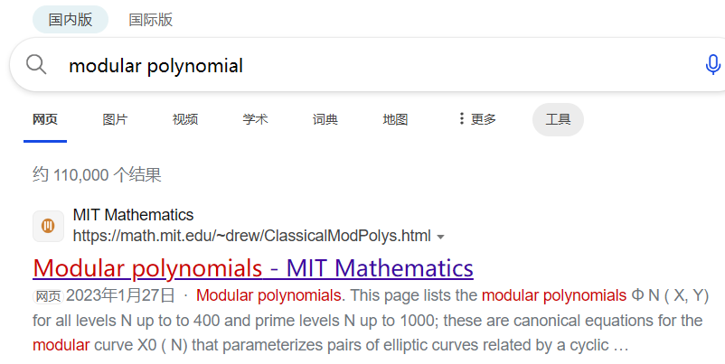

这次Round是密码专项赛，共5道题，做出了2道；剩的3道是鸡块师傅出的（鸡块师傅tql）


## 1，bestkasscn的超级简单密码

**出题人：bestkasscn**

**题目：**

<details>
    <summary>baby_RSA.py (点击展开)</summary>

```python
from Crypto.Util.number import *
import gmpy2
from functools import reduce
from secret import flag

p = getPrime(1024)
i = 0
while True:
    r = p * 5 + i
    if isPrime(r):
        i = 0
        break
    else:
        i += 1
while True:
    q = p * 10 + i
    if isPrime(q):
        break
    else:
        i += 1

n = p * q * r
e = 65537
c = pow(bytes_to_long(flag.encode()), e, n)
print('c=' + str(c))
print('p3=' + str(pow(p, 3, n)))
print('q3=' + str(pow(q, 3, n)))
print('r3=' + str(pow(r, 3, n)))
# n = 44571911854174527304485400947383944661319242813524818888269963870884859557542264803774212076803157466539443358890313286282067621989609252352994203884813364011659788234277369629312571477760818634118449563652776213438461157699447304292906151410018017960605868035069246651843561595572415595568705784173761441087845248621463389786351743200696279604003824362262237505386409700329605140703782099240992158439201646344692107831931849079888757310523663310273856448713786678014221779214444879454790399990056124051739535141631564534546955444505648933134838799753362350266884682987713823886338789502396879543498267617432600351655901149380496067582237899323865338094444822339890783781705936546257971766978222763417870606459677496796373799679580683317833001077683871698246143179166277232084089913202832193540581401453311842960318036078745448783370048914350299341586452159634173821890439194014264891549345881324015485910286021846721593668473
# c = 11212699652154912414419576042130573737460880175860430868241856564678915039929479534373946033032215673944727767507831028500814261134142245577246925294110977629353584372842303558820509861245550773062016272543030477733653059813274587939179134498599049035104941393508776333632172797303569396612594631646093552388772109708942113683783815011735472088985078464550997064595366458370527490791625688389950370254858619018250060982532954113416688720602160768503752410505420577683484807166966007396618297253478916176712265476128018816694458551219452105277131141962052020824990732525958682439071443399050470856132519918853636638476540689226313542250551212688215822543717035669764276377536087788514506366740244284790716170847347643593400673746020474777085815046098314460862593936684624708574116108322520985637474375038848494466480630236867228454838428542365166285156741433845949358227546683144341695680712263215773807461091898003011630162481
# p3 = 891438237083490546089708018947678893226384856270496377765399277417697191150845296075484241536063149330788867177806265725641352439792185047059884077696267280233195764685547392586251429555216372682368991273055524268769223153988946085858123028200360359212117360701384933036871231911448311911374115683475228820531478240539549424647154342506853356292956506486091063660095505979187297020928573605860329881982122478494944846700224611808246427660214535971723459345029873385956677292979041143593821672034573140001092625650099257402018634684516092489263998517027205660003413512870074652126328536906790020794659204007921147300771594986038917179253827432120018857213350120695302091483756021206199805521083496979628811676116525321724267588515105188480380865374667274442027086789352802613365511142499668793725505110436809024171752137883546327359935102833441492430652019931999144063825010678766130335038975376834579129516127516820037383067
# q3 = 44571911854174527304485400947383944661319242813524818888269963870884859557542264803774212076803157466539443358890313286282067621989609252352994203884813364011659788234277369629312571477760818634118449563652776213438461157699447304292906151410018017960605868035069246651843561595572415595568705784173761440671033435053531971051698504592848580356684103015611323747688216493729331061402058160819388999663041629882482138465124920580049057123360829897432472221079140360215664537272316836767039948368780837985855835419681893347839311156887660438769948501100287062738217966360434291369179859862550767272985972263442512061098317471708987686120577904202391381040801620069987103931326500146536990700234262413595295698193570184681785854277656410199477649697026112650581343325348837547631237627207304757407395388155701341044939408589591213693329516396531103489233367665983149963665364824119870832353269655933102900004362236232825539480774
# r3 = 22285955927087263652242700473691972330659621406762409444134981935442429778771132401887106038401578733269721679445156643141033810994804626176497101942406682005829894117138684814656285738880409317059224781826388106719230578849723652146453075705009008980302934017534623325921780797786207797784352892086880720749202442492937918619992591614713131681306874944356693778359565004415437554407990089293135634916859631279984463829118336826115430997439527110961309956466956650522900331263720500751112297418506140413317489683875995326726992533904683800042127871963320754241310699432792081707870167598822650064976439270556418985242630368723264289700246406905189810458354474959276748887369363592834205660349184660073395182450526542246354364903399132116153732074081050985584216815493617906868615192465631416955706457835185743023758573279838341229835613609332206338401219168119635681832981552328638132500079074010106995297184587143613134093145

```

</details>

**解答：**

题目给了$p^3mod\ n$、$q^3mod\ n$、$r^3mod\ n$，预期估计是**Frankie相关信息攻击**，但其实我们可以不这么做。

分析一下代码可知：$p<q<r$，所以我们可以得到$p^3<n=p*q*r$；因此直接开方就可以得到p，然后就去生成q和r即可（数字很小且算是相邻数，所以生成挺快的）；最后直接RSA解密即可。

<details>
    <summary>exp (点击展开)</summary>

```python
from random import *
from Crypto.Util.number import *
import gmpy2
p3 = 891438237083490546089708018947678893226384856270496377765399277417697191150845296075484241536063149330788867177806265725641352439792185047059884077696267280233195764685547392586251429555216372682368991273055524268769223153988946085858123028200360359212117360701384933036871231911448311911374115683475228820531478240539549424647154342506853356292956506486091063660095505979187297020928573605860329881982122478494944846700224611808246427660214535971723459345029873385956677292979041143593821672034573140001092625650099257402018634684516092489263998517027205660003413512870074652126328536906790020794659204007921147300771594986038917179253827432120018857213350120695302091483756021206199805521083496979628811676116525321724267588515105188480380865374667274442027086789352802613365511142499668793725505110436809024171752137883546327359935102833441492430652019931999144063825010678766130335038975376834579129516127516820037383067
q3 = 44571911854174527304485400947383944661319242813524818888269963870884859557542264803774212076803157466539443358890313286282067621989609252352994203884813364011659788234277369629312571477760818634118449563652776213438461157699447304292906151410018017960605868035069246651843561595572415595568705784173761440671033435053531971051698504592848580356684103015611323747688216493729331061402058160819388999663041629882482138465124920580049057123360829897432472221079140360215664537272316836767039948368780837985855835419681893347839311156887660438769948501100287062738217966360434291369179859862550767272985972263442512061098317471708987686120577904202391381040801620069987103931326500146536990700234262413595295698193570184681785854277656410199477649697026112650581343325348837547631237627207304757407395388155701341044939408589591213693329516396531103489233367665983149963665364824119870832353269655933102900004362236232825539480774
r3 = 22285955927087263652242700473691972330659621406762409444134981935442429778771132401887106038401578733269721679445156643141033810994804626176497101942406682005829894117138684814656285738880409317059224781826388106719230578849723652146453075705009008980302934017534623325921780797786207797784352892086880720749202442492937918619992591614713131681306874944356693778359565004415437554407990089293135634916859631279984463829118336826115430997439527110961309956466956650522900331263720500751112297418506140413317489683875995326726992533904683800042127871963320754241310699432792081707870167598822650064976439270556418985242630368723264289700246406905189810458354474959276748887369363592834205660349184660073395182450526542246354364903399132116153732074081050985584216815493617906868615192465631416955706457835185743023758573279838341229835613609332206338401219168119635681832981552328638132500079074010106995297184587143613134093145
n = 44571911854174527304485400947383944661319242813524818888269963870884859557542264803774212076803157466539443358890313286282067621989609252352994203884813364011659788234277369629312571477760818634118449563652776213438461157699447304292906151410018017960605868035069246651843561595572415595568705784173761441087845248621463389786351743200696279604003824362262237505386409700329605140703782099240992158439201646344692107831931849079888757310523663310273856448713786678014221779214444879454790399990056124051739535141631564534546955444505648933134838799753362350266884682987713823886338789502396879543498267617432600351655901149380496067582237899323865338094444822339890783781705936546257971766978222763417870606459677496796373799679580683317833001077683871698246143179166277232084089913202832193540581401453311842960318036078745448783370048914350299341586452159634173821890439194014264891549345881324015485910286021846721593668473
c = 11212699652154912414419576042130573737460880175860430868241856564678915039929479534373946033032215673944727767507831028500814261134142245577246925294110977629353584372842303558820509861245550773062016272543030477733653059813274587939179134498599049035104941393508776333632172797303569396612594631646093552388772109708942113683783815011735472088985078464550997064595366458370527490791625688389950370254858619018250060982532954113416688720602160768503752410505420577683484807166966007396618297253478916176712265476128018816694458551219452105277131141962052020824990732525958682439071443399050470856132519918853636638476540689226313542250551212688215822543717035669764276377536087788514506366740244284790716170847347643593400673746020474777085815046098314460862593936684624708574116108322520985637474375038848494466480630236867228454838428542365166285156741433845949358227546683144341695680712263215773807461091898003011630162481
e = 65537
p = gmpy2.iroot(p3, 3)[0]
i = 0
while True:
    r = p * 5 + i
    if isPrime(int(r)):
        i = 0
        break
    else:
        i += 1
while True:
    q = p * 10 + i
    if isPrime(int(q)):
        break
    else:
        i += 1
phi = (p-1)*(q-1)*(r-1)
d = gmpy2.invert(e, phi)
print(long_to_bytes(pow(c, d, n)))
# NSSCTF{cc10786a-cc59-a07d-5c9f-df1c55b18cd4}
```

</details>

<hr style="border: 0.5px solid black;"/>

## 2，bestkasscn的简单密码

**出题人：bestkasscn**

**题目：**

<details>
    <summary>easy_trick.py (点击展开)</summary>

```python
from random import randint
from secret import flag, enc_key

dir = "abcdefghijklmnopqrstuvwxyzABCDEFGHIJKLMNOPQRSTUVWXYZ0123456789{}"
assert len(flag) == 64
assert len(enc_key) == 64


def getGraph(row, column):
    graph = [['' for _ in range(row)] for _ in range(column)]
    for i in range(column):
        for j in range(row):
            graph[i][j] = dir[randint(0, 63)]
    return graph


def bestkasscnEncryption(str):
    binary = ''
    res = ''
    for c in str:
        binary += '0' + bin(ord(c))[2:] + ''
    while len(binary) % 6 != 0:
        binary += '0'
    for i in range(len(binary) // 6):
        res += dir[int(binary[i * 6:6 + i * 6], 2)]
    while len(res) % 3 != 0:
        res += '}'
    return res


encrypt = bestkasscnEncryption(enc_key)

graph1 = getGraph(len(encrypt), len(encrypt))
graph2 = getGraph(len(encrypt), len(encrypt))
for i in range(len(flag)):
    graph1[dir.index(encrypt[i])][i] = enc_key[i]
    graph2[i][dir.index(encrypt[i])] = flag[i]

for i in range(0, len(flag), 2):
    graph2[i][dir.index(encrypt[i])] = enc_key[i]
    graph1[dir.index(encrypt[i])][i] = flag[i]

with open('graph1.txt', 'w') as file:
    file.write("graph1:\n")
    for i in graph1:
        file.write(str(i))
        file.write(',')
        file.write('\n')
file.close()
with open('graph2.txt', 'w') as file:
    file.write("graph2:\n")
    for j in graph2:
        file.write(str(j))
        file.write(',')
        file.write('\n')
file.close()

with open('encrypt.txt', 'w') as file:
    file.write(encrypt)
file.close()
# encrypt='t25Lx3DOB19OyxnFC2vLBL90AgvFB2nLyw5FDgHPBMTZx25VDgHPBMDFB2zFBwvYzv9YAxzLCNnFC29Fzg9Fsq}'

```

</details>

那两个grapf太长了，就不放上去了。

**解答：**

这道题的话，有些地方算是需要点脑洞（比如enc_key就是压缩包密码）

先看看flag部分的相关代码：

```python
def getGraph(row, column):
    graph = [['' for _ in range(row)] for _ in range(column)]
    for i in range(column):
        for j in range(row):
            graph[i][j] = dir[randint(0, 63)]
    return graph

graph1 = getGraph(len(encrypt), len(encrypt))
graph2 = getGraph(len(encrypt), len(encrypt))
for i in range(len(flag)):
    graph1[dir.index(encrypt[i])][i] = enc_key[i]
    graph2[i][dir.index(encrypt[i])] = flag[i]

for i in range(0, len(flag), 2):
    graph2[i][dir.index(encrypt[i])] = enc_key[i]
    graph1[dir.index(encrypt[i])][i] = flag[i]
```

代码主要就是做的一件事：**把flag塞到二维列表里**，假如会审代码的话，很容易看出：这里是把flag奇数位的值和偶数位的值分别分到graph1.txt和graph2.txt中，因此只要我们将flag对应位收集起来就行。

但是，因为graph2.txt在一个加密压缩包里，所以需要解出enc_key才行。

看看enc_key的相关代码：

```python
dir = "abcdefghijklmnopqrstuvwxyzABCDEFGHIJKLMNOPQRSTUVWXYZ0123456789{}"
def bestkasscnEncryption(str):
    binary = ''
    res = ''
    for c in str:
        binary += '0' + bin(ord(c))[2:] + ''
    while len(binary) % 6 != 0:
        binary += '0'
    for i in range(len(binary) // 6):
        res += dir[int(binary[i * 6:6 + i * 6], 2)]
    while len(res) % 3 != 0:
        res += '}'
    return res
encrypt = bestkasscnEncryption(enc_key)
```

看完便发现：这里其实就是进行了**改表base64**，表为**dir**。

所以我们可以用工具去解决，当然也可以写个代码：

```python
dir = "abcdefghijklmnopqrstuvwxyzABCDEFGHIJKLMNOPQRSTUVWXYZ0123456789{}"
def bestkasscnDecryption(str):
    binary = ''
    res = ''
    for i in str:
        binary += bin(dir.index(i))[2:].zfill(6)
    for i in range(0, len(binary), 8):
        res += chr(int(binary[i:i+8], 2))
    return res
encrypt='t25Lx3DOB19OyxnFC2vLBL90AgvFB2nLyw5FDgHPBMTZx25VDgHPBMDFB2zFBwvYzv9YAxzLCNnFC29Fzg9Fsq}'
enc_key = bestkasscnDecryption(encrypt)
print(enc_key)
# One_who_has_seen_the_ocean_thinks_nothing_of_mere_rivers_so_do_I
```

解压后，得到graph2.txt。

然后就是把一开始的flag恢复思路带入即可：

<details>
    <summary>exp (点击展开代码)</summary>

```python
graph1 = []
graph2 = []
# 上述两表太长了，就不写出来了
enc_key = 'One_who_has_seen_the_ocean_thinks_nothing_of_mere_rivers_so_do_I'
enc = "t25Lx3DOB19OyxnFC2vLBL90AgvFB2nLyw5FDgHPBMTZx25VDgHPBMDFB2zFBwvYzv9YAxzLCNnFC29Fzg9Fsq}"
dir = "abcdefghijklmnopqrstuvwxyzABCDEFGHIJKLMNOPQRSTUVWXYZ0123456789{}"
flag = ''
for i in range(0, len(enc), 2):
    flag += graph1[dir.index(enc[i])][i]
    flag += graph2[i+1][dir.index(enc[i+1])]
    # 因为有可能len(flag)<len(enc)，所以加个if语句判断
    if flag[-1]=='}':
        break
print(flag)
# NSSCTF{What_I_miss_is_saying_nothing_nothing_better_than_hotpot}
```

</details>

<hr style="border: 0.5px solid black;"/>

## 3，Neighbors（复现）

**出题人：糖醋小鸡块**

**题目：**

<details>
    <summary>task.sage (点击展开代码)</summary>

```python
from Crypto.Util.number import *
from random import *
from secret import flag

m = bytes_to_long(flag)

def nextPrime(p):
    while(not isPrime(p)):
        p += 1
    return p

a = 151
b = 172
p1 = 2^a*5^b - 1
F.<i> = GF(p1^2, modulus = x**2 + 1)
E = EllipticCurve(j=F(1728))

assert E.is_supersingular()

for i in range(50):
    P = E(0).division_points(5)[1:]
    shuffle(P)
    phi = E.isogeny(P[0])
    E = phi.codomain()
    j1 = E.j_invariant()

a = int(j1[0])
b = int(j1[1])
p = nextPrime(a+b)
q = getPrime(p.bit_length())
n = p*q
e = 65537
c = pow(m,e,n)
print("e =",e)
print("n =",n)
print("c =",c)


#leak
path = []
for i in range(4):
    P = E(0).division_points(5)[1:]
    shuffle(P)
    phi = E.isogeny(P[0])
    j1 = phi.codomain().j_invariant()
    while(j1 in path):
        shuffle(P)
        phi = E.isogeny(P[0])
        j1 = phi.codomain().j_invariant()
    path.append(j1)
    E = phi.codomain()

print("j1 =",j1)


#e = 65537
#n = 27660779504321925356006447667320327390150480983648690901006174352749339874518759333831733034192127427897623854124514212301624188883116023679233194726978962252585566329625462410597485158957857003260340456610951535430042915065253353543837935016496092356489028408052863701705400021364167367862977808597173766465657159249607404278555781
#c = 17137574768375613142899612121220754893579308480997275465013572460778148685559737592316898103173913046913093108521865424971517481171364906226416089569353963219436198051916581024399601607752314215085545336295450568344615872394961924295547685771955504826631319190372175753842519822279019714777697711192486128339049294501128261475088218
#j1 = 3298455770740418540320875487876272515859315516778722120913599648146333514148291435827951366406176762948612097557652865226784729596111676446684986604300101971837911163*i + 4537130021779297048213998573445169432922796703632002090410524491881919608982806774072433257149497571183513473757657759960381311229351179660958581657639633158226859944
```

</details>

**解答：**

先分析一下：

> 已知一个**j-不变量为1728**的椭圆曲线E，然后对其进行**50次m为5**的同源（后来看鸡块师傅的wp才知道，准确的叫法是**度为**$5^{50}$的同源）得到一个新的椭圆曲线**E1**，然后取**E1**的j-不变量生成素数p以及相同位数的素数q，最后对flag进行RSA加密。
>
> 题目给的是**E1**在进行**度为**$5^{4}$的同源后得到的**E2**的j-不变量的值

当时做的时候，其实是有点思路的：

> 既然都知道了**E2**的j-不变量的值，而且当时感觉同源可能跟同构差不多，所以觉得可以逆回去得到**E1**；然后直接用**E1**的j-不变量得到素数p和q去解密即可

但是吧。。。当时不知道咋逆回去；即便鸡块师傅给了这个提示：**modular polynomial**，但我误解了意思，而且还没去查（（（

于是就卡住了（）

后来看wp才发现：**[modular polynomial](https://math.mit.edu/~drew/ClassicalModPolys.html)**是一个相邻的同源ECC之间的关系，而且一查就有（



在里边找到$Φ_5(X,Y)$这一项就行，然后说一下解法的正规解释（）

> 由于超奇异椭圆曲线的同源一定存在一个对偶同源，也就是对于两条曲线E1、E2，如果E1能够经过一个度为n的同源到达E2，那么E2就一定能经过一个度为n的对偶同源返回E1，所以我们只需要利用modular polynomial去找出E2的所有$5-isogeny$的邻居，然后再找这些邻居的$5-isogeny$的邻居，如此重复四次，就可以找到所有E2的$5^4-isogeny$的邻居了，然后遍历这些邻居的j不变量去尝试生成p，检查是否能被n整除，就得到了n的分解然后进行RSA解密

代码如下：

<details>
    <summary>exp (点击展开代码)</summary>

```python
from Crypto.Util.number import *

def nextPrime(p):
    while(not isPrime(p)):
        p += 1
    return p

#Φ5
def find_neighbors_phi5(X,j_prev=None):
    R.<Y> = PolynomialRing(X.parent())
    Φ5 = (
        X^6
        + Y^6
        - X^5*Y^5 
        + 3720*X^5*Y^4 
        + 3720*X^4*Y^5 
        - 4550940*X^5*Y^3 
        - 4550940*X^3*Y^5
        + 2028551200*X^5*Y^2 
        + 2028551200*X^2*Y^5
        - 246683410950*X^5*Y
        - 246683410950*X*Y^5 
        + 1963211489280*X^5 
        + 1963211489280*Y^5 
        + 1665999364600*X^4*Y^4 
        + 107878928185336800*X^4*Y^3 
        + 107878928185336800*X^3*Y^4 
        + 383083609779811215375*X^4*Y^2 
        + 383083609779811215375*X^2*Y^4
        + 128541798906828816384000*X^4*Y 
        + 128541798906828816384000*X*Y^4  
        + 1284733132841424456253440*X^4
        + 1284733132841424456253440*Y^4
        - 441206965512914835246100*X^3*Y^3  
        + 26898488858380731577417728000*X^3*Y^2 
        + 26898488858380731577417728000*X^2*Y^3 
        - 192457934618928299655108231168000*X^3*Y
        - 192457934618928299655108231168000*X*Y^3 
        + 280244777828439527804321565297868800*X^3
        + 280244777828439527804321565297868800*Y^3
        + 5110941777552418083110765199360000*X^2*Y^2 
        + 36554736583949629295706472332656640000*X^2*Y 
        + 36554736583949629295706472332656640000*X*Y^2        
        + 6692500042627997708487149415015068467200*X^2 
        - 264073457076620596259715790247978782949376*X*Y 
        + 6692500042627997708487149415015068467200*Y^2 
        + 53274330803424425450420160273356509151232000*X 
        + 53274330803424425450420160273356509151232000*Y 
        + 141359947154721358697753474691071362751004672000
    )

    res = Φ5.roots(multiplicities=False)
    if(j_prev == None):
        return res
    else:
        return list(set(res) - set([j_prev]))
    

a = 151
b = 172
p1 = 2^a*5^b - 1
F.<i> = GF(p1^2, modulus = x^2 + 1)
e = 65537
n = 27660779504321925356006447667320327390150480983648690901006174352749339874518759333831733034192127427897623854124514212301624188883116023679233194726978962252585566329625462410597485158957857003260340456610951535430042915065253353543837935016496092356489028408052863701705400021364167367862977808597173766465657159249607404278555781
c = 17137574768375613142899612121220754893579308480997275465013572460778148685559737592316898103173913046913093108521865424971517481171364906226416089569353963219436198051916581024399601607752314215085545336295450568344615872394961924295547685771955504826631319190372175753842519822279019714777697711192486128339049294501128261475088218
j1 = 3298455770740418540320875487876272515859315516778722120913599648146333514148291435827951366406176762948612097557652865226784729596111676446684986604300101971837911163*i + 4537130021779297048213998573445169432922796703632002090410524491881919608982806774072433257149497571183513473757657759960381311229351179660958581657639633158226859944

set1 = find_neighbors_phi5(j1)

set2 = []
for k in set1:
    set2 += find_neighbors_phi5(k)
set2 = set(set2)

set3 = []
for k in set2:
    set3 += find_neighbors_phi5(k)
set3 = set(set3)

set4 = []
for k in set3:
    set4 += find_neighbors_phi5(k)
set4 = set(set4)


for k in set4:
    a = int(k[0])
    b = int(k[1])
    p = nextPrime(a+b)
    if(n % p == 0):
        q = n // p
        d = inverse(e,(p-1)*(q-1))
        print(long_to_bytes(int(pow(c,d,n))))
        break


#NSSCTF{try_to_find_5-isogeny_neighbors_4nd_F@ctor_n}
```

</details>

---

剩下的两题，因为出题人写的太细了，所以我就不写在这里了（[出题人wp](https://tangcuxiaojikuai.xyz/post/b4a50eee.html#more)）
