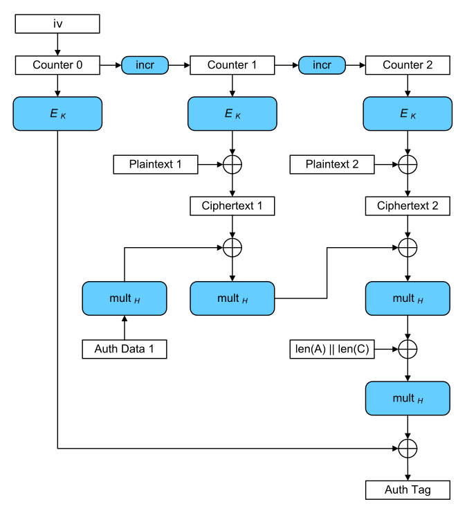
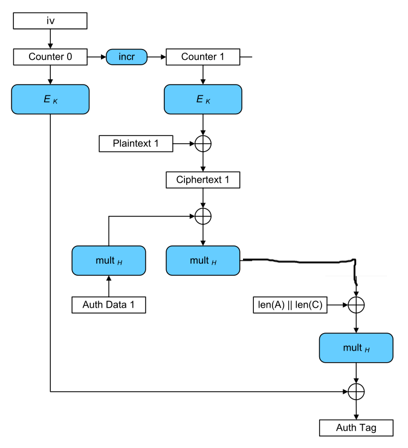

因为复习累了, 再加上有人问, 就稍微看了下; 有三道确实是不会但也没时间现学了, 就暂时欠着 (下次一定, 要是我好久没更可以催)

# reiwa_rot13

## 题目

```python
from Crypto.Util.number import *
import codecs
import string
import random
import hashlib
from Crypto.Cipher import AES
from Crypto.Random import get_random_bytes
from flag import flag

p = getStrongPrime(512)
q = getStrongPrime(512)
n = p*q
e = 137

key = ''.join(random.sample(string.ascii_lowercase, 10))
rot13_key = codecs.encode(key, 'rot13')

key = key.encode()
rot13_key = rot13_key.encode()

print("n =", n)
print("e =", e)
print("c1 =", pow(bytes_to_long(key), e, n))
print("c2 =", pow(bytes_to_long(rot13_key), e, n))

key = hashlib.sha256(key).digest()
cipher = AES.new(key, AES.MODE_ECB)
print("encyprted_flag = ", cipher.encrypt(flag))
'''
n = 105270965659728963158005445847489568338624133794432049687688451306125971661031124713900002127418051522303660944175125387034394970179832138699578691141567745433869339567075081508781037210053642143165403433797282755555668756795483577896703080883972479419729546081868838801222887486792028810888791562604036658927
e = 137
c1 = 16725879353360743225730316963034204726319861040005120594887234855326369831320755783193769090051590949825166249781272646922803585636193915974651774390260491016720214140633640783231543045598365485211028668510203305809438787364463227009966174262553328694926283315238194084123468757122106412580182773221207234679
c2 = 54707765286024193032187360617061494734604811486186903189763791054142827180860557148652470696909890077875431762633703093692649645204708548602818564932535214931099060428833400560189627416590019522535730804324469881327808667775412214400027813470331712844449900828912439270590227229668374597433444897899112329233
encyprted_flag =  b"\xdb'\x0bL\x0f\xca\x16\xf5\x17>\xad\xfc\xe2\x10$(DVsDS~\xd3v\xe2\x86T\xb1{xL\xe53s\x90\x14\xfd\xe7\xdb\xddf\x1fx\xa3\xfc3\xcb\xb5~\x01\x9c\x91w\xa6\x03\x80&\xdb\x19xu\xedh\xe4"
'''
```

## 解题

题目是一道附件题，题目主要给了我们以下信息：
$$
\begin{split}
public\ key&=(n,\ e)\\
c_1&=k^e\ mod\ n\\
c_2&=K^e\ mod\ n\\
K&=rot13(k)\\
enc&=AES(m,\ sha256(k))
\end{split}
$$
其中$k$是一个由10个小写英文字符组成的AES密钥。

因此，我们肯定得先得到$k$的值，然后才能通过AES解密出$m$；而我们知道——rot13的计算其实就是下面这个公式：
$$
\begin{split}
C&=(M-13)\ mod\ 26\\
\end{split}
$$
细究的话，其实就两种情况：
$$
Case\ 1:\ M+13\ \ \ \ \ \ \ (M<13)\\
Case\ 2:\ M-13\ \ \ \ \ \ \ (M>13)
$$
也就是说：**一个字符M进行rot13，其结果只可能是M±13中的一个**

而我们的$k$由$10$个字符组成，故而rot13后的结果$K$与我们的密钥$k$的关系，只可能是这样的一个等式：
$$
K=k+\sum_{i=1}^{10}256^i(±13)
$$
更进一步来说，我们便知道了：
$$
\begin{split}
c_1&=k^e\ mod\ n\\
c_2&=(k+X)^e\ mod\ n\\
\end{split}
$$
又因为$e$很小，所以我们可以直接通过[Franklin-Reiter相关消息攻击](https://blog.csdn.net/XiongSiqi_blog/article/details/130978226)来得到我们的密钥$k$的。

而$X$有$2^{10}=1024$种情况，因此我们知道了1024种可能的k；然后通过all()来判断此时的$k$是否正确；得到$k$后直接AES解密enc就结束了。

## EXP

```python
from Crypto.Util.number import long_to_bytes
from gmpy2 import iroot
import itertools
import tqdm
import hashlib
from Crypto.Cipher import AES

def franklinReiter(n,e,r,c1,c2):
    R.<X> = Zmod(n)[]
    f1 = X^e - c1
    f2 = (X + r)^e - c2
    return Integer(n-(compositeModulusGCD(f1,f2)).coefficients()[0])


def compositeModulusGCD(a, b):
    if(b == 0):
        return a.monic()
    else:
        return compositeModulusGCD(b, a % b)


n = 105270965659728963158005445847489568338624133794432049687688451306125971661031124713900002127418051522303660944175125387034394970179832138699578691141567745433869339567075081508781037210053642143165403433797282755555668756795483577896703080883972479419729546081868838801222887486792028810888791562604036658927
e = 137
c1 = 16725879353360743225730316963034204726319861040005120594887234855326369831320755783193769090051590949825166249781272646922803585636193915974651774390260491016720214140633640783231543045598365485211028668510203305809438787364463227009966174262553328694926283315238194084123468757122106412580182773221207234679
c2 = 54707765286024193032187360617061494734604811486186903189763791054142827180860557148652470696909890077875431762633703093692649645204708548602818564932535214931099060428833400560189627416590019522535730804324469881327808667775412214400027813470331712844449900828912439270590227229668374597433444897899112329233
encyprted_flag = b"\xdb'\x0bL\x0f\xca\x16\xf5\x17>\xad\xfc\xe2\x10$(DVsDS~\xd3v\xe2\x86T\xb1{xL\xe53s\x90\x14\xfd\xe7\xdb\xddf\x1fx\xa3\xfc3\xcb\xb5~\x01\x9c\x91w\xa6\x03\x80&\xdb\x19xu\xedh\xe4"

pro = itertools.product([13, -13], repeat=10) # 1024 posibilities
# bruteforce to get k
for i in tqdm.tqdm(pro):
    prob = sum([i[k]*256**k for k in range(10)])
    m = franklinReiter(n, e, prob, c1, c2)
    key = long_to_bytes(int(m))
    if all(chr(k) in string.ascii_lowercase for k in key):
        # if we get, then decrypt enc
        print(i)
        # (-13, -13, 13, 13, 13, -13, -13, 13, -13, 13)
        key = hashlib.sha256(key).digest()
        cipher = AES.new(key, AES.MODE_ECB)
        print(cipher.decrypt(encyprted_flag))
        # b'SECCON{Vim_has_a_command_to_do_rot13._g?_is_possible_to_do_so!!}'
        break
```

# Dual_Summon

## 题目

~~~python
from Crypto.Cipher import AES
import secrets
import os
import signal

signal.alarm(300)

flag = os.getenv('flag', "SECCON{sample}")

keys = [secrets.token_bytes(16) for _ in range(2)]
nonce = secrets.token_bytes(16)

def summon(number, plaintext):
    assert len(plaintext) == 16
    aes = AES.new(key=keys[number-1], mode=AES.MODE_GCM, nonce=nonce)
    ct, tag = aes.encrypt_and_digest(plaintext)
    return ct, tag

# When you can exec dual_summon, you will win
def dual_summon(plaintext):
    assert len(plaintext) == 16
    aes1 = AES.new(key=keys[0], mode=AES.MODE_GCM, nonce=nonce)
    aes2 = AES.new(key=keys[1], mode=AES.MODE_GCM, nonce=nonce)
    ct1, tag1 = aes1.encrypt_and_digest(plaintext)
    ct2, tag2 = aes2.encrypt_and_digest(plaintext)
    # When using dual_summon you have to match tags
    assert tag1 == tag2

print("Welcome to summoning circle. Can you dual summon?")
for _ in range(10):
    mode = int(input("[1] summon, [2] dual summon >"))
    if mode == 1:
        number = int(input("summon number (1 or 2) >"))
        name   = bytes.fromhex(input("name of sacrifice (hex) >"))
        ct, tag = summon(number, name)
        print(f"monster name = [---filtered---]")
        print(f"tag(hex) = {tag.hex()}")

    if mode == 2:
        name   = bytes.fromhex(input("name of sacrifice (hex) >"))
        dual_summon(name)
        print("Wow! you could exec dual_summon! you are master of summoner!")
        print(flag)

~~~

## 解题

题目是一道靶机题，需要我们通过输入一个明文m来通过dual_summon()的验证，从而得到题目的flag。

其中，dual_summon()函数长这样：

~~~python
def dual_summon(plaintext):
    assert len(plaintext) == 16
    aes1 = AES.new(key=keys[0], mode=AES.MODE_GCM, nonce=nonce)
    aes2 = AES.new(key=keys[1], mode=AES.MODE_GCM, nonce=nonce)
    ct1, tag1 = aes1.encrypt_and_digest(plaintext)
    ct2, tag2 = aes2.encrypt_and_digest(plaintext)
    assert tag1 == tag2
~~~

其输入输出如下：

> **input:**         一个字符长度为16的明文的16进制值$P$
>
> **output:**      没有输出，但如果$tag1 == tag2$就成功运行，否则报错

另一个函数summon()长这样：

~~~python
def summon(number, plaintext):
    assert len(plaintext) == 16
    aes = AES.new(key=keys[number-1], mode=AES.MODE_GCM, nonce=nonce)
    ct, tag = aes.encrypt_and_digest(plaintext)
    return ct, tag
~~~

其输入输出如下：

> **input:**         选择的密钥${key}_i$和一个字符长度为16的明文的16进制值$P$
>
> **output:**      生成对应的$(c, {tag})$

而我们仔细观察这两函数会发现——**都使用了相同的$nonce$**，所以突破口肯定也是这个了。

因此我们需要先看一下AES-GCM模式是怎样的，[下图](https://meowmeowxw.gitlab.io/ctf/utctf-2020-crypto/)是一个2个block的明文P的加密流程：



> 为了方便继续分析，这里先说明一些东西：
>
> > $E_i()$：一个使用${key}_i$的AES-ECB加密函数
> >
> > $P_k$：明文的第$k$块
> >
> > $C_k$：密文的第$k$块
> >
> > ${Co}_j$：计数器的状态$j$
> >
> > $H_i$：$E_i(16*b'0')$的结果
> >
> > $T$：GCM生成的标识/签名
> >
> > $multH$：乘H（没错，真就这么直白）
> >
> > $A$：相关数据（这个其实可以不细究，当成一个量就行）
> >
> > $L$：$len(A)+len(C)$
> >
> > $+和*$：在域$GF(2^{128})$下的加法和乘法（既约多项式为$x^{128} + x^7 + x^2 + x + 1$）

我们可以发现——GCM的加密跟CTR一致 (即：$C_k=P_k+E_i({Co}_j)$)，但GCM还能生成出一个$Tag$。

分析上图就可以得到这样一个式子：
$$
T_i=E_{i}(Co_0)+H_i*L+H_i^2*C_2+H_i^3*C_1+H_i^4*A
$$
如果是1个block的话，其实就是少一层的事，如下图：



于是就有
$$
T_i=E_{i}(Co_0)+H_i*L+H_i^2*C+H_i^3*A
$$
倘若代入$C_k=P_k+E_k({Co}_j)$，便有：
$$
T_i=E_{i}(Co_0)+H_i*L+H_i^2*E_{i}(Co_1)+H_i^2*P+H_i^3*A
$$
转换成这样，是因为在使用选项1的summon函数时，我们仅能知道$P$（因为该函数让我们输入）和$T$。

此时，我们把跟$P$无关的量设成$X_i$的话，便有：
$$
\begin{equation}
T_i(P)=X_i+H_i^2*P
\end{equation}
$$
回到一开始在说dual_summon()时说的，假如$T_1(P)=T_2(P)$，则有：
$$
X_1+H_1^2*P=X_2+H_2^2*P
$$
因此便有：
$$
\begin{equation}
P=\frac{X_1+X_2}{H_1^2+H_2^2}
\end{equation}
$$
而我们对$(1)$式分析一下会发现：
$$
\begin{split}
T_i(0)&=X_i
\\T_i(1)&=X_i+H_i^2
\end{split}
$$
于是，根据$key$的不同，我们有：
$$
\begin{split}
X_1&=T_1(0)
\\H_1^2&=T_1(0)+T_1(1)
\end{split}
$$

$$
\begin{split}
X_2&=T_2(0)
\\H_2^2&=T_2(0)+T_2(1)
\end{split}
$$

此时将这些值代入$(2)$式便得到了能通过dual_summon验证的$P$了。

## EXP

~~~python
from pwn import *
from Crypto.Util.number import *

io = remote('dual-summon.seccon.games', '2222')
sk = []
io.recvline()
F = GF(2^128, name="x", modulus=x^128 + x^7 + x^2 + x + 1)


def poly_to_hex(poly):
    # print(len(poly.to_bytes()))
    return F(list(poly)[::-1]).to_bytes()[-16:].hex().encode()

def hex_to_poly(h):
    # print(bytes.fromhex(m))
    return F(list(F.from_bytes(bytes.fromhex(h)))[::-1])

def inter(ch, m):
    #io.recv()
    io.send(b"1\n")
    # print(io.recv())
    io.send(f"{ch}".encode()+b"\n")
    #io.recv()
    io.send(m+b"\n")
    io.recvline()
    ss = io.recvline()[:-1].split(b"tag(hex) = ")[1].decode()
    return hex_to_poly(ss)

# get (Ki, HHi)
K1 = inter(1, poly_to_hex(F(0)))
HH1 = K1+inter(1, poly_to_hex(F(1)))
K2 = inter(2, poly_to_hex(F(0)))
HH2 = K2+inter(2, poly_to_hex(F(1)))

# get P
P = (K1+K2)/(HH1+HH2)
# print(poly_to_hex(P))
# io.recv()

# send to socket and get flag
io.send(b"2\n")
# print(io.recv())
io.send(poly_to_hex(P)+b"\n")
io.recvline()
io.recvline()
# b'SECCON{Congratulation!_you are_master_of_summonor!_you_can_summon_2_monsters_in_one_turn}\n'
~~~

# To be continued


