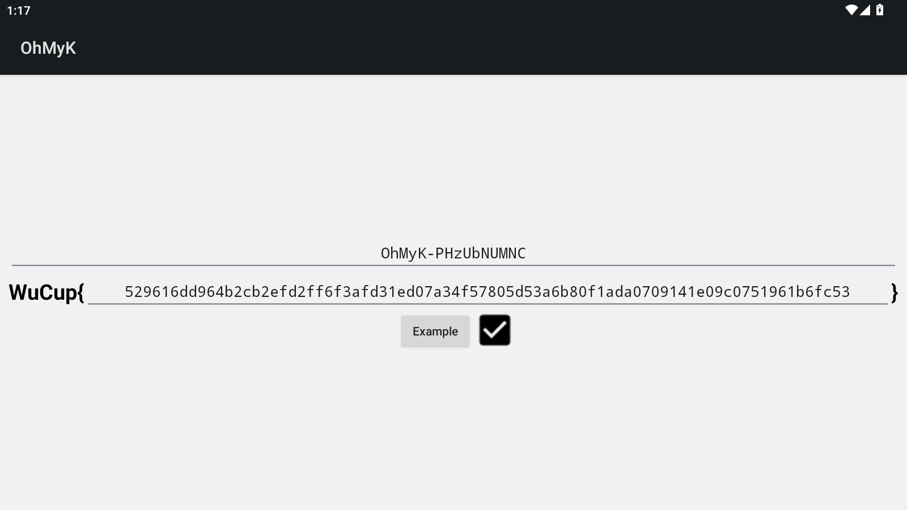
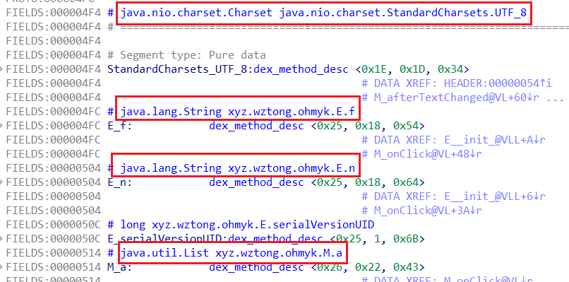
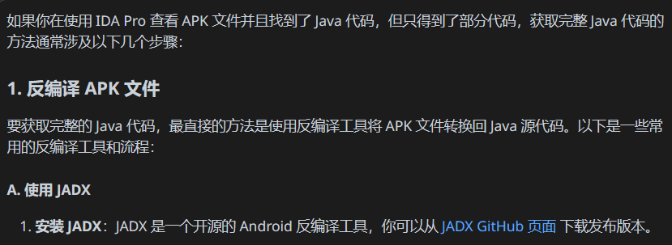
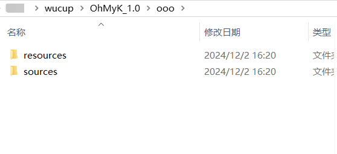
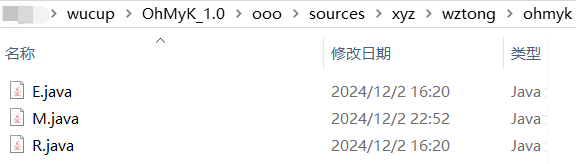

## 前言

虽然此题放在了密码方向，但从整个做题过程来看，其实是一道RE题（）

不过嘛，虽然对我来说，我自己会觉得比较shi；但还是可以做的，主要还是自己赛后做的时候比较死板了)))

这次记录就算作是给我自己的一个警示吧

**（以上评价仅个人观点，请忽略）**

## 做题过程

### 分析apk并获得java代码

首先，刚刚说了题目给的.apk文件，长这样：


然后模拟器安装试试，打开软件后会看到一个界面——有两行（一行ID一行没描述）：



在软件里，我们只能通过按Example键去看到一组值（算是挺符合 “咋全是Flag” 这个描述吧）；但这里还看不出个所以然，因此就得回看下.apk文件了。

毕竟我不是RE手，所以我的第一反应就是：直接加载到IDA里看下算了；然后便发现存在一些java的东西：

再加上我以前知道Python写的代码可以编译成.exe，所以我做的时候觉得这个应该也是java代码编译的，因此我们稍微查查这种能怎么逆出Java代码即可（算是我自己的第一直觉吧）；我是直接问的GPT，它告诉我可以使用**jadx**进行反编译（就像ucompyle6能反编译出python的代码一样，个人理解）：



所以我们找这个工具安装下，运行相关指令就能获得反编译出来的东西了：



而我们要找的代码是在**sources文件夹**里：



### 分析M.java，获取了些常量

接下来就是分析这三个java代码了，但我们其实主要看M.java就行（其他两个定义了些会用到的**Java类**），我这里贴下M.java的代码吧：

<details>
    <summary><b>M.java (点击展开)</b></summary>

```java
package xyz.wztong.ohmyk;

import android.app.Activity;
import android.os.Bundle;
import android.text.Editable;
import android.text.TextWatcher;
import android.view.View;
import android.widget.CheckBox;
import android.widget.EditText;
import java.io.IOException;
import java.io.ObjectInputStream;
import java.math.BigInteger;
import java.nio.charset.StandardCharsets;
import java.security.MessageDigest;
import java.security.NoSuchAlgorithmException;
import java.util.Arrays;
import java.util.List;
import java.util.Random;
import java.util.zip.InflaterInputStream;

/* loaded from: classes.dex */
public class M extends Activity implements TextWatcher, View.OnClickListener {
    public static final int[] i = { 0, 1996959894, -301047508, -1727442502, 124634137, 1886057615, -379345611,
            -1637575261, 249268274, 2044508324, -522852066, -1747789432, 162941995, 2125561021, -407360249, -1866523247,
            498536548, 1789927666, -205950648, -2067906082, 450548861, 1843258603, -187386543, -2083289657, 325883990,
            1684777152, -43845254, -1973040660, 335633487, 1661365465, -99664541, -1928851979, 997073096, 1281953886,
            -715111964, -1570279054, 1006888145, 1258607687, -770865667, -1526024853, 901097722, 1119000684, -608450090,
            -1396901568, 853044451, 1172266101, -589951537, -1412350631, 651767980, 1373503546, -925412992, -1076862698,
            565507253, 1454621731, -809855591, -1195530993, 671266974, 1594198024, -972236366, -1324619484, 795835527,
            1483230225, -1050600021, -1234817731, 1994146192, 31158534, -1731059524, -271249366, 1907459465, 112637215,
            -1614814043, -390540237, 2013776290, 251722036, -1777751922, -519137256, 2137656763, 141376813, -1855689577,
            -429695999, 1802195444, 476864866, -2056965928, -228458418, 1812370925, 453092731, -2113342271, -183516073,
            1706088902, 314042704, -1950435094, -54949764, 1658658271, 366619977, -1932296973, -69972891, 1303535960,
            984961486, -1547960204, -725929758, 1256170817, 1037604311, -1529756563, -740887301, 1131014506, 879679996,
            -1385723834, -631195440, 1141124467, 855842277, -1442165665, -586318647, 1342533948, 654459306, -1106571248,
            -921952122, 1466479909, 544179635, -1184443383, -832445281, 1591671054, 702138776, -1328506846, -942167884,
            1504918807, 783551873, -1212326853, -1061524307, -306674912, -1698712650, 62317068, 1957810842, -355121351,
            -1647151185, 81470997, 1943803523, -480048366, -1805370492, 225274430, 2053790376, -468791541, -1828061283,
            167816743, 2097651377, -267414716, -2029476910, 503444072, 1762050814, -144550051, -2140837941, 426522225,
            1852507879, -19653770, -1982649376, 282753626, 1742555852, -105259153, -1900089351, 397917763, 1622183637,
            -690576408, -1580100738, 953729732, 1340076626, -776247311, -1497606297, 1068828381, 1219638859, -670225446,
            -1358292148, 906185462, 1090812512, -547295293, -1469587627, 829329135, 1181335161, -882789492, -1134132454,
            628085408, 1382605366, -871598187, -1156888829, 570562233, 1426400815, -977650754, -1296233688, 733239954,
            1555261956, -1026031705, -1244606671, 752459403, 1541320221, -1687895376, -328994266, 1969922972, 40735498,
            -1677130071, -351390145, 1913087877, 83908371, -1782625662, -491226604, 2075208622, 213261112, -1831694693,
            -438977011, 2094854071, 198958881, -2032938284, -237706686, 1759359992, 534414190, -2118248755, -155638181,
            1873836001, 414664567, -2012718362, -15766928, 1711684554, 285281116, -1889165569, -127750551, 1634467795,
            376229701, -1609899400, -686959890, 1308918612, 956543938, -1486412191, -799009033, 1231636301, 1047427035,
            -1362007478, -640263460, 1088359270, 936918000, -1447252397, -558129467, 1202900863, 817233897, -1111625188,
            -893730166, 1404277552, 615818150, -1160759803, -841546093, 1423857449, 601450431, -1285129682, -1000256840,
            1567103746, 711928724, -1274298825, -1022587231, 1510334235, 755167117 };
    public static MessageDigest j;
    public List a;
    public EditText b;
    public EditText c;
    public CheckBox d;
    public BigInteger e;
    public BigInteger f;
    public BigInteger g;
    public BigInteger h;

    public static BigInteger a(String str) {
        byte[] byteArray = new BigInteger(str, 16).toByteArray();
        if (byteArray[0] == 0) {
            byteArray = Arrays.copyOfRange(byteArray, 1, byteArray.length);
        }
        if (byteArray.length < 20) {
            byte[] bArr = new byte[20];
            System.arraycopy(byteArray, 0, bArr, 20 - byteArray.length, byteArray.length);
            byteArray = bArr;
        }
        int i2 = 0;
        while (i2 < byteArray.length) {
            int i3 = i2 + 4;
            int i4 = -1;
            for (byte b : Arrays.copyOfRange(byteArray, i2, i3)) {
                i4 = i[(i4 ^ b) & 255] ^ (i4 >>> 8);
            }
            int i5 = ~i4;
            System.arraycopy(new byte[] { (byte) (i5 >>> 24), (byte) (i5 >>> 16), (byte) (i5 >>> 8), (byte) i5 }, 0,
                    byteArray, i2, 4);
            i2 = i3;
        }
        StringBuilder sb = new StringBuilder();
        for (byte b2 : byteArray) {
            String hexString = Integer.toHexString(b2 & 255);
            if (hexString.length() == 1) {
                hexString = "0".concat(hexString);
            }
            sb.append(hexString);
        }
        return new BigInteger(sb.toString(), 16);
    }

    public static boolean b(byte[] bArr, String str, BigInteger bigInteger, BigInteger bigInteger2,
            BigInteger bigInteger3, BigInteger bigInteger4) {
        BigInteger a = a(str.substring(0, 40));
        BigInteger a2 = a(str.substring(40, 80));
        byte[] copyOfRange = Arrays.copyOfRange(j.digest(bArr), 0, 20);
        StringBuilder sb = new StringBuilder();
        for (byte b : copyOfRange) {
            String hexString = Integer.toHexString(b & 255);
            if (hexString.length() == 1) {
                hexString = "0".concat(hexString);
            }
            sb.append(hexString);
        }
        BigInteger bigInteger5 = new BigInteger(sb.toString(), 16);
        BigInteger modPow = a2.modPow(bigInteger2.subtract(BigInteger.valueOf(2L)), bigInteger2);
        return bigInteger3.modPow(bigInteger5.multiply(modPow).mod(bigInteger2), bigInteger)
                .multiply(bigInteger4.modPow(a.multiply(modPow).mod(bigInteger2), bigInteger)).mod(bigInteger)
                .mod(bigInteger2).equals(a);
    }

    @Override // android.text.TextWatcher
    public final void afterTextChanged(Editable editable) {
        this.d.setChecked(!r8.isChecked());
        this.d.setChecked(false);
        String obj = this.c.getText().toString();
        if (obj.length() != 80) {
            return;
        }
        try {
            this.d.setChecked(b(this.b.getText().toString().getBytes(StandardCharsets.UTF_8), obj, this.e, this.f,
                    this.g, this.h));
        } catch (Exception unused) {
            this.d.setChecked(false);
        }
    }

    @Override // android.text.TextWatcher
    public final void beforeTextChanged(CharSequence charSequence, int i2, int i3, int i4) {
    }

    @Override // android.view.View.OnClickListener
    public void onClick(View view) {
        E e = (E) this.a.get(new Random(System.currentTimeMillis()).nextInt(this.a.size()));
        this.b.setText(e.n);
        this.c.setText(e.f);
    }

    @Override // android.app.Activity
    public final void onCreate(Bundle bundle) {
        super.onCreate(bundle);
        try {
            ObjectInputStream objectInputStream = new ObjectInputStream(new InflaterInputStream(getAssets().open("a")));
            try {
                j = MessageDigest.getInstance("SHA256");
                this.e = (BigInteger) objectInputStream.readObject();
                this.f = (BigInteger) objectInputStream.readObject();
                this.g = (BigInteger) objectInputStream.readObject();
                this.h = (BigInteger) objectInputStream.readObject();
                this.a = (List) objectInputStream.readObject();
                objectInputStream.close();
                setContentView(R.layout.m);
                EditText editText = (EditText) findViewById(R.id.i);
                this.b = editText;
                editText.addTextChangedListener(this);
                EditText editText2 = (EditText) findViewById(R.id.v);
                this.c = editText2;
                editText2.addTextChangedListener(this);
                this.d = (CheckBox) findViewById(R.id.c);
                findViewById(R.id.b).setOnClickListener(this);
            } catch (Throwable th) {
                try {
                    objectInputStream.close();
                } catch (Throwable th2) {
                    th.addSuppressed(th2);
                }
                throw th;
            }
        } catch (IOException | ClassNotFoundException | NoSuchAlgorithmException e) {
            throw new RuntimeException(e);
        }
    }

    @Override // android.text.TextWatcher
    public final void onTextChanged(CharSequence charSequence, int i2, int i3, int i4) {
    }
}

```

</details>

在代码中，主函数是这块：

<details>
    <summary><b>onCreate (点击展开)</b></summary>

```java
public final void onCreate(Bundle bundle) {
    super.onCreate(bundle);
    try {
        ObjectInputStream objectInputStream = new ObjectInputStream(new InflaterInputStream(getAssets().open("a")));
        try {
            j = MessageDigest.getInstance("SHA256");
            this.e = (BigInteger) objectInputStream.readObject();
            this.f = (BigInteger) objectInputStream.readObject();
            this.g = (BigInteger) objectInputStream.readObject();
            this.h = (BigInteger) objectInputStream.readObject();
            this.a = (List) objectInputStream.readObject();
            objectInputStream.close();
            setContentView(R.layout.m);
            EditText editText = (EditText) findViewById(R.id.i);
            this.b = editText;
            editText.addTextChangedListener(this);
            EditText editText2 = (EditText) findViewById(R.id.v);
            this.c = editText2;
            editText2.addTextChangedListener(this);
            this.d = (CheckBox) findViewById(R.id.c);
            findViewById(R.id.b).setOnClickListener(this);
        } catch (Throwable th) {
            try {
                objectInputStream.close();
            }
            catch (Throwable th2) {
                th.addSuppressed(th2);
            }
            throw th;
        }
    }
    catch (IOException | ClassNotFoundException | NoSuchAlgorithmException e) {
        throw new RuntimeException(e);
    }
}
```

</details>

在这里边，我也只能看出——**e、f、g、h、a这五个变量是由a文件（在resources/assets里能找到）读取得到的（前四个是BigInt类型，a是List类型），以及存在使用SHA256的地方**；该函数的其他地方感觉可能是我们不需要管的。

但在分析其他函数之前，肯定得先读取出那五个变量，最简单的方法就是照着获取即可：

<details>
    <summary><b>get_num (点击展开)</b></summary>

```java
package xyz.wztong.ohmyk;

import java.io.FileInputStream;
import java.io.IOException;
import java.io.ObjectInputStream;
import java.math.BigInteger;
import java.util.List;
import java.util.zip.InflaterInputStream;

public class Main {
    public static void main(String[] args) {
        String path = "OhMyK_1.0\\ooo\\sources\\xyz\\wztong\\ohmyk\\a";

        try {
            ObjectInputStream objectInputStream = new ObjectInputStream(
                    new InflaterInputStream(new FileInputStream(path)));
            try {
                BigInteger e = (BigInteger) objectInputStream.readObject();
                BigInteger f = (BigInteger) objectInputStream.readObject();
                BigInteger g = (BigInteger) objectInputStream.readObject();
                BigInteger h = (BigInteger) objectInputStream.readObject();
                List<?> a = (List<?>) objectInputStream.readObject();
                System.out.println("e = " + e);
                System.out.println("f = " + f);
                System.out.println("g = " + g);
                System.out.println("h = " + h);
                System.out.println("List a: ");
                for (Object i : a) {
                    E i1 = (E) i;
                    // just for beautify
                    System.out.println(i1.n + " -> " + i1.f);
                }
            } catch (ClassNotFoundException e) {
                // TODO Auto-generated catch block
                e.printStackTrace();
            }
        } catch (IOException e) {
            e.printStackTrace();
        }
    }
}

```

</details>

然后就能获得数据了（数据太长，我就不粘了），写的时候发现a列表里的元素是自定义的class E类，所以就那样子输出了；此时发现输出的a列表刚好和最前面在软件上看到的类型一致，那估计会有点用。

### 继续分析，发现存在DSA的k复用

然后我们看下别的函数，就会注意到**afterTextChanged**这个函数：

```java
public final void afterTextChanged(Editable editable) {
    this.d.setChecked(!r8.isChecked());
    this.d.setChecked(false);
    String obj = this.c.getText().toString();
    if (obj.length() != 80) {
        return;
    }
    try {
        this.d.setChecked(b(this.b.getText().toString().getBytes(StandardCharsets.UTF_8), obj, this.e, this.f, this.g, this.h));
    } catch (Exception unused) {
        this.d.setChecked(false);
    }
}
```


里边有用到了刚刚获取的**e、f、g、h**，接着便是关键部分——**b函数**了（我没骂人，真就叫**b函数**）：

```java
public static boolean b(byte[] bArr, String str, BigInteger bigInteger, BigInteger bigInteger2, BigInteger bigInteger3, BigInteger bigInteger4) {
    BigInteger a = a(str.substring(0, 40));
    BigInteger a2 = a(str.substring(40, 80));
    byte[] copyOfRange = Arrays.copyOfRange(j.digest(bArr), 0, 20);
    StringBuilder sb = new StringBuilder();
    for (byte b : copyOfRange) {
        String hexString = Integer.toHexString(b & 255);
        if (hexString.length() == 1) {
            hexString = "0".concat(hexString);
        }
        sb.append(hexString);
    }
    BigInteger bigInteger5 = new BigInteger(sb.toString(), 16);
    BigInteger modPow = a2.modPow(bigInteger2.subtract(BigInteger.valueOf(2L)), bigInteger2);
    return bigInteger3.modPow(bigInteger5.multiply(modPow).mod(bigInteger2), bigInteger).multiply(bigInteger4.modPow(a.multiply(modPow).mod(bigInteger2), bigInteger)).mod(bigInteger).mod(bigInteger2).equals(a);
}
```

虽然对于我这个只会python的人而言看着挺高大上，但看最后几行会发现——最后是DSA的验签操作（只是嘛。。。感觉出题人是不是公式写错了？）

我这里放个我印象中的DSA验签 **(这个别的师傅都有说过，我这里放个DexterJie师傅的[DSA数字签名 | DexterJie'Blog](https://dexterjie.github.io/2024/07/26/DSA/?highlight=dsa)，讲得十分详细，假如是密码小白看到这里的话，可以试着看下DexterJie师傅的文章入下Cry的门)**：
$$
g^{H(m)s^{-1}}h^{rs^{-1}}\equiv a\ (mod\ q)\\h\equiv g^x(mod\ q)
$$
此时回看下a列表，是不是每个元素就是一组 **m和(r, s)** 呢？那肯定是了嘛（

可以从该函数的这两行代码看得出来：

```java
BigInteger a = a(str.substring(0, 40));
BigInteger a2 = a(str.substring(40, 80));
```

因为当时题目没人解，所以当时还给了一堆hint，其中就有两条：**OhMyK-sixT6ZZyVa**和**OhMyK-X5V1kiEt87**；这时候去a列表里看对应的值就会发现——**这两组的r一致**，而我们知道DSA是这样签名的：
$$
\begin{split}
r&=g^k\ mod\ q
\\s&=k^{-1}(H(m)+xr)\ mod\ q
\end{split}
$$
所以很明显——考点就是**DAS的k复用问题**了，再加上题目还有个提示：**提交x即可**，就能知道本题是让我们求上式的**x**。

于是有如下推导：


$$
\begin{split}
&\boxed{
\begin{aligned}
s_1 &= k^{-1}(H(m_1) + xr) \mod q \\
s_2 &= k^{-1}(H(m_2) + xr) \mod q
\end{aligned}
}\\
&\Rightarrow {s_1}^{-1}(H(m_1)+xr)\equiv {s_2}^{-1}(H(m_2)+xr)\ mod\ q\\
&\Rightarrow x\equiv ({s_1}^{-1}H(m_1)-{s_2}^{-1}H(m_2)){({s_2}^{-1}r-{s_1}^{-1}r)}^{-1}\ mod\ q
\end{split}
$$
最后把x转成16进制套个flag格式就行。

不过就是——这里算之前需要**对r和s先经过a函数的处理**哈（如果将a函数转成其他编程语言的代码的话，需要注意一下数据类型的问题）

该部分的exp：

<details>
    <summary><b>exp (点击展开)</b></summary>

```python
from hashlib import sha256
from Crypto.Util.number import inverse, bytes_to_long


def a(hex_str):
    # 将输入的十六进制字符串转换为可变的字节数组
    byte_array = bytearray.fromhex(hex_str)

    # 去掉前导的0
    while len(byte_array) > 0 and byte_array[0] == 0:
        byte_array.pop(0)

    # 如果字节数组的长度少于20个字节，则前面填充0使其长度达到20字节
    if len(byte_array) < 20:
        byte_array = bytearray(20 - len(byte_array)) + byte_array

    # 自定义的查找表 i
    i = [
        0, 1996959894, -301047508, -1727442502, 124634137, 1886057615, -379345611,
        -1637575261, 249268274, 2044508324, -522852066, -1747789432, 162941995,
        2125561021, -407360249, -1866523247, 498536548, 1789927666, -205950648,
        -2067906082, 450548861, 1843258603, -187386543, -2083289657, 325883990,
        1684777152, -43845254, -1973040660, 335633487, 1661365465, -99664541,
        -1928851979, 997073096, 1281953886, -715111964, -1570279054, 1006888145,
        1258607687, -770865667, -1526024853, 901097722, 1119000684, -608450090,
        -1396901568, 853044451, 1172266101, -589951537, -1412350631, 651767980,
        1373503546, -925412992, -1076862698, 565507253, 1454621731, -809855591,
        -1195530993, 671266974, 1594198024, -972236366, -1324619484, 795835527,
        1483230225, -1050600021, -1234817731, 1994146192, 31158534, -1731059524,
        -271249366, 1907459465, 112637215, -1614814043, -390540237, 2013776290,
        251722036, -1777751922, -519137256, 2137656763, 141376813, -1855689577,
        -429695999, 1802195444, 476864866, -2056965928, -228458418, 1812370925,
        453092731, -2113342271, -183516073, 1706088902, 314042704, -1950435094,
        -54949764, 1658658271, 366619977, -1932296973, -69972891, 1303535960,
        984961486, -1547960204, -725929758, 1256170817, 1037604311, -1529756563,
        -740887301, 1131014506, 879679996, -1385723834, -631195440, 1141124467,
        855842277, -1442165665, -586318647, 1342533948, 654459306, -1106571248,
        -921952122, 1466479909, 544179635, -1184443383, -832445281, 1591671054,
        702138776, -1328506846, -942167884, 1504918807, 783551873, -1212326853,
        -1061524307, -306674912, -1698712650, 62317068, 1957810842, -355121351,
        -1647151185, 81470997, 1943803523, -480048366, -1805370492, 225274430,
        2053790376, -468791541, -1828061283, 167816743, 2097651377, -267414716,
        -2029476910, 503444072, 1762050814, -144550051, -2140837941, 426522225,
        1852507879, -19653770, -1982649376, 282753626, 1742555852, -105259153,
        -1900089351, 397917763, 1622183637, -690576408, -1580100738, 953729732,
        1340076626, -776247311, -1497606297, 1068828381, 1219638859, -670225446,
        -1358292148, 906185462, 1090812512, -547295293, -1469587627, 829329135,
        1181335161, -882789492, -1134132454, 628085408, 1382605366, -871598187,
        -1156888829, 570562233, 1426400815, -977650754, -1296233688, 733239954,
        1555261956, -1026031705, -1244606671, 752459403, 1541320221, -1687895376,
        -328994266, 1969922972, 40735498, -1677130071, -351390145, 1913087877,
        83908371, -1782625662, -491226604, 2075208622, 213261112, -1831694693,
        -438977011, 2094854071, 198958881, -2032938284, -237706686, 1759359992,
        534414190, -2118248755, -155638181, 1873836001, 414664567, -2012718362,
        -15766928, 1711684554, 285281116, -1889165569, -127750551, 1634467795,
        376229701, -1609899400, -686959890, 1308918612, 956543938, -1486412191,
        -799009033, 1231636301, 1047427035, -1362007478, -640263460, 1088359270,
        936918000, -1447252397, -558129467, 1202900863, 817233897, -1111625188,
        -893730166, 1404277552, 615818150, -1160759803, -841546093, 1423857449,
        601450431, -1285129682, -1000256840, 1567103746, 711928724, -1274298825,
        -1022587231, 1510334235, 755167117
    ]
    bb = []
    # 按4个字节处理
    for i2 in range(0, len(byte_array), 4):
        i4 = 0xFFFFFFFF
        for b in byte_array[i2:i2 + 4]:
            i4 = i[(i4 ^ b) & 0xFF] ^ ((i4 >> 8)&0xFFFFFF)
        i5 = ~i4 & 0xFFFFFFFF
        # 修改字节数组中的对应4个字节
        bb += list(i5.to_bytes(4, byteorder='big'))
        byte_array = byte_array[:i2] + i5.to_bytes(4, byteorder='big') + byte_array[i2+4:]

    # 返回最终转换为大整数
    return int.from_bytes(byte_array, byteorder='big')


h1 = bytes_to_long(sha256(b"OhMyK-sixT6ZZyVa").digest()[:20])
h2 = bytes_to_long(sha256(b"OhMyK-X5V1kiEt87").digest()[:20])
sig1 = "42def2b62f7231a4f0b0a59a557300c43875fceea0ef2d8f8514477e2a667c55ec2e67387310191c"
sig2 = "42def2b62f7231a4f0b0a59a557300c43875fcee32a9a8d59857e67e6dbc5c86bc70584f7b648cad"

e = 178011905478542266528237562450159990145232156369120674273274450314442865788737020770612695252123463079567156784778466449970650770920727857050009668388144034129745221171818506047231150039301079959358067395348717066319802262019714966524135060945913707594956514672855690606794135837542707371727429551343320695239
f = 864205495604807476120572616017955259175325408501
g = 174068207532402095185811980123523436538604490794561350978495831040599953488455823147851597408940950725307797094915759492368300574252438761037084473467180148876118103083043754985190983472601550494691329488083395492313850000361646482644608492304078721818959999056496097769368017749273708962006689187956744210730
h = 103232238666983971809327508066514356419787907649466949462394226369130871754234245874004092201548824299312939921557482756782309229667636222376851630500312178743987396738426156452022352302679982609351355870817034754415018536831514110999501105000359521022666210250084531007148927684341774040838911059131394088305

r = a(sig1[:40])
s1 = a(sig1[40:])
s2 = a(sig2[40:])


x = (h2*inverse(s2, f)-h1*inverse(s1, f))*inverse(r*inverse(s1, f)-r*inverse(s2, f), f) % f
print("\n")
print(f"WuCup{{{hex(x)[2:]}}}")
# WuCup{11b351053a7dae2c2fb80c08aa70f58ab6684d2a}

```

</details>

## 后记

虽然还有两道题，但个人感觉记录了没啥意义，就懒得记录了（反正网上肯定能搜到，实在搜不到就再找我要思路吧）


