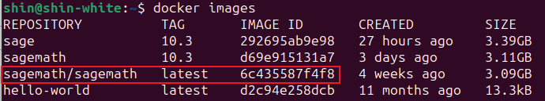
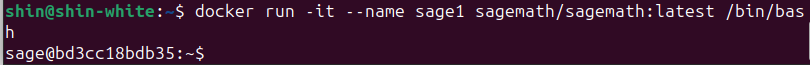
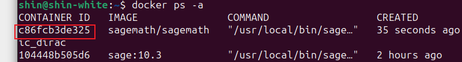
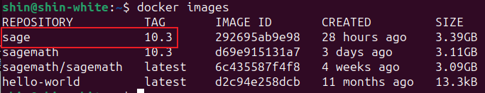

写这篇文章，主要是因为忍不了sage9.5的类型转换，听说sage的docker镜像很好用，而且版本很新，所以记录一下（）

### 在虚拟机上安装docker

我用的虚拟机是Ubuntu，所以我参考的是[Ubuntu安装docker教程](https://docs.docker.com/engine/install/ubuntu/#installation-methods)，估计其他虚拟机也有教程，可以自行找找。

### 在Docker上安装sagemath

安装完Docker后，得先启动docker：`systemctl start docker`

然后把Sage容器给拉下来：` docker pull sagemath/sagemath`，大概等一下下就好了

最后使用`docker images`这个指令查看一下就行：

使用的话，就看自己喜欢哪种方式了（

> 不使用jupyter的一种指令：`docker run -it sagemath/sagemath:latest`
>
> 使用jupyter的一种指令：`docker run -p 8888:8888 --name sage sagemath/sagemath:latest`
>
> 关闭容器并删除容器：`docker stop sage;docker rm sage`

### 安装python库并保存成image

安装的话，主要是这样的指令：`docker run -it --name sage sagemath/sagemath:latest /bin/bash`

然后会有个交互式 Shell：

接着就是sage安装python库的指令：`sage -pip install 库名 (库名 库名 ... 库名) `

按理来说，这里直接安装完必要的python库就能用了；但是，我们这里用的是**一个镜像**；假如我们安装完库后不保存镜像，并直接停止运行再重启的话，下次用的时候是**没有的**！

因此安装python库后，要记得存一下；这样才能存储到我们所下的python库。

步骤如下：

> 1，打开一个新的命令行（**下完python库的容器的命令行别关！**）
>
> 2，输入命令`docker ps -a`去查看对应的容器ID：
>
> 
>
> 3，使用命令`docker commit <容器ID> sage:10.3`，其中**sage:10.3**可以改成别的，这个主要是启动的时候需要用到的**repository:tag**
>
> 4，运行完后，会出现一个sha256值，说明安装成功了；当然你也可以再输入`docker images`确认一下
>
> 

### 结语

以上是我自己安装和使用sage的流程，假如哪里不太对，可以跟我说说（
